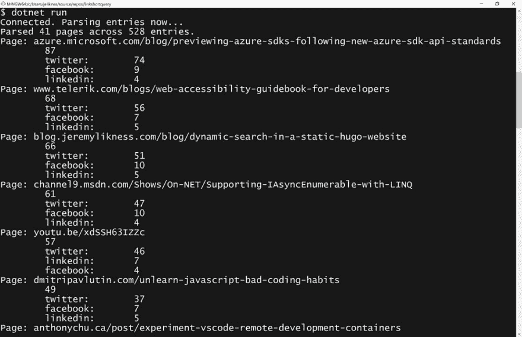
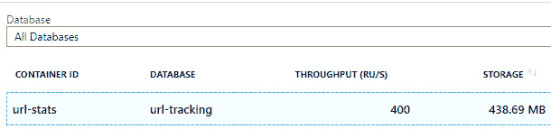

# 使用。NET LINQ 来查询动态无模式的 NoSQL CosmosDB 文档

> 原文：<https://dev.to/azure/using-net-linq-to-query-dynamic-schema-less-nosql-cosmosdb-documents-4i3h>

[](https://res.cloudinary.com/practicaldev/image/fetch/s--XWkMfd2w--/c_limit%2Cf_auto%2Cfl_progressive%2Cq_auto%2Cw_880/https://blog.jeremylikness.com/blog/using-linq-to-query-dynamic-schemaless-cosmosdb-documenimg/cosmossdk.jpg)

2019 年 7 月 9 日，宣布了一组新的用于与 Azure 服务合作的库。这些 SDK 面向多种语言，包括🐍Python、☕ Java、JavaScript 和. NET。涵盖了一些流行的服务，包括 [Azure Cosmos DB](https://jlik.me/f7d) 。

> 杰里米·利克内斯·⚡️[@杰里米·利克内斯](https://dev.to/jeremylikness)新的[# azure](https://twitter.com/hashtag/Azure)SDK 已经准备好供您预览并分享您的反馈。发布给🐍[# python](https://twitter.com/hashtag/Python)☕[# Java](https://twitter.com/hashtag/Java)[# Java](https://twitter.com/hashtag/Java)脚本和 [#dotNET](https://twitter.com/hashtag/dotNET) 。为什么？
> 
> ✅更容易使用
> ✅惯用地语言和生态系统
> ✅未来兼容性
> ✅更好的文档和样本
> 
> [jlik.me/f61](https://t.co/4EXayhRpzF)2019 年 7 月 10 日下午 17:36[](https://twitter.com/intent/tweet?in_reply_to=1149009392127356928)[](https://twitter.com/intent/retweet?tweet_id=1149009392127356928)0[](https://twitter.com/intent/like?tweet_id=1149009392127356928)2

我决定带着它们转一圈，为我的[link shorter 项目](https://blog.jeremylikness.com/series/serverless-link-shortener/)做些有用的东西。现在，我有一个 Power BI 仪表板，我写道:

[**用异能 BI 探索宇宙空间**](https://blog.jeremylikness.com/blog/2017-10-12_exploring-the-cosmosdb-with-power-bi/)

[](https://res.cloudinary.com/practicaldev/image/fetch/s--J_GxXk7u--/c_limit%2Cf_auto%2Cfl_progressive%2Cq_auto%2Cw_880/https://blog.jeremylikness.com/blog/2017-10-12_exploring-the-cosmosdb-with-power-img/8_hu1ea39eae0e668d3662f1b14462e83260_32929_200x100_fit_q75_box.jpeg)

<small>了解我如何利用 CosmosDB 存储来自 URL 缩短工具的遥测数据，然后在 PowerBI 仪表板中分析数据。</small>

仪表板很有用，但每天只刷新一次。如果我能写一些快速简单的东西给我一个实时的事物快照会怎么样？为了简单起见，我决定从一个控制台应用程序开始。哦，看那个。完成了，看来我关于新 SDK 的帖子是过去 24 小时内最受欢迎的页面！

<figure>[](https://res.cloudinary.com/practicaldev/image/fetch/s--XWkMfd2w--/c_limit%2Cf_auto%2Cfl_progressive%2Cq_auto%2Cw_880/https://blog.jeremylikness.com/blog/using-linq-to-query-dynamic-schemaless-cosmosdb-documenimg/cosmossdk.jpg) 

<figcaption>成品 app</figcaption>

</figure>

但是我是怎么到这里的呢？让我倒回去，我从头开始。

## 控制台 App

我决定用跨平台[写点东西。网芯](https://jlik.me/f7e)。我已经安装了。NET Core SDK，所以我只需要创建一个目录并初始化一个新的控制台应用程序。

`dotnet new console`

我建议不要将凭证签入源代码控制，所以我将它们存储在本地的一个`appSettings.json`文件中，由于有了一个`.gitIngore`，它不会被签入源代码控制。这意味着添加配置包，以便我可以读取设置:

`dotnet add package Microsoft.Extensions.Configuration.Json`

最后，我为 Cosmos DB 添加了新的 [Azure SDK。](https://www.nuget.org/packages/Microsoft.Azure.Cosmos/)

`dotnet add package Microsoft.Azure.Cosmos --version 3.0.0.19-preview`

之后启动 [Visual Studio 代码](https://jlik.me/f7f)就上路了！

`code .`

## 接通

新的 SDK 包含大量的入门示例，因此我从这里“借用”了主要代码:

[https://github . com/Azure/Azure-cosmos-dot net-v3/blob/master/Microsoft。Azure.Cosmos.Samples/CodeSamples/Queries/Program.cs](https://github.com/Azure/azure-cosmos-dotnet-v3/blob/master/Microsoft.Azure.Cosmos.Samples/CodeSamples/Queries/Program.cs)

这段代码建立了一个配置服务并获取设置:

```
IConfigurationRoot configuration = new ConfigurationBuilder()
   .AddJsonFile("appSettings.json")
   .Build();
string endpoint = configuration["EndPointUrl"];
if (string.IsNullOrEmpty(endpoint))
{
   throw new ArgumentNullException("Please specify a valid endpoint in the appSettings.json");
} 
```

当然，我必须创建一个`appSettings.json`文件并填充它:

```
{  "EndPointUrl":  "https://don't you wish.documents.azure.com:443",  "AuthorizationKey":  "DoodleDoodleDeeWubbaWubbaWubba=="  } 
```

(你不会以为我会把证件给别人吧？)

为了确保设置在本地发布，我将它添加到我的`.csproj`配置:

```
<ItemGroup>
   <None Include="appSettings.json">
      <CopyToOutputDirectory>PreserveNewest</CopyToOutputDirectory>
   </None>
</ItemGroup> 
```

创建客户端的代码只有几行代码。这将实例化客户端，并在完成后对其进行处理。

```
using (CosmosClient client = new CosmosClient(endpoint, authKey))
{
   await Program.RunQueryAsync(client);
} 
```

此时我运行了它，没有抛出异常，所以我当然知道是时候交付生产了。呃……

## 打开容器

Azure Cosmos DB 将数据组织到[数据库账户](https://jlik.me/f7i)中，这些账户包含关于区域、故障转移、要使用的 API 类型和其他属性的信息。在一个数据库中，您可以有多个容器，这些容器被不同地分区和供应。我有一个名为`url-tracking`的数据库和一个名为`url-stats`的容器。

<figure>[](https://res.cloudinary.com/practicaldev/image/fetch/s--LVwuXERa--/c_limit%2Cf_auto%2Cfl_progressive%2Cq_auto%2Cw_880/https://blog.jeremylikness.com/blog/using-linq-to-query-dynamic-schemaless-cosmosdb-documenimg/cosmosdatabase.jpg) 

<figcaption>宇宙数据库和容器</figcaption>

</figure>

我在代码中设置了这些名字:

```
private static readonly string CosmosDatabaseId = "url-tracking";
private static readonly string containerId = "url-stats"; 
```

> **提示**出于习惯，我用`static readonly`代替`const`。稍后我可能想将这些值移动到一个配置文件中，使用`static readonly`我可以在进程启动时初始化这些值，而不是在编译时必须可用的`const`。

我知道数据库和容器已经存在(这是我的生产数据，而不是带有示例数据的演示)，所以到达容器看起来像这样:

```
var cosmosDatabase = client.GetDatabase(CosmosDatabaseId);
var container = cosmosDatabase.GetContainer(containerId);
Console.WriteLine("Connected. Parsing entries now..."); 
```

现在该把数据拉出来了！

## 数据的形状

关于我的容器中的元数据，有一些有趣的事情需要了解。这可能是一个糟糕的设计选择，但在当时看起来很好，我决定利用 NoSQL 不需要固定模式的事实。我跟踪一个*媒介*，它告诉我链接被发布到了哪里(例如，Twitter、脸书，甚至是 PowerPoint 演示文稿内部)。Twitter 点击的示例条目如下:

```
{  "id":  "unique guid goes here",  "page":  "azure.microsoft.com/blog/previewing-azure-sdks-following-new-azure-sdk-api-standards",  "shortUrl":  "F61",  "campaign":  "link",  "referrerUrl":  "t.co/4EXayhRpzF",  "referrerHost":  "t.co",  "agent":  "Mozilla/5.0 etc...",  "browser":  "Chrome",  "browserVersion":  "77",  "browserWithVersion":  "Chrome 77",  "desktop":  1,  "platform":  "Windows",  "platformVersion":  "10",  "platformWithVersion":  "Windows 10",  "count":  1,  "timestamp":  "2019-07-10T2054",  "host":  "azure.microsoft.com",  "twitter":  1  } 
```

如果相同的条目来自 LinkedIn，它看起来会像这样:

```
{  "id":  "unique guid goes here",  "unimportant-stuff":  "removed",  "count":  1,  "timestamp":  "2019-07-10T2054",  "host":  "azure.microsoft.com",  "linkedin":  1  } 
```

请注意，属性因介质而异。这给解析数据带来了独特的挑战。像 JavaScript 这样的动态语言处理得很好，但是像 C#这样的强类型语言呢？回想起来，通过这样做，我可以更容易直观地理解“通配符”属性(注意添加的 *medium* 属性):

```
{  "id":  "unique guid goes here",  "unimportant-stuff":  "removed",  "count":  1,  "timestamp":  "2019-07-10T2054",  "host":  "azure.microsoft.com",  "medium":  "linkedin",  "linkedin":  1  } 
```

…甚至是这个:

```
{  "id":  "unique guid goes here",  "unimportant-stuff":  "removed",  "count":  1,  "timestamp":  "2019-07-10T2054",  "host":  "azure.microsoft.com",  "medium":  {  "linkedin":  1  }  } 
```

但是我没有，所以…目前我能想到的最好的方法是 _ 在**主机**之后查看属性。稍后会有更多的介绍。我可能会回头编写一个实用程序来更新数据结构，但目前它工作得很好。

## 查询

Azure Cosmos DB [SQL API](https://jlik.me/f7j) 的一个优点是可以使用 SQL 语法来查询文档。这是一个完全有效的查询:

`SELECT * FROM c WHERE <filter> ORDER BY c.timestamp DESC`

然而，我更喜欢使用 LINQ，因为我不必操纵字符串，可以采取更流畅的方法。

> 等等杰里米。你一直提到的这个 LINQ T2 是什么？如果你不熟悉 C#和/或。网，不要害怕。LINQ 代表(这里是文档链接)[语言综合查询](https://jlik.me/f7g)。这是一种使用 C#方法编写查询而不求助于字符串操作的方式。上面的例子变成了`query.Select(c=>c).Where(c=>{//filter}).OrderByDescending(c=>c.timestamp)`

目标很简单:抓取过去 24 小时的所有条目，并在页面和介质上聚合它们。排序以首先列出最受欢迎的页面的总点击数，然后在页面内按最受欢迎的媒体排序并按媒体显示点击数。为了保存数据，我创建了这个:

```
var documents = new Dictionary<string,IDictionary<string,int>>(); 
```

字典按页面进行索引，然后在页面内有一个嵌套字典，按 medium 和 click count 进行索引。

接下来，我构建了我的查询。这是最酷的部分:新的 SDK 完全支持 LINQ，动态数据没有问题！我没有尝试投射到一个`dynamic`类型，而是使用一个`IDictionary<string, object>`来模拟一个“属性包”(字符串是属性名，对象是它们各自的值)。下面的代码设置查询并创建一个迭代器，这样我就可以异步获取结果。请注意，将字典中一个条目的值转换为一个适当的`DateTime`属性是非常好的(看到我在那里做了什么吗？)来过滤我的查询。

```
var queryable = container
   .GetItemLinqQueryable<IDictionary<string, object>>();
var oneDay = DateTime.UtcNow.AddDays(-1);
var query = queryable
   .OrderByDescending(s => s["timestamp"])
   .Where(s => (DateTime)s["timestamp"] > oneDay);
var iterator = query.ToFeedIterator(); 
```

这是 LINQ 对你的询问。

> 尽管字典值是一个`object`类型，所以我不必锁定到一个特定的模式，但是 SDK 足够智能，可以将值序列化到适当的值。NET 类型，在本例中为`timestamp`一个`DateTime`。

迭代结果的一般策略很简单，而且据我所知，它会自动适当地处理节流请求(我还没有深入到可以断言这一点的程度，但是我的数据集没有问题)。

```
int entries = 0;
int pages = 0;
while (iterator.HasMoreResults)
{
   foreach(var document in await iterator.ReadNextAsync())
   {
      entries += 1;
      var page = document["page"].ToString();
      if (!documents.ContainsKey(page))
      {
         documents.Add(page, new Dictionary<string,int>());
         pages += 1;
      }
   // medium logic goes here
   }
} 
```

如您所见，您只需简单地询问是否有更多的结果，然后异步遍历提要。按介质跟踪计数的逻辑与 SDK 无关，所以我在这里爆料:

```
var pageData = documents[page];
bool medium = false;
foreach(var key in document.Keys)
{
   if (medium) {
      if (pageData.ContainsKey(key))
      {
         pageData[key] += 1;
      }
      else
      {
         pageData[key] = 1;
      }
      break;
   }
   else 
   {
      if (key == "host") 
      {
         medium = true;
      }
   }
} 
```

我正在寻找属性之后的属性*和属性`host`，并使用它对数据进行透视和求和。是的，这需要对列顺序的信任，这也是我之前解释这个大警告的原因。幸运的是，如果由于某种原因“通配符”属性不存在，循环将在`host`之后退出。*

## 生成报告

现在数据已经收集完毕，生成报告很容易，*尤其是*在 LINQ 的帮助下。我显示了总数，然后首先按点击次数最多的页面排序，在页面内按点击次数最多的页面排序*中等* :

```
Console.WriteLine($"Parsed {pages} pages across {entries} entries.");
foreach (var page in documents
   .OrderByDescending(kv => kv.Value.Values.Sum()))
{
   Console.WriteLine(
      $"Page: {page.Key}\n\t{page.Value.Values.Sum()}");
   foreach (var medium in page.Value
      .OrderByDescending(kv => kv.Value))
   {
      Console.WriteLine($"\t{medium.Key}:\t{medium.Value}");
   }
} 
```

哇！那很容易。我花了大约 30 分钟写代码，写这篇博文花了更长的时间。你可以打赌一整天我都会跑:

`dotnet run`

…并查看事情的进展情况。

## 总结

新的 SDK 已经发布，到目前为止，看起来不错。我能够快速启动并运行，API 感觉很直观，示例帮助我找到了解决问题的方法。我期待着看到这些基于反馈的改进，并在未来的版本中看到更多的服务。我希望你觉得这很有用。一如既往，请在下面的评论中分享你的个人经历和反馈！

🔗[开始使用新的 Azure SDK](https://jlik.me/f7h)。

问候，

[](https://res.cloudinary.com/practicaldev/image/fetch/s--S1KFS2BY--/c_limit%2Cf_auto%2Cfl_progressive%2Cq_66%2Cw_880/https://blog.jeremylikness.cimg/jeremylikness.gif)