# Laravel React 如何在 Laravel 应用程序中使用 React-教程

> 原文：<https://dev.to/lvtdeveloper/using-react-in-a-laravel-application-8fp>

反应式应用程序是网络世界的一大部分，这就是为什么有必要使用最新的技术来部署。从 5.5 版本开始，Laravel 集成了一个脚手架来部署 React JS。在本教程中，我们将学习如何集成 React 和 Laravel。

事实上，这真的很简单，让我们开始吧！

**安装拉索**

要在 Laravel 中创建新项目，我们要做的第一件事是使用 Composer 下载 Laravel 安装程序:

$ composer global 需要 laravel/installer

如果你还没有安装 composer，请访问:[https://dev . to/lvt developer/installing-virtual-environment-with-laravel-homestead-tutorial-4p 32](https://dev.to/lvtdeveloper/installing-virtual-environment-with-laravel-homestead-tutorial-4p32)
在这篇文章中，我解释了如何做，所以检查一下。

创建我们的项目的第一个命令是“laravel new ”,后面是我们希望分配给项目的名称。例如，“laravel new dutylist”将创建一个名为 dutylist 的目录，其中包含一个新的 laravel 安装，并且已经安装了所有的依赖项。

$ laravel 新的 dutylist

[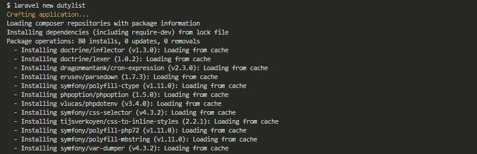](https://res.cloudinary.com/practicaldev/image/fetch/s--bX-Ficwt--/c_limit%2Cf_auto%2Cfl_progressive%2Cq_auto%2Cw_880/https://thepracticaldev.s3.amazonaws.com/i/wj51oxn3uxj83xu5goh4.png)

完成后，使用以下命令进入新目录:

$cd dutylist

**在 Laravel 中使用 React**

默认情况下，Laravel 应用程序包含位于 resources/js/components 目录中的 ExampleComponent.vue Vue 组件。ExampleComponent.vue 文件是一个单文件 vue 组件的例子，它在同一个文件中定义了它的 JavaScript 和 HTML 模板。单个文件组件为构建 JavaScript 驱动的应用程序提供了一种非常方便的方法。示例组件注册在您的 app.js 文件中:

[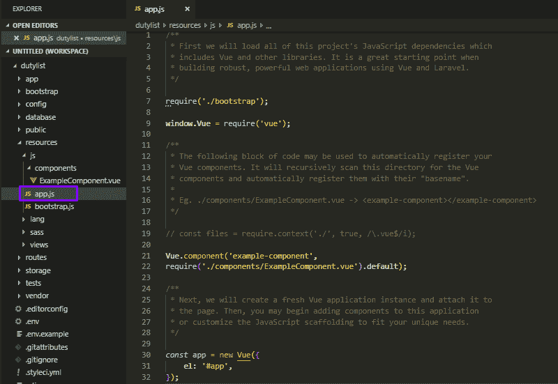](https://res.cloudinary.com/practicaldev/image/fetch/s--WUUYw6kV--/c_limit%2Cf_auto%2Cfl_progressive%2Cq_auto%2Cw_880/https://thepracticaldev.s3.amazonaws.com/i/3bfb0cschhc1ow54wsm7.png)

[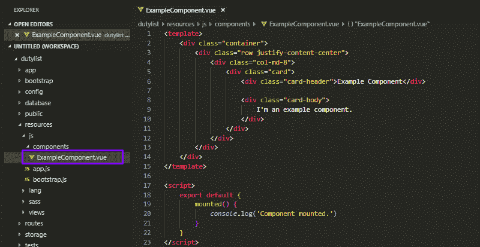](https://res.cloudinary.com/practicaldev/image/fetch/s--7bKrq2P2--/c_limit%2Cf_auto%2Cfl_progressive%2Cq_auto%2Cw_880/https://thepracticaldev.s3.amazonaws.com/i/rfz3qkpuh127qcu2967q.png)

我们需要使用以下命令将默认的 Vue.js 脚手架更改为 React.js:

[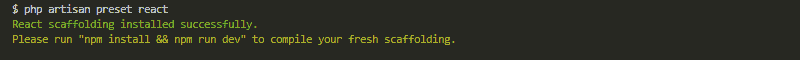](https://res.cloudinary.com/practicaldev/image/fetch/s--XygGXfDV--/c_limit%2Cf_auto%2Cfl_progressive%2Cq_auto%2Cw_880/https://thepracticaldev.s3.amazonaws.com/i/s30uyslgvg2327hj16ca.png)

现在您可以看到 Laravel 在 resources/js/components 目录下的 Example.js 文件中创建了一个 react 组件:

[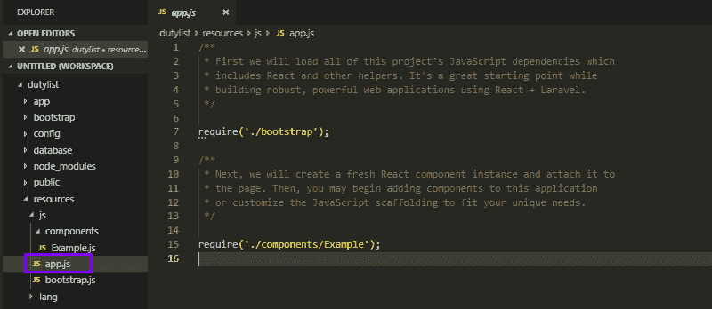](https://res.cloudinary.com/practicaldev/image/fetch/s--HGR0GUJj--/c_limit%2Cf_auto%2Cfl_progressive%2Cq_auto%2Cw_880/https://thepracticaldev.s3.amazonaws.com/i/en64cpcow8s3p0soo3gf.png)

[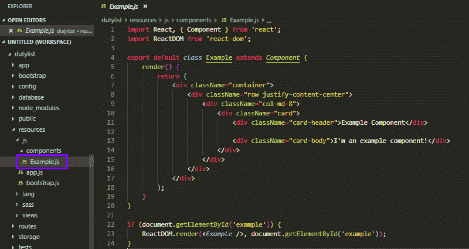](https://res.cloudinary.com/practicaldev/image/fetch/s--4-D77ck5--/c_limit%2Cf_auto%2Cfl_progressive%2Cq_auto%2Cw_880/https://thepracticaldev.s3.amazonaws.com/i/n857j24br7cekon5wcrl.png)

运行命令“npm install”来安装我们的项目所需的所有 javascript 包。

[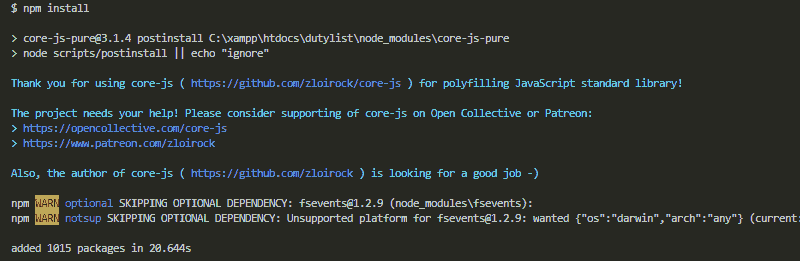](https://res.cloudinary.com/practicaldev/image/fetch/s--S_YLFU8m--/c_limit%2Cf_auto%2Cfl_progressive%2Cq_auto%2Cw_880/https://thepracticaldev.s3.amazonaws.com/i/j94h2ooc0geblwa51e97.png)

当我们使用 npm install 安装依赖项时，会自动生成一个 node_modules 目录，其中保存了已安装的软件包。它还生成一个 package-lock.json 文件，该文件负责跟踪 node_modules 中所做的更改，或者跟踪对 package.json 文件所做的更改

[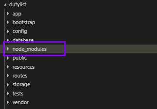](https://res.cloudinary.com/practicaldev/image/fetch/s--oacNGbAy--/c_limit%2Cf_auto%2Cfl_progressive%2Cq_auto%2Cw_880/https://thepracticaldev.s3.amazonaws.com/i/6m798v4q1orw91y5mo4v.png)

现在我们用命令启动应用程序:

[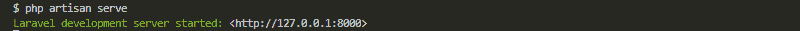](https://res.cloudinary.com/practicaldev/image/fetch/s--5s5EJzD_--/c_limit%2Cf_auto%2Cfl_progressive%2Cq_auto%2Cw_880/https://thepracticaldev.s3.amazonaws.com/i/izf5li4vnfzc9u2fg5nb.png)

打开路径为“ [http://localhost:8000](http://localhost:8000) 的浏览器，可以看到 Laravel 的默认视图

[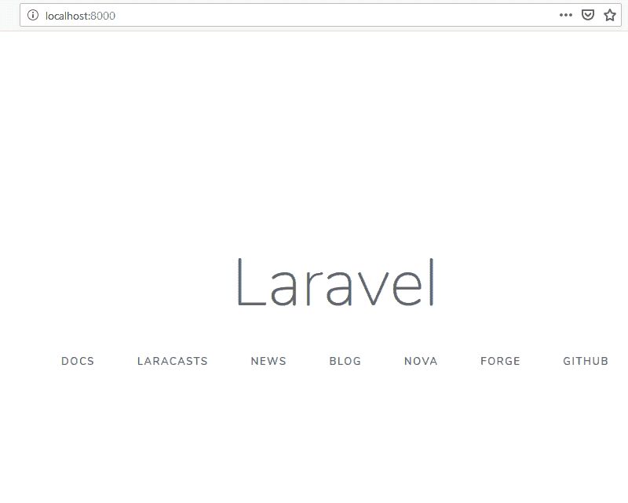](https://res.cloudinary.com/practicaldev/image/fetch/s--8-AojEaJ--/c_limit%2Cf_auto%2Cfl_progressive%2Cq_auto%2Cw_880/https://thepracticaldev.s3.amazonaws.com/i/ew5bsbkbkwtplu0bgccb.png)

让我们使用 react 将这个视图更改为一个视图。

在 resources/js/components 目录中创建 index.js 文件

[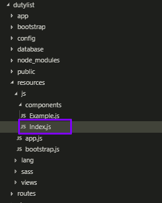](https://res.cloudinary.com/practicaldev/image/fetch/s--0s-nAOYm--/c_limit%2Cf_auto%2Cfl_progressive%2Cq_auto%2Cw_880/https://thepracticaldev.s3.amazonaws.com/i/zwyb2p6ra0v7sui2j7lf.png)

将 Example.js 文件中的所有内容复制到 index.js，并进行一些更改:

[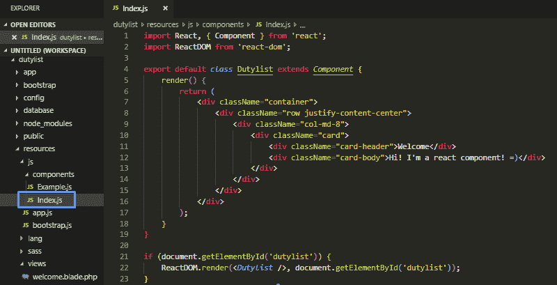](https://res.cloudinary.com/practicaldev/image/fetch/s--DpHItw3X--/c_limit%2Cf_auto%2Cfl_progressive%2Cq_auto%2Cw_880/https://thepracticaldev.s3.amazonaws.com/i/ly3l7c5bhc5j1raglup8.png)

在 app.js 中，我们添加了新的组件

[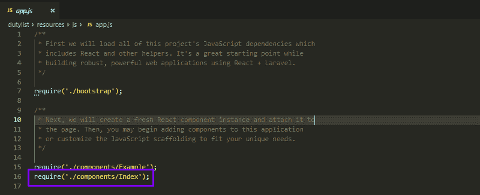](https://res.cloudinary.com/practicaldev/image/fetch/s--YaiIQwPP--/c_limit%2Cf_auto%2Cfl_progressive%2Cq_auto%2Cw_880/https://thepracticaldev.s3.amazonaws.com/i/qoptc1nhdiwrfi96glcu.png)

为了将任何元素呈现到浏览器 DOM 中，我们需要一个容器或根 DOM 元素。在这种情况下将

and everything inside it will be managed by React DOM. This change will be inside the welcome.blade.php located in the resources/views

[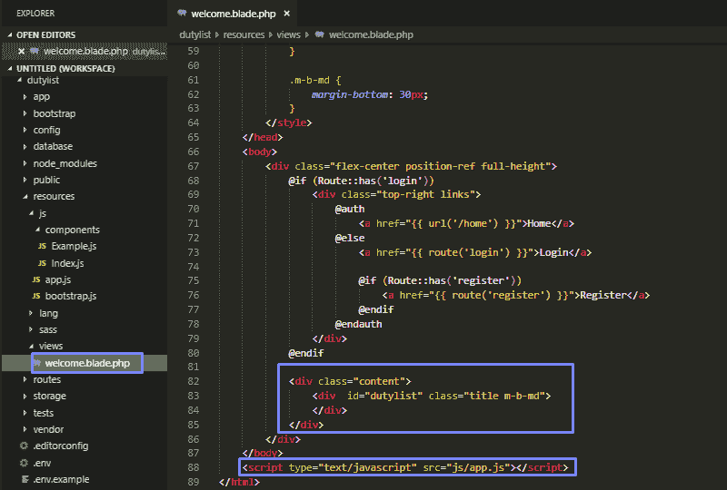](https://res.cloudinary.com/practicaldev/image/fetch/s--dwYMI9fx--/c_limit%2Cf_auto%2Cfl_progressive%2Cq_auto%2Cw_880/https://thepracticaldev.s3.amazonaws.com/i/wl1dmk0rpswibn61f4pu.png)

要通过 React JS 显示视图，我们需要使用 Laravel Mix 和“npm run dev”命令编译 JavaScript 文件:

[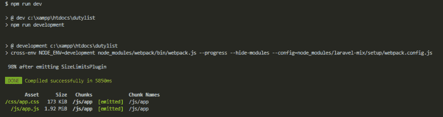](https://res.cloudinary.com/practicaldev/image/fetch/s--ROOPX6c4--/c_limit%2Cf_auto%2Cfl_progressive%2Cq_auto%2Cw_880/https://thepracticaldev.s3.amazonaws.com/i/mrbqoh6f3laet536hegp.png)

现在我们有了一个使用 react.js 的 Laravel 应用程序

[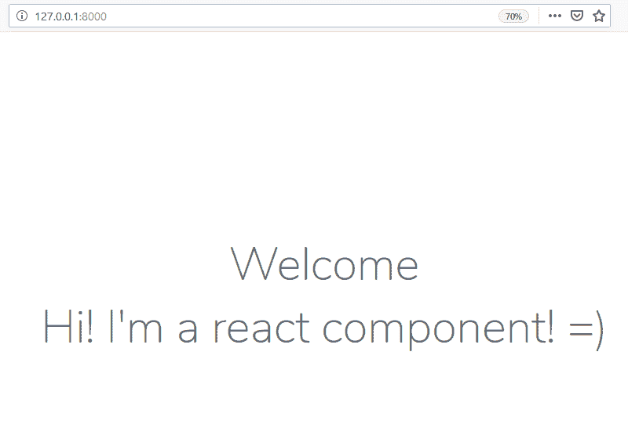](https://res.cloudinary.com/practicaldev/image/fetch/s--hf1Uqrm3--/c_limit%2Cf_auto%2Cfl_progressive%2Cq_auto%2Cw_880/https://thepracticaldev.s3.amazonaws.com/i/linw6isascc2k7nfrx88.png)

感谢阅读！编码员们，祝你们愉快💜