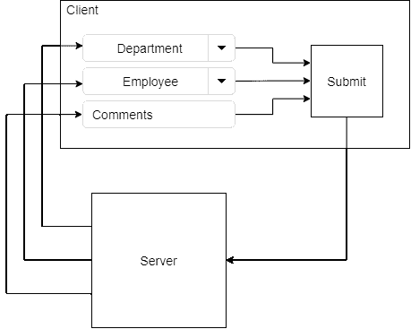
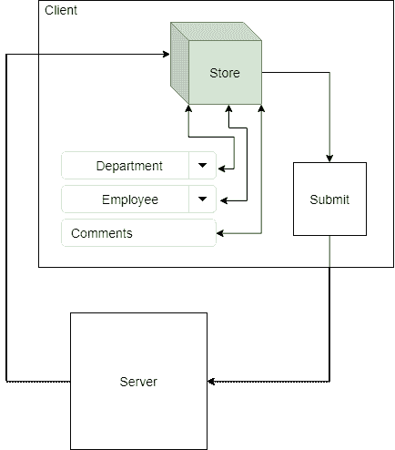
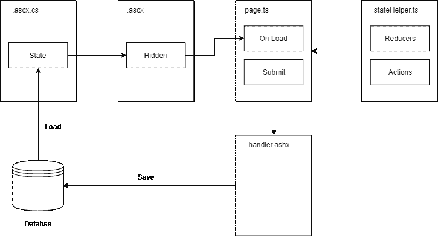

# 在旧的 ASP.NET Web 窗体项目中使用 Redux

> 原文：<https://dev.to/kapantzak/using-redux-in-a-legacy-asp-net-web-forms-project-1805>

[Redux](https://redux.js.org/) 是脸书 [Flux](https://facebook.github.io/flux/) 设计模式的一个实现。

有人可能会说*“为什么要在 React 以外的应用中使用 Redux？”*。现在看起来可能有点奇怪，但它帮助我的团队组织了数据流。

在我目前的工作中，我参与了一个基于 ASP.NET 网络技术的项目。这是一项相当过时的技术，但我们已经尝试使用一些现代工具，如 [Typescript](https://www.typescriptlang.org/) 和 [webpack](https://webpack.js.org/) ，以改善开发过程。

# 应用概述

应用程序使用一个**母版页**，它是入口点，并根据 url 加载适当的**用户控件**。

每个用户控件(从现在开始，我们称之为表单)加载各自的 javascript 文件来处理客户端的交互。

与服务器的通信是通过 ajax 调用扩展名为`.ashx`的特定文件(*通用处理程序*)进行的，尽管在某些情况下会触发回发，导致页面完全刷新。

这里有一个简单的概述

[](https://res.cloudinary.com/practicaldev/image/fetch/s--rOvVqIWq--/c_limit%2Cf_auto%2Cfl_progressive%2Cq_auto%2Cw_880/https://thepracticaldev.s3.amazonaws.com/i/zzf8sraxf4sutgw6gtfq.png)

# 问题

在我们的项目中，常见的情况是一个表单有一些过滤器(剑道控件)，一个*应用过滤器*按钮和一个显示结果的网格。

假设我们有一个包含 3 个过滤器的表单，一个包含可用部门的组合框，一个包含雇员的组合框和一个包含评论的文本框。

在加载时，每个过滤器都获得一些初始数据。这两个 comboboxes 分别获取部门列表和雇员列表，而 comments textbox 获取一个字符串。这些数据源必须从数据库中检索，并存储在后端的一些隐藏字段中。

在前端的`window.load`上，剑道控件用隐藏字段的值作为数据源进行初始化。

```
function initFilters() {
    const departments = JSON.parse($('#Hidden_departments').val());
    const employees = JSON.parse($('#Hidden_employees').val());
    const comments = $('#Hidden_comments').val();

    $('#cmb_departments').kendoDropDownList({
        data: departments
    });

    // Same for others ...
} 
```

Enter fullscreen mode Exit fullscreen mode

我们可以看到，每个过滤器从不同的点获取数据源。

当我们想要收集过滤器的值并将它们提交给服务器时，也会发生同样的情况。同样，我们必须在不同的地方搜索以获得每个值，用这些值创建一个对象并将其发送到服务器。

```
function getFiltersValues() {
    const departmentVal = $('#cmb_departments').data('kendoDropDownList').value();
    const employeeVal = $('#cmb_employees').data('kendoDropDownList').value();
    const commentsVal = $('#txt_comments').val();

    return {
        department: departmentVal,
        employee: employeeVal,
        comments: commentsVal
    }
} 
```

Enter fullscreen mode Exit fullscreen mode

下图说明了上述过程。

[](https://res.cloudinary.com/practicaldev/image/fetch/s--pgnMV__q--/c_limit%2Cf_auto%2Cfl_progressive%2Cq_auto%2Cw_880/https://thepracticaldev.s3.amazonaws.com/i/ch4mps5by6evo49uhmxa.png)

因此，问题是我们必须在许多不同的地方搜索，以便在一个句子中获得过滤器数据源和过滤器值:

> 真理没有单一的来源！

# 使用 Redux

与前面的方法相反，使用 Redux，我们试图维护单一的真实来源。这个来源是应用程序状态，或者更好地说，是用户控件状态，因为每个用户控件都维护自己的状态(我们不实现通用的应用程序状态，而是将每个用户控件视为一个**单独的应用程序**)。

下图说明了用户控件的数据生命周期:

[](https://res.cloudinary.com/practicaldev/image/fetch/s--s00f9kxe--/c_limit%2Cf_auto%2Cfl_progressive%2Cq_auto%2Cw_880/https://thepracticaldev.s3.amazonaws.com/i/leecx8km3etywhhn3xn0.png)

# 实现

现在，让我们看看如何在我们的 ASP.NET Web 窗体项目中使用 Redux。

[](https://res.cloudinary.com/practicaldev/image/fetch/s--bEbz0gd1--/c_limit%2Cf_auto%2Cfl_progressive%2Cq_auto%2Cw_880/https://thepracticaldev.s3.amazonaws.com/i/s7nnyk2ahge90krbdopw.png)

### 初始状态

当用户控件加载时，后端(`.ascx.cs`)查询数据库，创建一个表示初始状态的对象，将其序列化并存储在一个隐藏字段中。