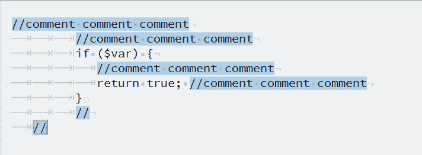
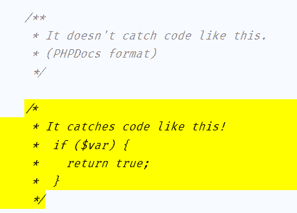

# 使用正则表达式查找并删除注释的 PHP 代码(并提高可读性)

> 原文：<https://dev.to/pmarcus93/using-regex-to-find-and-remove-commented-php-code-and-improve-readability-3dap>

(封面图片由 boskampi @ [pixabay](https://pixabay.com/users/boskampi-3788146/) 拍摄)

过去一周，我一直忙于工作中的一个遗留项目。问题是代码在版本控制之前有很多工件:明显或不必要的注释、空白、换行等等。这增加了理解代码所需的认知负荷，使代码难以阅读。

所以，我和我的团队讨论过这个问题，我们开始着手从代码中删除这些东西，使它更干净，更易维护，更易读。

为了安全起见，我们决定只删除完全不影响代码执行的内容——只删除不必要的/注释过的代码、过多的新行和无法实现的语句。为了使我的工作更容易，我做了两个简单的正则表达式来帮助找到这些事件，分析它们，并在必要时替换它——因为有些类有 800 多行代码。

`(\/{2,}.+)|(\/{2,})`

这将查找并突出显示任何以“//”开头的注释。在有效代码行的末尾是空行还是注释并不重要。

`/*[^*](.|\n)*?*/`

这将找到并突出显示任何非 PHP 文档的注释代码块(通常，这些代码块以/**而不是/*开头)。

### 我如何使用这个正则表达式？

我选择的 IDE 是 JetBrains 的 PHP Storm。我使用他们的替换工具(使用正则表达式)来查找 ocurrencies，分析是否可以删除，并用“\n”(换行符)替换它。每个健壮的文本编辑器或 IDE 都有一个等效的工具，你可以像我一样使用它。

### 结果

我将这些更改拆分成多个拉取请求。这有助于代码审查过程，使我的同事更容易管理它。到我写这篇文章的时候，我已经做了 5 个 PR，平均 20 个 PR 的文件。

它应该很快就会被部署，并且对这个项目中的任务有很大的帮助。光看代码，区别就是白天和黑夜。