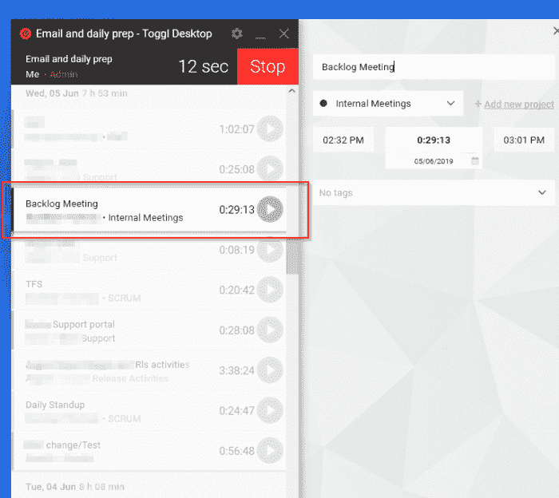
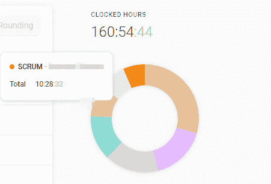

# 使用时间追踪软件对你有利。

> 原文：<https://dev.to/yerac/using-time-tracking-software-to-your-advantage-4dg>

## 唉，时间追踪！

当在工作环境中听到“时间追踪”时，人们经常会抽搐。尽管一些公司利用这一点来确保他们讨厌的员工没有任何停工时间，并且一直是小摇钱树，但我相信这可以用来做好事，更重要的是提高你自己的生产力。为什么不用时间追踪软件来为你服务呢？！

当然，这并不意味着前面提到的可怕的公司时间跟踪不存在，但不要让这影响你的判断。

我将要介绍的这个工具无论如何都不是一个新工具，但是我介绍给它的每个人都被它迷住了，并且没有回头。

### 所以，我为什么要在乎？

你知道典型开发人员的生活。不断的干扰、零星的支持邮件和变成长达一小时会议的“快速”分组会议。当你到达迭代的末尾时，有人问你“为什么你不去找 X”。量化而不是编造借口不是更好吗？

### 介绍，Toggl

Toggl 是一个完全免费(带付费选项)的时间追踪工具，适用于网络、桌面和移动设备。我用这个已经快 4 年了。

其工作方式是，您可以针对特定项目分配任务(即“客户 X 支持”，或“内部会议”)，这些任务属于特定的客户。任务是自由文本，但是可以通过使用相同的自动完成的任务名称组合在一起进行报告。你可以让所有事情完全不被指派，也可以保持分析能力，对每个客户的多个项目和不同的工作流进行超级细化(比如我！)

例如，如果我从过去几周中随机选择一天，我可以看到我在做什么，以及这一天是如何分配的。我发现最好只在我的环境发生变化时创建一个新条目——比如转到一个不同的工作岗位，或者不得不在某人的办公桌前提供一些支持等等。

在这里，你可以看到我那天花了 7 小时 53 分钟在纯粹的工作活动上。在这一天里，我们花了 24 分钟在我们的日常追赶上(哎哟！)，我一天中的大部分时间都被某种支持占据了，剩下的时间都被推着离开了。

我喜欢 Toggl 的一点是，我可以说“哇，站立的时间真长，每个月‘浪费’了多少时间？”

Toggl 有一个相当不错的基于 web 的仪表板，提供了比桌面或移动应用程序更多的功能。你可以深入每个任务、项目或客户，找出你的时间花在了哪里。见下文。

### 这很好，但有什么意义呢？(又名。我如何受益)

#### a)找出你在重复活动上花了多少时间(&确定优化)

找出你“昂贵”的重复性任务，并优化它们！例如:

在这里，你可以看到我上个月花了**10.5 小时**在每日站立、展示&展示或者回顾(都在我的 SCRUM 保护伞下【如果你愿意的话，scrumbrella】)。虽然这只占我时间的 6%,但这仍然是一个相当大的部分，也是我可以在团队中进行优化的一个领域。一篇未来的文章将会讲述如何有效地站立，请看这个空间。

我从使用这个工具中获得的一个主要收获是发现了我在推送和准备发布文件上花费了多少时间。我对此进行了几个月的监控，然后实现了 Powershell 脚本来自动化这项任务。现在只需要 10%的时间！

#### B)跟踪 QA 与新功能的工作时间

我分解项目的方式是在每个客户下有一个核心项目集合，通常是:

*   <clientname>: *(用于任何变更请求和可计费工作)*</clientname>
*   <clientname>支持:*(用于客户报告缺陷或查询)*</clientname>
*   <clientname>发布活动:*(用于跟踪测试和发布周期时间)*</clientname>

这意味着我有能力做到以下几点:

*   **确定哪些客户要求最高**或提出最多的问题/缺陷(并允许我们强调测试差距、知识问题等)。)
*   **确定我在质量保证和收费工作上花了多少时间**
*   **事后填写我的时间表**,而不用手忙脚乱地扫描电子邮件和查看历史记录！！

#### C)有正当的借口！

这是交付周期的最后一天，您还没有完成一项功能。如果说你花 25%的时间在计划外的会议上，这不是很好吗？

能够证明某事是好的。能够自圆其说，并指向一个饼状图更好！

## 结论

Toggl 是一个很棒的工具(至少对我来说是这样)，如果你想看看你的一天是如何度过的并生成报告，我真的推荐它。经过多年的使用，我没有看到自己停止。

Toggl 也有很多额外的选项，比如标记任务，将项目标记为可计费，以获得更好的发票，等等——这些功能我个人并不使用，但可能对某些人有用。

你用什么，如果有的话，有这样做的成功或失败的故事吗？*注意:这是发布到 dev.to 进行讨论。*

使用时间追踪软件对你有利。最早出现在 [yer.ac |一个开发者的冒险，等等。](http://yer.ac/blog)。