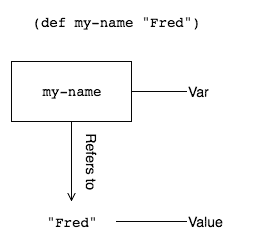

# 使用变量和值

> 原文：<https://dev.to/kendru/using-variables-and-values-1lm9>

这篇文章是安德鲁的书[第九课](https://www.learn-clojurescript.com/section-2/lesson-9-variables-and-values/)，[T3】学 ClojureScriptT5】](https://gum.co/learn-cljs)

* * *

ClojureScript 将我们自认为对变量的了解进行了彻底的颠覆。我们应该开始考虑不能改变的值，而不是考虑可能被修改的变量。虽然 ClojureScript 有变量的概念(称为`var`)，但我们通常不能改变变量所引用的值。ClojureScript 小心翼翼地将 var 和它的*值*区分开来。就像在 JavaScript 中一样，变量可能被重新定义以引用不同的对象；但与 JavaScript 不同的是，变量引用的对象是不能改变的。正是这种用*值*编程的核心思想使得 ClojureScript 如此有趣。事实上，值是每一种函数式编程语言的核心，我们会发现不可变值和纯函数的组合(我们将在第 12 章讨论，然后在第 4 单元再次讨论)使得编程风格非常容易推理。

*本章内容:*

*   理解不可变值和可变变量之间的区别
*   学习命名值的两种主要方式- `def`和`let`
*   解释价值或用价值编程

## 了解 var

var 非常类似于 JavaScript 变量。它是对某个值的可变引用。事实上，它是可变的，这意味着我们可以让它先引用一个值，然后再引用其他值。

想象一下，去参加一个聚会，每个人都是陌生人。当你进门时，会给你一个写有你名字的名牌。很有可能，你写在名字标签上的名字会成为其他参加聚会的人称呼你的名字。现在想象一下，你和另一个名字不同的与会者交换了姓名标签。你作为一个人将保持不变。收到一个新的姓名标签不会改变你的身份，只会改变别人用来称呼你的名字。此外，人们现在用你原来姓名标签上的名字来指代别人。名牌不再属于你，并不意味着它是无效的。

[](https://res.cloudinary.com/practicaldev/image/fetch/s--WQt06iNQ--/c_limit%2Cf_auto%2Cfl_progressive%2Cq_auto%2Cw_880/https://kendru.github.io/img/learn-cljs/chapter9/binding-var.png)

*将 Var 绑定到值*

这个虚构的场景类似于 var 和 values 的工作方式——values 是聚会上的人，var 是名字标签。正如名字可以被改变而不影响拥有它们的人一样，变量也可以被改变而不影响它们所命名的值。将一个 var 和一个值关联起来的过程叫做*将 var 绑定*到一个值。请随意跟随 REPL。

#### 定义变量

```
(def  my-name  "Fred")  ;; <1>  ;; #'cljs.user/my-name  my-name  ;; "Fred"  (defn  mk-global  [value]  (def  i-am-global  value))  ;; #'cljs.user/mk-global  mk-global  ;; <2>  ;; #object[ ... ]  (mk-global  [4  8  15  16  23  42])  ;; #'cljs.user/i-am-global  i-am-global  ;; <3>  ;; [4 8 15 16 23 42]  (def  ten  10)  ;; #'cljs.user/ten  (def  twenty  (*  ten  2))  ;; <4>  ;; #'cljs.user/twenty  twenty  ;; 20  ten  ;; <5>  ;; 10 
```

Enter fullscreen mode Exit fullscreen mode

1.  将 var，`my-name`绑定到值`"Fred"`
2.  `defn`创建了一个函数并将其绑定到 var，`mk-global`
3.  尽管`i-am-global` var 是在的`mk-global`函数中定义的*，但它对`cljs.user`命名空间是全局的*
4.  由于表达式计算值，`twenty`被绑定到`(* ten 2)`或`20`的结果
5.  我们验证了当我们将 10 乘以 2 时，它的值没有改变

### 符号

在第三章中，我们简单地看了一下符号，符号本质上是指其他东西的名字，通常是一个变量。在上面的 REPL 会话中，`my-name`、`mk-global`、`i-am-global`、`ten`、`twenty`都是符号。也就是说，它们是引用我们绑定的变量的名称。当 ClojureScript 正在评估我们的程序代码并遇到一个符号时，它将尝试评估该符号所引用的任何内容，如果它无法将该符号解析为任何已知值，它将显示一个警告。

#### 符号

```
(def  x  7)  ;; <1>  ;; #'cljs.user/x  x  ;; <2>  ;; 7  'x  ;; <3>  ;; x  (defn  doubler  [x]  (*  2  x))  ;; <4>  ;; #'cljs.user/doubler  (doubler  3)  ;; 6  y  ;; <5>  ;; WARNING: Use of undeclared Var cljs.user/y at line 1 <cljs repl>  ;; nil 
```

Enter fullscreen mode Exit fullscreen mode

1.  使用符号`x`指代变量
2.  对它所指的事物求值的符号
3.  符号前的引号导致 ClojureScript 计算符号*本身*，而不是它所引用的事物
4.  在函数中，符号`x`指的是函数参数，而不是全局变量
5.  试图计算不引用任何内容的符号时的警告

#### 你试试

ClojureScript 中的几乎所有东西都是值，var 可以绑定到任何值。有了这些知识，使用`def`创建一个引用这个函数的 var:

```
(fn  [message]  (js/alert  (.toUpperCase  (str  message  "!!!!!!!!!!!!!!!!")))) 
```

Enter fullscreen mode Exit fullscreen mode

你能用你创建的 var 来调用这个函数吗？例如`(my-var "inconceivable")`

> *你已经知道如何使用它*
> 
> 在 JavaScript 中，我们每天都在处理不可变的数据。JavaScript 中的字符串和数字是不可变的——它们是不能改变的值。我们可以*从中导出*新值，但我们(谢天谢地)不能说`1 = 2`或`"Unchangeable" += "... or not"`。我们认为这些类型的值是不可变的是非常自然的，但是我们认为集合是不可变的就比较困难了。遇到过不可变数据结构的更有经验的程序员可能倾向于认为它们是“庞大的”或资源密集型的(并且它们的许多实现确实是低效的)。无论我们只是习惯于来自其他语言的可变集合，还是认为不可变集合不切实际，都需要一段时间来养成使用不可变集合的习惯，然而，一旦我们习惯了，就可以像以同样的方式思考字符串和数字一样，自然地思考映射、向量等。

## 用 let 创建本地绑定

虽然`def`创建了一个对整个名称空间可见的 var，但我们有时希望命名和使用更临时或更集中的值。ClojureScript 使用`let`来创建这些本地绑定。像 var 一样，let 将一个名字映射到某个值，但是在对`let`的内容求值后，它们不再继续存在。当我们想在函数中间方便地命名事物，而又不想用一堆不必要的变量污染名称空间时，这是很有用的。`let`表达式的形式如下:

```
(let  [bindings]  expr1  expr2  ...  expr-n) 
```

Enter fullscreen mode Exit fullscreen mode

`bindings`是成对的名称和值，例如`[a 20, b 10, c (+ a b)]`，整个`let`表达式计算为`let`主体内最后一个表达式的值。因为只考虑最后一个表达式的值，所以其他表达式只用于副作用，比如打印到控制台或进行 DOM 操作。下面是一个在实际应用中如何使用 let 的例子:

```
(defn  parse-msg  [msg-raw]  (let  [msg-types  {:c  ::control  :e  ::event  :x  ::error}  msg  (reader/read-string  msg-raw)  type  (:t  msg)  data  (:d  msg)]  (println  "Got data:"  data)  [(get  msg-types  type)  data])) 
```

Enter fullscreen mode Exit fullscreen mode

这里有几件重要的事情需要注意。首先，我们用`let`、`msg-types`、`msg`、`type`和`data`创建的名字，只是为`let`内部的代码定义的，当`let`完成求值时，这些名字将被垃圾收集。第二，我们首先声明的名字在后来的绑定中是可用的。例如，我们将`msg`定义为对表达式`(reader/read-string msg-raw)`求值的结果，然后根据`msg`定义`type`和`data`。这是完全正常的，并允许我们编写更清晰和简洁的代码。

### 快速回顾

*   当 let 创建一个与已经定义的 var 同名的绑定时会发生什么？以下代码的输出会是什么？

```
(def  name  "Napoleon")  (let  [name  "Pedro"]  (println  "Vote 4"  name)) 
```

Enter fullscreen mode Exit fullscreen mode

*   填写下面的函数，这样它会告诉你你最喜欢的甜点的名字:

```
(let  [desserts  ["Apple Pie"  "Ice Cream Sandwiches"  "Chocolates"  "Berry Buckle"]  favorite-index  1  favorite-dessert  (get  desserts  favorite-index)]  (println  "All desserts are great, but I like"  favorite-dessert  "the best")) 
```

Enter fullscreen mode Exit fullscreen mode

## 总结

我们现在已经讨论了 ClojureScript 中命名事物的两种主要方法——`def`用于命名空间级别的绑定,`let`用于本地绑定——所以我们准备解决“计算机科学中仅有的两个难题”之一。脚注:[这是对菲尔·卡尔顿的名言的半开玩笑的引用，“在计算机科学中只有两件困难的事情:缓存失效和命名。”]将这些知识与我们将在接下来的几章中学习的内容结合起来，我们将能够开始编写一些有趣的应用程序。我们现在可以:

*   解释什么是 var，以及它是如何被一个符号引用的
*   使用`def`定义全局绑定
*   使用`let`定义本地绑定