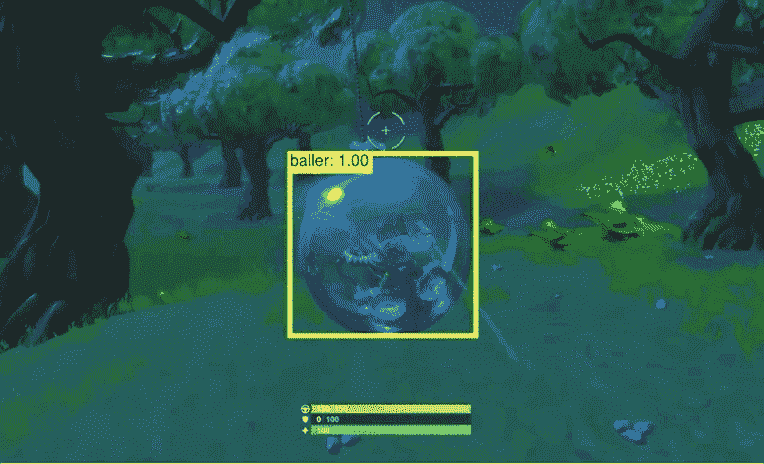

# 使用视频游戏来改善机器学习

> 原文：<https://dev.to/couch/using-video-games-to-improve-machine-learning-2lk0>

机器学习的一个令我兴奋的应用是在游戏中。不仅对游戏开发者有用，而且对许多其他应用程序也有用！我感兴趣的一个领域是使用视频游戏来模拟现实世界的挑战，并创建可以在视频游戏之外实施的解决方案。在这里，我将向您介绍我是如何构建一个为堡垒之夜定制的对象检测模型的。

## 我们建立模型是为了什么？

在机器学习中，最好从决定你想回答什么问题开始。在我的情况下，我决定建立一个模型，可以跟踪在福尔尼特称为 Baller 的独特车辆。目标将是识别和跟踪球员何时在球员的视野中，包括球员何时使用车辆。

## 有什么意义？

这个练习的主要论点是演示我们如何使用模拟环境来解决现实世界中的通用人工智能问题。我们不必收集真实世界的数据，而是可以捕捉视频游戏数据作为构建、测试和改进人工智能系统的试验台。在堡垒之夜的例子中，特别是这里展示的模型，想象一下能够创建一个框架来避免物体、优化决策或规划最佳旅行路线。可能性是无限的！

希望这篇文章能激发你对电子游戏的想象力。在下一篇文章中，我将分享如何复制上述模型来检测和跟踪球员的指南。