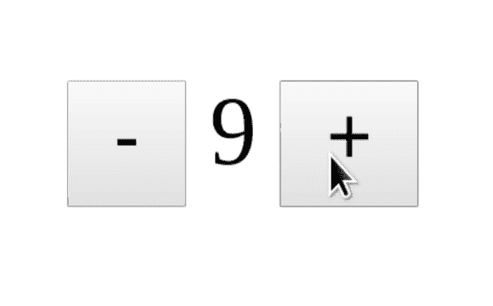

# 在角形中使用 Web 组件

> 原文：<https://dev.to/coryrylan/using-web-components-in-angular-forms-35ij>

Web 组件提供了使用在任何地方、任何前端框架或技术中工作的组件的好处。大多数 JavaScript 框架，如 Angular 和 Vue，对 web 组件和定制元素都有一流的支持。尽管我们可以获得框架级的支持，但有时我们希望与我们选择的框架所能提供的高级 API 进行更深入的集成。在这篇文章中，我们将看到如何利用
Angular 指令来提升我们的 web 组件，使之与 Angular 表单无缝地工作。我们可以两全其美，Web 组件可重用性和框架级集成。

## 腹板构件呈角形

我们可以毫无问题地使用 Angular 表单中的 Web 组件，但是因为 Web 组件不是 Angular 表单组件，所以它没有 Angular 表单提供的有用的 API，比如自定义验证和表单状态管理。

在 Angular overall 中使用 web 组件非常简单。Web 组件与我们在 Angular 组件中熟悉的模板 API 一起工作。第一步是我们需要告诉 Angular 我们在应用程序中使用了定制元素标签。

```
import { NgModule, CUSTOM_ELEMENTS_SCHEMA } from '@angular/core';
import { BrowserModule } from '@angular/platform-browser';
import { ReactiveFormsModule } from '@angular/forms';

import { AppComponent } from './app.component';
import './wc-counter'; // our Web Component we will be using in our application

@NgModule({
  imports:      [ BrowserModule, ReactiveFormsModule ],
  declarations: [ AppComponent, CounterDirective ],
  bootstrap:    [ AppComponent ],
  schemas: [
    CUSTOM_ELEMENTS_SCHEMA
  ]
})
export class AppModule { } 
```

通过将`CUSTOM_ELEMENTS_SCHEMA`添加到 AppModule Angular 将不会在自定义标记元素上抛出错误，它无法匹配注册的角度组件。现在我们可以导入我们想要使用的 web 组件了。在这个例子中，我们将导入一个简单的计数器组件，它是我们在上一篇文章[Web 组件介绍](https://coryrylan.com/blog/introduction-to-web-components)中创建的。

[](https://res.cloudinary.com/practicaldev/image/fetch/s--lXF_k9hN--/c_limit%2Cf_auto%2Cfl_progressive%2Cq_auto%2Cw_880/https://thepracticaldev.s3.amazonaws.com/i/i2sfrc9n9rwq2mscrrbf.png)

计数器组件是一个简单的自定义输入，用于跟踪用户输入的计数器值。你可以在下面的演示中看到完整的实现，或者阅读我们之前的教程。

为了使用 Web 组件，我们使用通常在 Angular 组件中使用的相同模板语法。

```
import { Component } from '@angular/core';

@Component({
  selector: 'my-app',
  templateUrl: `
    <h2>Web Component</h2>
    <p>{{count}}</p>
    <x-counter [value]="count" (valueChange)="count = $event.detail"></x-counter>
  `
})
export class AppComponent  {
  count = 5;
} 
```

Web 组件主要通过属性和自定义事件进行通信，就像 Angular `Input`和`Output` s 一样。然而，如果我们将此组件与 Angular form 一起使用，它的效果不如[自定义 Angular Form 控件](https://coryrylan.com/blog/angular-custom-form-controls-with-reactive-forms-and-ngmodel)。我们没有办法使用自定义验证或其他形式的 API。使用角度指令，我们可以将自定义表单控件 API 应用到 web 组件中。

## 用指令扩展行为

角度指令允许我们扩展或添加 HTML 元素的行为，这也包括自定义元素标签。使用一个指令，我们可以连接我们的计数器 web 组件，无缝地使用 Angular form API。理想情况下，我们会喜欢这样的 API:

```
<h2>Angular Reactive Forms Component using Web Component</h2>
<p>{{counter.value}}</p>
<p>Valid (min value 0): {{counter.valid}}</p>
<x-counter [formControl]="counter"></x-counter> 
```

使用指令 API，我们可以使用与 web 组件相同的定制元素选择器。通过使用相同的选择器，我们可以将特定于角度的 API 逻辑附加到我们的 web 组件上。

```
import { Directive, OnInit, forwardRef, HostBinding, ChangeDetectionStrategy, Input, Output, EventEmitter, ElementRef, HostListener } from '@angular/core';
import { ControlValueAccessor, NG_VALUE_ACCESSOR } from '@angular/forms';

@Directive({
  selector: 'x-counter',
  providers: [
    {
      provide: NG_VALUE_ACCESSOR,
      useExisting: forwardRef(() => CounterDirective),
      multi: true
    }
  ]
})
export class CounterDirective implements ControlValueAccessor  {
  onChange: any = () => {};
  onTouched: any = () => {};

  private _value: number;

  get value() {
    return this._value;
  }

  set value(val) {
    if (val !== this._value) {
      this._value = val;
      this.onChange(this._value);
      this.onTouched();
    }
  }

  writeValue(value) {
    if (value) {
      this.value = value;
    }
  }

  registerOnChange(fn) {
    this.onChange = fn;
  }

  registerOnTouched(fn) {
    this.onTouched = fn;
  }
} 
```

这里我们有一个`ControlValueAccessor`的基本实现。`ControlValueAccessor`为自定义输入控件定义了一个一致的 API 来与 Angular 通信。通过实现这个接口，Angular 可以理解组件值何时改变或更新，并将其反映到 Angular 表单中。

每当在我们的指令中设置值时，我们使用`onChange()`方法来通知表单控件已经被更新。我们还调用了`onTouched()`,这样 Angular 可以将表单控件标记为已触摸，这对于验证是必不可少的。

为了设置值，我们需要监听 web 组件上的值变化。我们可以使用一个`HostListener`装饰器为我们的 web 组件设置一个监听器。

```
...
set value(val) {
  if (val !== this._value) {
    this._value = val;
    this.onChange(this._value);
    this.onTouched();
  }
}

@HostListener('valueChange', ['$event.detail'])
listenForValueChange(value) {
  this.value = value;
}
... 
```

`HostListener`在我们的主机元素上创建一个事件监听器，这个元素就是`x-counter`元素。现在在`valueChange`上，我们可以获得 web 组件发出的更新值，并将其赋给我们的值。

最后，我们需要确保表单控件是否是通过 Angular forms API 以编程方式设置的，以便更新底层 web 组件。我们可以使用一个`HostBinding`，但是我很难让它工作，所以我将使用一个`ElementRef`。

```
...
set value(val) {
  if (val !== this._value) {
    this._value = val;
    this.onChange(this._value);
    this.onTouched();
    this.elementRef.nativeElement.value = val;
  }
}

constructor(private elementRef: ElementRef) { }

@HostListener('valueChange', ['$event.detail'])
listenForValueChange(value) {
  this.value = value;
}
... 
```

`ElementRef`是通过依赖注入注入的，它给了我们一个对主机元素的引用。通过这个引用，我们可以获得原始的 DOM 引用并设置 web 组件的 value 属性。

现在我们已经连接了我们的指令，我们可以将我们的 web 组件与本机 Angular Forms APIs 一起使用了。

```
import { Component } from '@angular/core';
import { FormControl, Validators } from '@angular/forms';

@Component({
  selector: 'my-app',
  template: `
    <h2>Web Component</h2>
    <p>{{count}}</p>
    <x-counter [value]="count" (valueChange)="count = $event.detail"></x-counter>

    <h2>Angular Reactive Forms Component using Web Component</h2>
    <p>{{counter.value}}</p>
    <p>Valid (min value 0): {{counter.valid}}</p>
    <x-counter [formControl]="counter"></x-counter>

    <h2>Angular Template Forms Component using Web Component</h2>
    <p>{{count2}}</p>
    <x-counter [(ngModel)]="count2"></x-counter>
  `
})
export class AppComponent  {
  count = 1;
  count2 = 3;
  counter = new FormControl(2, Validators.min(0));
} 
```

因为我们的指令将我们的 web 组件连接到 Angular Forms API
,所以我们现在可以使用表单 API，比如反应式表单控件、自定义验证和 ngModel。

```
<p>{{counter.value}}</p>
<p>Valid (min value 0): {{counter.valid}}</p>
<x-counter [formControl]="counter"></x-counter> 
```

在我们的模板中，我们可以看到我们可以完全访问 Angular Form 控件 API。我们可以访问该值，并让验证器逻辑应用于 web 组件
值。

在 Angular 中，当与 web 组件结合使用时，指令可能是一个强大的工具。我们可以获得 web 组件的完全可重用性，以及框架级 API 的优秀开发人员体验。看一看完整的工作演示[这里](https://stackblitz.com/edit/angular-alrq5w)