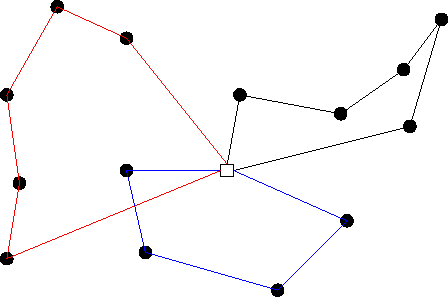
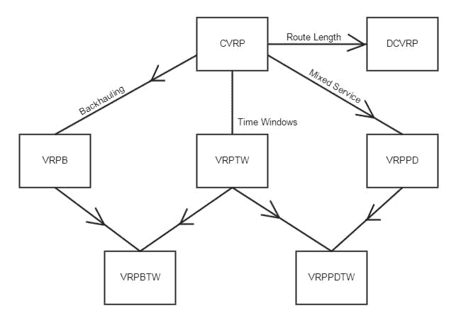
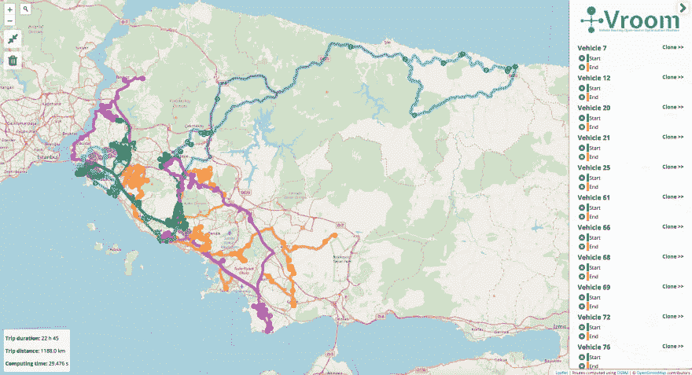

# 车辆路径问题及其求解方法

> 原文：<https://dev.to/iedmrc/vehicle-routing-problems-and-how-to-solve-them-8h3>

# 车辆路径问题

* * *

[车辆路径问题(VRP)](https://en.wikipedia.org/wiki/Vehicle_routing_problem) 在物流中是必不可少的。顾名思义，当我们在任何地图上有 ***N 辆车*** 要访问 ***M 个节点*** 时，车辆路径问题就存在了。

[](https://res.cloudinary.com/practicaldev/image/fetch/s--MKsT6Jkm--/c_limit%2Cf_auto%2Cfl_progressive%2Cq_auto%2Cw_880/https://upload.wikimedia.org/wikipedia/commons/2/2b/Figure_illustrating_the_vehicle_routing_problem.png) 
*一张图说明了车辆路径问题*

我们可以说 VRP 是旅行商问题的子集。一般来说，看起来是这样的:

CVRP，VRPTW ⊆ SVRP，DVRP ⊆ VRP ⊆ TSP ⊆图论

**CVRP** :如果你的车辆受到任何容量(例如最大装载限制)约束，那么我们称之为*有容量限制的车辆路径问题(CVRP)*

**VRPTW** :如果你的车辆有工作时间限制，那么我们称之为*有时间窗的车辆路径问题(VRPTW)*

**SVRP** :如果访问点(节点)给定，那么我们称之为*静态车辆路径问题*

**DVRP** :如果访问点(节点)是在地图上试图解决或移动时出现的，那么我们称之为*动态车辆路径问题*

迷茫？🤔

[](https://res.cloudinary.com/practicaldev/image/fetch/s--oKcoDYhG--/c_limit%2Cf_auto%2Cfl_progressive%2Cq_auto%2Cw_880/https://upload.wikimedia.org/wikipedia/commons/2/29/Map_of_vrp_subproblems.jpg)

这是一张地图，显示了常见的 VRP 子问题之间的关系，来自维基百科。

# 图论和 VRP 求解器

* * *

主角是*图论*。这一切都始于向欧拉提出的“*柯尼斯堡七桥*”[问题](https://en.wikipedia.org/wiki/Seven_Bridges_of_K%C3%B6nigsberg)。
今天，我们要问一些更复杂的问题，比如"*所有的包裹是如何以最高效的方式送达目的地的？*”。

有许多方法可以解决 VRP。 ***启发式*** ， ***构造方法*** ， ***两阶段算法*** ， ***元启发式*** 等等都是 VRP 的通用方法。更多信息见[此处](http://neo.lcc.uma.es/vrp/solution-methods/)。

今天，我们有足够的计算能力来运行迭代解决方案或优化器，在用计算机解决 VRP 时需要很长时间。

# 现实世界地图，路线和求解

* * *

## 打开街道地图

到目前为止，我们已经描述了这个问题并介绍了一些解决方案，但是现实世界地图上的道路和路线呢？人们可以想到*谷歌地图*、 *Yandex 地图*、 *HERE 地图*等..它们都很好，但也很商业化。感谢[***OpenStreetMap(OSM)***](https://wiki.openstreetmap.org/wiki/Main_Page)和社区，我们有了一个非常大且有用的真实世界地图，每周都会更新。

## 开源路由机

OpenStreetMap 只提供真实世界的地图，而不是路线，因此我们需要其他东西来给我们路线、距离、持续时间等等..哦，那是什么 [***开源路由机(OSRM)***](http://map.project-osrm.org/) ？你猜对了，我们热爱自由软件！ ***OSRM*** 使用 *OpenStreetMap* 作为(地图)后端，具有以下特性:

*   **最近的** -将坐标捕捉到街道网络并返回最近的匹配
*   **路线** -寻找坐标间最快的路线
*   **表** -计算所有坐标对之间最快路线的持续时间或距离
*   **匹配** -以最合理的方式将嘈杂的 GPS 轨迹捕捉到道路网络中
*   **Trip** -使用贪婪启发式算法解决旅行推销员问题
*   **图块** -使用内部路由元数据生成地图框矢量图块

现在，我们可以获取所有节点之间的路径，然后运行 VRP 求解算法来优化(最快或最短)节点路径序列。

但是等等！请给我更多的开源！😂

## 车辆路径开源优化机

[***车辆路径开源优化机(VROOM)***](http://vroom-project.org) 是一个 VRP 求解器。它使用 OSRM 或[***OpenRouteService(OSR)***](https://openrouteservice.org/)作为后端获取路线并返回解决 *CVRP* 、 *VRPTW* 、 *CVRPTW* 问题的方案。它也有一个很好的用户界面(前端)来显示地图上的车辆，节点和路线。

你应该注意到，VROOM 的目标是优化*总持续时间*，而不是*总距离*。因此，您可能需要找到另一个开源解决方案或编写自己的解决方案来计算最短路径。

# 说话便宜给我看代码！

* * *

## 以传统方式准备依赖关系

也就是说，没有码头工人。建议你跳非传统。

### 拿着 OSM 地图跑 OSRM

要为您的操作系统和架构构建 OSRM，请遵循本指南。

然后，你需要下载一张 OSM 地图，并为 OSRM 进行处理。接下来，您可以运行 OSRM 后端。遵循[这个指南](https://github.com/Project-OSRM/osrm-backend/wiki/Running-OSRM)来实现它们。

### 运行 VROOM 后端并公开 API

根据本指南中的[克隆并构建 VROOM。确保您的路径中有`vroom`二进制文件(环境变量)。](https://github.com/VROOM-Project/vroom/wiki/Building)

到目前为止，我们有一个带地图的路由机器(OSRM )( OSM ),和一个使用它们的 VRP 解算器(弗鲁姆)。我们可以通过 CLI 调用带有适当参数的 VROOM 并得到计算结果。不过通过 [Node.js HTTP API](https://github.com/VROOM-Project/vroom-express) 与 VROOM 交互更容易。

好了，让我们安装并运行 *VROOM Express.js API* 。这很容易。只需克隆存储库并遵循这里的指南。一个警告:在运行之前，不要忘记通过`config.js`进行配置。您可能想要更改`MAX_JOBS`、`MAX_VEHICLES`、`PORT`或`routingServers`的值。

## 通过 Docker 准备依赖关系

首先，下载一张 OSM 地图，通过[这个简单的向导](https://github.com/Project-OSRM/osrm-backend#using-docker)用 dockerized OSRM 处理它。但是不要像上一个命令中那样运行 OSRM。因为从现在开始，我们将在下面的合成文件中使用`docker-compose`:

%[[https://gist . github . com/IED MRC/51d 02 fefa 9 E3 ee 91 a 5608 c 02 c 452 c 965](https://gist.github.com/iedmrc/51d02fefa9e3ee91a5608c02c452c965)]

根据自己的需要调整`command`和`volume`参数。如果你想编辑 VROOM 后端的配置文件，克隆[这个库](https://github.com/iedmrc/vroom-docker)并构建你自己的镜像。你可以通过克隆[这个库](https://github.com/iedmrc/vroom-frontend-docker)为 VROOM 前端做同样的事情。这些存储库是我为 VROOM 后端和前端准备的映像。我建议你复习一下。

发动它！

```
docker-compose up -d 
```

一个警告:如果你使用 Mac 的 *Docker，你可能需要增加默认的 Docker 资源。我为 Docker 保留了以下资源:*

*   CPUs 个
*   内存:6 GiB
*   互换:2.0 吉卜

链接到 docker 文件:

*   VROOM 后端坞站存储库:https://github . com/iemrc/vroom 坞站
*   VROOM 前端坞站存储库:https://github . com/iemrc/vroom 前端坞站

## 通过直接 API 请求解决 VRP

现在，您可以通过向 VROOM Express API 发出请求来解决 VRP 问题，并根据本 API 指南附上一个 JSON 有效负载。

请求示例:

```
curl 'http://localhost:3000/' -H 'Content-type: application/json' --data-binary \
'{ "jobs": [ { "id": 1613, "service": 1200, "amount": [ 1 ], "location": [ 29.02988, 40.99423 ] }, { "id": 1665, "service": 1200, "amount": [ 1 ], "location": [ 29.216, 41.008520000000004 ] }, { "id": 21234, "service": 900, "amount": [ 1 ], "location": [ 29.272640000000003, 40.94765 ] }, { "id": 23457, "service": 600, "amount": [ 1 ], "location": [ 29.119659999999996, 40.97359 ] }, { "id": 24145, "service": 900, "amount": [ 1 ], "location": [ 29.16579, 40.925540000000005 ] }, { "id": 33007, "service": 900, "amount": [ 1 ], "location": [ 29.123801, 40.978068 ] }, { "id": 38081, "service": 600, "amount": [ 1 ], "location": [ 29.113429999999997, 40.980259999999994 ] }, { "id": 39163, "service": 900, "amount": [ 1 ], "location": [ 29.25528, 40.87539 ] } ], "vehicles": [ { "id": 7, "start": [ 29.208498, 40.890795 ], "end": [ 29.208498, 40.890795 ], "capacity": [ 25 ], "time_window": [ 30600, 61200 ], "startDescription": "Start", "endDescription": "End" } ], "options": { "g": true }}' --compressed 
```

回应:

```
{
  "code": 0,
  "summary": {
    "cost": 4387,
    "unassigned": 0,
    "amount": [8],
    "service": 7200,
    "duration": 4387,
    "waiting_time": 0,
    "distance": 72452,
    "computing_times": {"loading": 28,"solving": 4,"routing": 10}
  },
  "unassigned": [],
  "routes": [{
      "vehicle": 7,
      "cost": 4387,
      "amount": [8],
      "service": 7200,
      "duration": 4387,
      "waiting_time": 0,
      "distance": 72452,
      "steps": [{
          "type": "start",
          "location": [29.208498,40.890795],
          "arrival": 30600,
          "duration": 0,
          "distance": 0
        },{
          "type": "job",
          "location": [29.16579,40.925540000000005],
          "job": 24145,
          "service": 900,
          "waiting_time": 0,
          "arrival": 31064,
          "duration": 464,
          "distance": 8110
        },{
          "type": "job",
          "location": [29.02988,40.99423],
          "job": 1613,
          "service": 1200,
          "waiting_time": 0,
          "arrival": 32854,
          "duration": 1354,
          "distance": 25277
        },{
          "type": "job",
          "location": [29.113429999999997,40.980259999999994],
          "job": 38081,
          "service": 600,
          "waiting_time": 0,
          "arrival": 34586,
          "duration": 1886,
          "distance": 34414
        },{
          "type": "job",
          "location": [29.123801,40.978068],
          "job": 33007,
          "service": 900,
          "waiting_time": 0,
          "arrival": 35260,
          "duration": 1960,
          "distance": 35539
        },{
          "type": "job",
          "location": [29.119659999999996,40.97359],
          "job": 23457,
          "service": 600,
          "waiting_time": 0,
          "arrival": 36215,
          "duration": 2015,
          "distance": 36533
        },{
          "type": "job",
          "location": [29.216,41.00852],
          "job": 1665,
          "service": 1200,
          "waiting_time": 0,
          "arrival": 37454,
          "duration": 2654,
          "distance": 47712
        },{
          "type": "job",
          "location": [29.272640000000003,40.94765],
          "job": 21234,
          "service": 900,
          "waiting_time": 0,
          "arrival": 39281,
          "duration": 3281,
          "distance": 57059
        },{
          "type": "job",
          "location": [29.25528,40.87539],
          "job": 39163,
          "service": 900,
          "waiting_time": 0,
          "arrival": 41007,
          "duration": 4107,
          "distance": 67891
        },{
          "type": "end",
          "location": [29.208498,40.890795],
          "arrival": 42187,
          "duration": 4387,
          "distance": 72452
        }
      ]}
  ]} 
```

## 通过前端解决 VRP

如果你已经通过`docker-compose`或者手动编译运行了 VROOM 前端，通过上传你准备好的 JSON，你可以让 VROOM 求解 VRP。

[](https://res.cloudinary.com/practicaldev/image/fetch/s--64qJHPs7--/c_limit%2Cf_auto%2Cfl_progressive%2Cq_auto%2Cw_880/https://cdn.hashnode.com/res/hashnode/image/upload/v1559256825172/I4vq18w7D.png)
*VROOM 前端截图*

# 最终概述

* * *

1.  在这里下载一张 OSM 地图。
2.  构建 OSRM 二进制文件并处理。osm 文件用 [docker](https://github.com/Project-OSRM/osrm-backend#using-docker) 或如这里所述[用](https://github.com/Project-OSRM/osrm-backend/wiki/Running-OSRM)表示。
3.  构建 VROOM 二进制文件，并确保它在路径中。
4.  运行 OSRM HTTP 服务器监听端口 5000(或任何您想要的端口)。
5.  将 VROOM Express.js API 配置为在路径中使用 VROOM 二进制文件，并通过其侦听的端口连接到 OSRM HTTP 服务器。
6.  运行 VROOM Express.js API 监听端口 3000(或任何您想要的端口)。
7.  制作一个 JSON 文件，如这里所述[。](https://github.com/VROOM-Project/vroom/blob/master/docs/API.md)
8.  用准备好的 JSON 文件向 VROOM Express.js 发出 HTTP 请求。
9.  [可选]配置 VROOM 前端连接到 VROOM Express.js API，并运行它监听端口 9966(或任何您想要的端口)。

# 总之

* * *

车辆路径问题是一个非常有价值并且仍然活跃的研究领域，尤其是在物流领域。社区对此有很好的解决方案。这里我们把它们结合起来，解决了问题。

如果你有任何问题，请随时提问！请把这个消息传播出去！🙏🏼