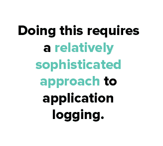

# 详细日志记录:不良应用程序行为的放大镜

> 原文：<https://dev.to/scalyr/verbose-logging-your-magnifying-glass-for-bad-application-behavior-2pi6>

你可能不认为详细日志是黑客马拉松和创业公司的材料。大多数程序员也不会认为这是一种特别先进的技术。但是它很重要，有足够多的人询问它，所以它值得报道。

在本帖中，我们将看看:

*   什么是详细日志记录
*   人们为什么使用它
*   以及如何在您的应用程序中消费和生产它

当你完成时，你会牢牢掌握这项技术。

如此多的人询问详细日志的部分原因是，它有点笼统，就像搜索“日志”是笼统的一样。

所以，让我们至少从一个更具体的定义开始。

### 什么是详细日志记录？

详细日志记录的定义在很大程度上依赖于从软件中进行一般日志记录的思想。让我们来定义日志记录:

> 在软件中，日志记录是将软件运行时发生的事件记录到永久介质中的实践。

这可以涵盖很多方面，从记录关键错误到记录电子商务应用程序的正常购买交易，再到记录软件执行的每一种方法。这些细节会因软件的性质、团队的偏好以及软件运行的环境而有很大的不同。

推理日志方法最常见的方式之一是通过使用[所谓的日志级别](https://www.scalyr.com/blog/logging-levels/)。

这些允许你控制你的日志的“聊天”程度，从“只记录关键错误”到“记录所有事情和厨房水槽”而详细日志记录则落在了*极端*的厨房水槽端。这是一种表达这种想法的简写方式，即你在故意用极高的噪音率记录事件[。](https://en.wikipedia.org/wiki/Signal-to-noise_ratio)

因此“详细日志记录”成为一种常见的简写方式，其定义如下:

> 在软件中，**详细日志记录**是将软件运行时发生的事件尽可能多的信息记录到永久介质**中的做法。**

还值得一提的是，详细日志记录通常是一种可以打开和关闭的模式。换句话说，通过日志记录级别或一个简单的标志，软件开发人员可以让您暂时“变得详细”,而不是将详细日志记录作为软件的默认或唯一状态。

### 为什么人们使用这种技术？

现在我们已经确定了这是什么，下一个问题是“他们为什么要这么做？”

在某种程度上，你大概可以推断出其中的原因。一般来说，什么时候人们会宁愿提供过多的信息呢？

当你面临一个棘手的问题，并且认为任何线索都可能有所帮助时，你会这样做。

详细日志记录也是如此。当您调试或试图寻找一些产品支持问题时，通常会采用这种日志记录模式。

如果解决方案不是立即显而易见，您可以切换到详细模式，并希望即将到来的信息洪流会有所帮助。

这通常不是最有效的方法。换句话说，当你进入冗长模式时，给自己拿一杯咖啡，准备花一点时间筛选大量输出，寻找任何似乎有用的东西。

### 使用详细日志记录:一些示例

就伐木而言，活动主要有两方:生产者和消费者。让我们先看看详细模式下日志记录的消耗方面，并给出一些例子。

#### 操作系统日志

如果你倾向于[查看日志](https://technet.microsoft.com/en-us/library/aa996634(v=exchg.65).aspx)，你的操作系统会产生一个令人印象深刻的日志缓存。作为消费者，你很少想这么做，除非电脑出问题了。在谷歌上搜索你遇到的问题的细节或在论坛上寻求帮助时，你可能会遇到建议[为操作系统的某些方面启用详细日志记录](https://technet.microsoft.com/en-us/library/aa996634(v=exchg.65).aspx)。

#### 安装人员

想象一下，你正试图安装某个软件，却得到一个神秘的错误，比如“不允许，安装中止。”

可悲的是，这种事情经常发生。

软件安装往往会产生日志，但这些可能还不够。因此，您会合理地转向在详细模式下运行安装，许多安装程序都提供了这种模式。

#### 命令行

也许查找详细信息的最简单、最快的例子发生在您使用命令行的时候。例如，以 Linux 环境中的 gzip 命令为例。这是可以想象到的最简单的命令之一——给 gzip 一个文件，它会对其进行压缩或解压缩。

但是如果您给它添加“-v”标志，您就告诉它以详细模式运行。然后，它会向您显示包括压缩/解压缩百分比在内的附加信息。

#### 排除您自己软件的故障

我要提到的最后一个快速消费的例子是你要对有问题的软件负责。您可能在[devo PS 谱](https://scalyr.com/blog/devops-past-present-and-future/)的任何地方，需要故障排除信息。

在这种情况下，您通常会更改代码使用的配置文件或数据库中的配置设置。“翻到模式”，你会告诉它，然后你会开始你的问题搜索。

### 在您自己的应用程序中生成详细的日志记录

这为事情的另一面提供了一个很好的过渡:从应用程序生成详细的日志记录。这样做首先需要一种相对复杂的方法来记录应用程序日志。当然，您需要这样做，但是您还需要前面提到的可配置的日志级别以及在它们之间切换的方法。你也应该[产生格式良好的日志文件](https://www.scalyr.com/blog/be-kind-to-your-log-file-and-those-reading-it/)，以免你将消费者淹没在无用信息的浪潮中。

有了所有这些，考虑一下最详细的日志记录级别。

什么有助于故障排除？围绕每条信息的大量上下文？关于你从代码的什么地方登录的注释？你的软件的输入和输出的详尽的转储？你必须根据上下文来决定。

也许提供详细模式最重要的考虑是使切换对任何使用它的人来说都是简单和安全的。如果您默认使用详细模式或者忘记关闭它，您将很快[创建无法管理的日志文件](https://www.scalyr.com/blog/log-file-too-big/)，同时让那些寻找基本信息而不是大海捞针的人日子真的不好过。

### 展望未来:罗嗦成为新常态

最后，值得一提的是，随着技术的进步，详细日志记录的旧缺陷可能会消失。从历史上看，冗长模式更倾向于在大量信息之间进行权衡，以避免找到和使用您真正需要的信息的困难。但是[现代日志管理解决方案](https://www.scalyr.com/blog/log-management-need/)正在改变这方面的游戏，它提供了以下功能:

*   为您处理日志聚合和存储。
*   解析日志消息并将它们转换成数据。
*   提供智能索引和搜索。

因此，您应该了解详细模式的历史:一种将自己埋在信息中的方式，希望其中一些信息会有所帮助。但是你也应该理解它正在成为什么:一种鱼与熊掌兼得的方式。