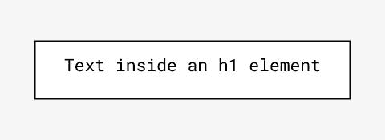
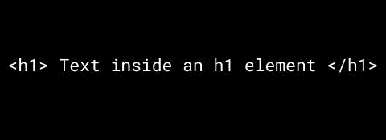
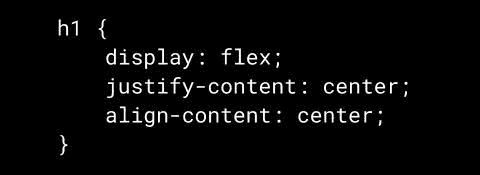
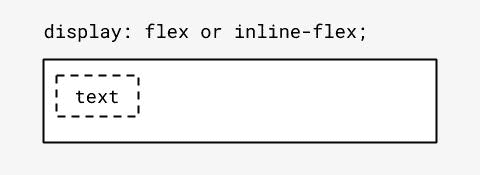
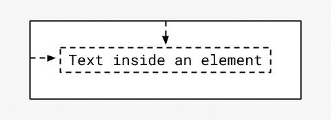

# 使用 flexbox 垂直和水平居中文本

> 原文：<https://dev.to/eduardo__uribe/vertically-and-horizontally-center-text-with-flexbox-1fmd>

今天，您将学习如何轻松地将文本垂直和水平居中。

### 起始代码

超文本标记语言

半铸钢ˌ钢性铸铁(Cast Semi-Steel)

### 工作原理

flex 容器中的文本通过自动包装在[匿名块容器](https://www.w3.org/TR/css-display-3/#css-anonymous)中而成为 flex 项目。

这将文本转换为 flex 项，并允许它参与其容器的 flex 格式上下文。

现在，任何 flexbox 属性都可以应用于包含文本的匿名块。

在这种情况下，我们使用`justify-content: center;`水平居中，使用`align-items: center;`垂直居中

这就是使用 flexbox 在元素内部垂直和水平居中文本的方式。

[喜欢收到关于新的 HTML/CSS 小技巧的通知在 twitter 上关注我@Eduardo__Uribe](https://twitter.com/Eduardo__Uribe)