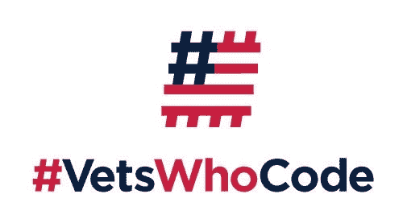

# 编写代码的老手——为服务过的人提供技术机会

> 原文：<https://dev.to/vetswhocode/vets-who-code-servicing-tech-opportunities-to-those-who-served-11lc>

当我在 2016 年从美国陆军离职时，我以为我的未来已经完全清楚了。我已经准备好接受新的挑战——我被我梦想中的纽约学校录取了，我将被一个令人难以置信的家庭支持系统所包围，我的目标是科技行业。

我很幸运有一个相当不错的转变；分手 10 天后，我在教室里解决离散数学问题。“我是一名老兵，我很好地适应了课堂，我将进入一个利润丰厚的行业——我已经准备好了！”我会对自己说。

我天真地认为，出现在课堂上并在学术界表现出色，将是竞争激烈的私营部门的一张黄金入场券。不幸的是，事实并非如此。当我第一次出去申请实习的时候，我感到非常震惊；我开始寻找工作时，以为雇主会听到我说“我懂 C++”，他们会向我抛出橄榄枝。

伙计，我错了。我从一个校友网络、我的导师和我的同事那里得到了大量的建议，他们之前都经历过技术危机——做项目，做实际工作，在课外做一些展示你技能的事情。一切开始变得清晰，我内心燃烧着一团火，想要追逐它，做更多的事情。

* * *

### 学习是一种生活方式

大学很棒，但是有很多理论。确实有项目，但还不够——或者至少，没有个性化到我可以真正展示它并给雇主留下深刻印象的程度。所以我首先开始走出去，在 Udemy 上学习，在 hackerrank 上练习算法，只是在空闲时间做更多的事情。

刚开始还好，过了一段时间就觉得有点失落了。它是无组织的，笨重的，而且整体效率低下。我在学校有几个退伍军人朋友，我们讨论了退伍军人如何在现实世界中帮助我们。我们真正注意到的一件事是在我们各自的领域缺乏资深社区——感觉很孤独。当了几年的士兵，一周 7 天 24 小时都被其他士兵包围着，这让我感到特别孤独。这让我有了一个想法，开始寻找能够满足这种友情需求的退伍军人技术团队——除了现在作为士兵和开发人员。

* * *

### 寻找编码的兽医

经过一些在线挖掘，我在 2018 年夏天遇到了编码的兽医，我真的很感兴趣。首先，他们有一个审查过程(没有双关语的意思)；他们想要一些该领域基本知识的证明，一个“前期工作”练习，不仅展示技能水平，还展示承诺的意愿。

现在，编码的兽医，或者 VWC，不仅仅是审查人们成为某个独家聊天小组的一部分或者类似的东西。他们为那些出去做准备工作的老兵提供免费培训，从而显示了他们的干劲和决心。这种培训将持续大约 16-18 周，每周 3-4 个晚上通过 Slack 或视频电话进行会面，并教授一些业内使用的最流行的框架和技术。

我被卖了。我伸出手，让他们知道我的背景和我为什么要在那里。杰罗姆·哈达威回复了我，让我提供那张金奖券(前期工作)。今年早些时候，我创建了一个网站，但真正吸引他们眼球的是他们的知识库上的一个 github Pull 请求。被录取并开始学习新的篇章是一种令人欣慰的经历。在一个关注科技行业的社区里，和其他退伍军人在一起真的很令人兴奋。

我的训练队列在 2018 年秋季跑了 17 周，同时我也保持了全日制学校的时间表。VWC 团队为我们提供了实践和指导，帮助我们理解 React 和 Express 等框架，同时让我们接触到现实世界的行业经验，从而真正奠定了基调。这又是一次，都来自老兵们。我只是没有从学校获得那种效用(学术界可能是真正的泡沫)。

因此，除了我在教室里学到的理论，我还和 VWC 一起参加了在线课程，了解了这个行业所有微妙的话题。我们不停地编码；我们的教练布拉德·汉基(Brad Hankee)做了一项令人难以置信的工作，让我和其他退伍军人同时参与并接受挑战。即使我有计算机科学的背景，这个团队也能够足够个性化，让每个老兵都有机会打破常规，对进入科技领域充满信心。

* * *

### 努力工作→奖励

VWC 的团队非常关注 Javascript 语言，这是理所当然的，因为它几乎是业内使用最广泛的语言。这为我做了很多——在此之前我甚至没有写过一行 javascript 代码(作为一名计算机专业的学生！？).

在 VWC 大学之前，我一直在努力寻找实习机会。在我加入这个团队的前一个夏天，我在一家刚刚起步的初创公司实习，几乎没有多余的钱，更重要的是，没有导师。这不是一次很好的经历。

我在 2018 年 12 月完成了 VWC 的队列，我知道是时候开始申请实习了。

让我这么说:一月份，我收到了**两家知名公司的邀请**。

听到这个好消息，我欣喜若狂。客观地说，这些邀请是在我申请了前一年申请总数的 5%之后发出的。如果这还不足以说明 VWC 的所作所为，我不知道还有什么能说明问题。

但是等等——还有更多！VWC 不仅提供免费培训，还会送你上路。这是一个退伍军人的社区；在我的团队结束后，我觉得自己被赋予了力量，只想要更多这样的东西。我 100%是社区的活跃成员，每天都在 slack 频道上交流。

收到我的邀请后，杰罗姆让我在下一批学生中从事教学工作。我被给予了两周的时间来教授一门扩展的“计算机科学”课程，这门课程在以前的几届学生中并不丰富。我既兴奋又荣幸地答应了——我认为这是回报老兵和 VWC 的一个很好的方式。

总的来说，编写代码的兽医绝对是让我走出低谷并把我推向更高境界的催化剂。技术背景的程度也不重要，每一个老兵都受欢迎。**我们只要求一件事——动力和承诺**。学习编码是一条充满挑战的路，但老兵习惯了挑战的路。无论你是一个从未写过一行代码的老手，还是一直在谷歌工作的人，我们都希望你加入进来，帮助你发挥潜力。