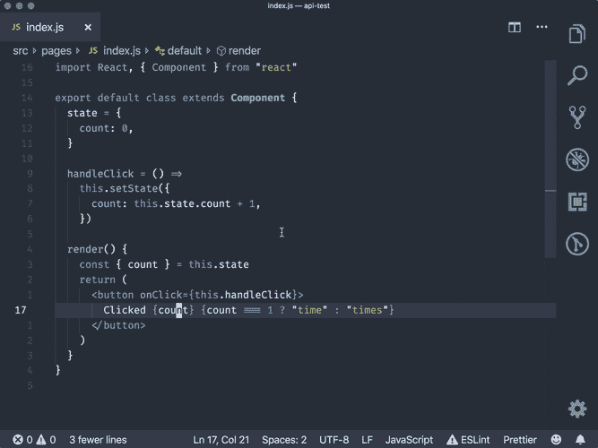
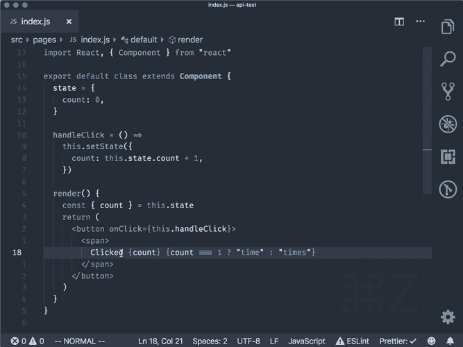
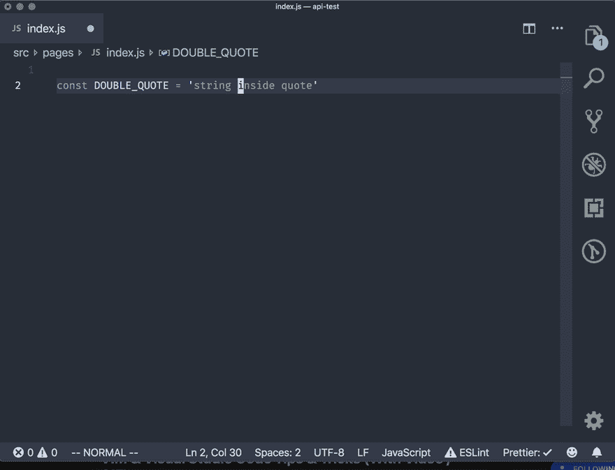
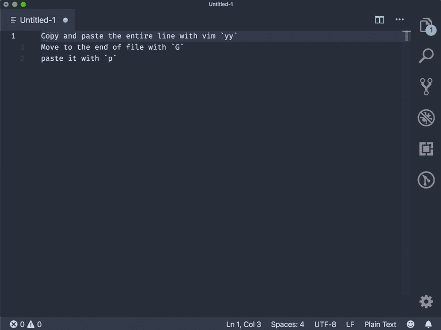

# VIM & Visual Studio 代码提示和技巧(带视频/ GIF)

> 原文：<https://dev.to/muhajirdev/vim-visual-studio-code-tips-tricks-with-video-gif-8on>

这篇文章将收集我每天使用的 VIM 和 Visual Studio 代码技巧。而且**会经常更新**。敬请关注。如果你愿意，你可以在这里或者推特上关注我。我真的很想在这里听到你的反馈

Visual Studio 代码中安装的扩展:

*   [VSCodeVim](https://github.com/VSCodeVim/Vim)

## 在标签中删除

[](https://res.cloudinary.com/practicaldev/image/fetch/s--Vq3Xxtjf--/c_limit%2Cf_auto%2Cfl_progressive%2Cq_66%2Cw_880/https://cdn.hashnode.com/res/hashnode/image/upload/v1561899637547/wu98ydxWG.gif)

## 删除周围标签

[](https://res.cloudinary.com/practicaldev/image/fetch/s--AT6vuMxK--/c_limit%2Cf_auto%2Cfl_progressive%2Cq_66%2Cw_880/https://cdn.hashnode.com/res/hashnode/image/upload/v1561899815957/rY6Rk-Qp8.gif)

*2019 年 6 月 30 日更新*

## 变单引号为双引号

[](https://res.cloudinary.com/practicaldev/image/fetch/s--wYmgeX93--/c_limit%2Cf_auto%2Cfl_progressive%2Cq_66%2Cw_880/https://cdn.hashnode.com/res/hashnode/image/upload/v1561905097925/PfR687VHY.gif)

*2019 年 7 月 4 日更新*

## 用 Emmet 改变标记

请注意，您需要先设置键盘快捷键。按下`cmd+shift+p`然后写入`Preferences: Open Keyboard Shortcuts (JSON)`。并加上下面的

```
[
...
 {
    "key": "shift+cmd+n",
    "command": "editor.emmet.action.updateTag",
    "when": "editorTextFocus"
  },
...
] 
```

Enter fullscreen mode Exit fullscreen mode

我的完整键盘快捷键可以在我的 [github 点文件](https://github.com/muhajirdev/dotfiles/blob/master/vscode-keybindings-mac.json)中看到

[](https://res.cloudinary.com/practicaldev/image/fetch/s--XSlzO9Lm--/c_limit%2Cf_auto%2Cfl_progressive%2Cq_66%2Cw_880/https://cdn.hashnode.com/res/hashnode/image/upload/v1562235200819/Dpi0XgmSj.gif)

*更新 2019 年 7 月 11 日*

## 用 Emmet 去匹配标签

类似于上面的提示。这里我用`cmd+m`作为快捷键。你可以在我的 github dotfiles 上查看键盘快捷键文件。

[](https://res.cloudinary.com/practicaldev/image/fetch/s--rAGvUxkp--/c_limit%2Cf_auto%2Cfl_progressive%2Cq_66%2Cw_880/https://cdn.hashnode.com/res/hashnode/image/upload/v1562811003814/UHXvSZYgk.gif)

## 用 VIM 复制粘贴

[](https://res.cloudinary.com/practicaldev/image/fetch/s--boq-2tXS--/c_limit%2Cf_auto%2Cfl_progressive%2Cq_66%2Cw_880/https://cdn.hashnode.com/res/hashnode/image/upload/v1562926540034/Y0SvA7QX0.gif)

# 更新

我创建了 [VSCode.xyz](https://vscode.xyz) 作为 VSCode 提示和技巧门户。看看这个。

**这篇文章将会更新**更多的提示和技巧。敬请关注。

喜欢并分享如果你觉得有用。

如果你有额外的建议。你可以放在下面的评论里。我可能会把它也放在这个帖子里:)