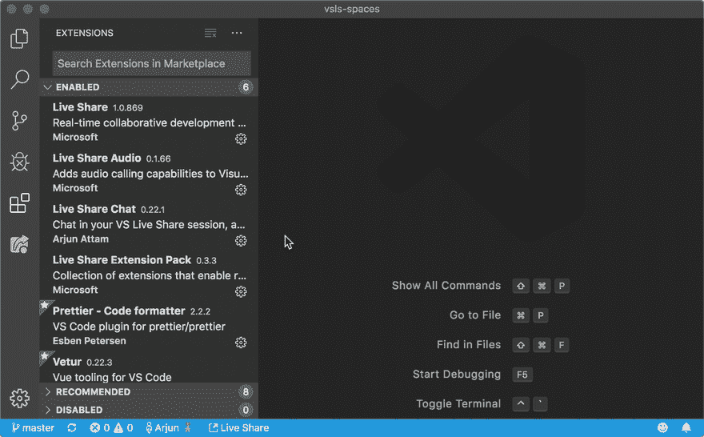
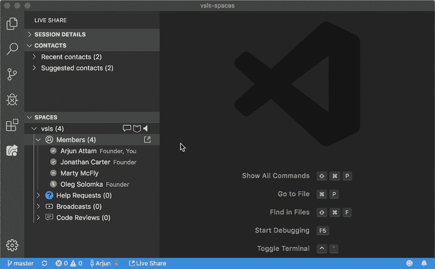
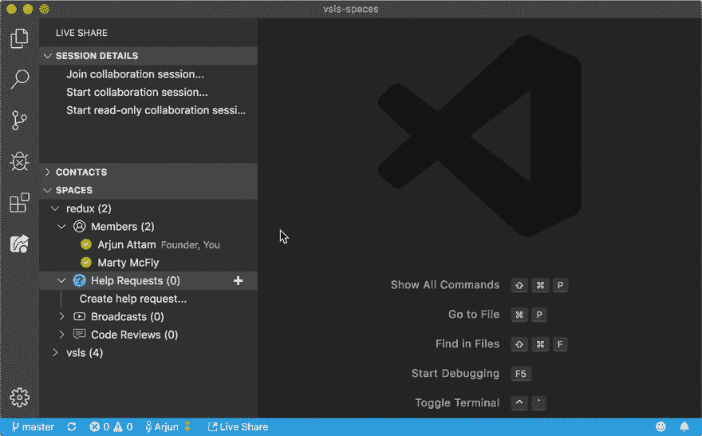
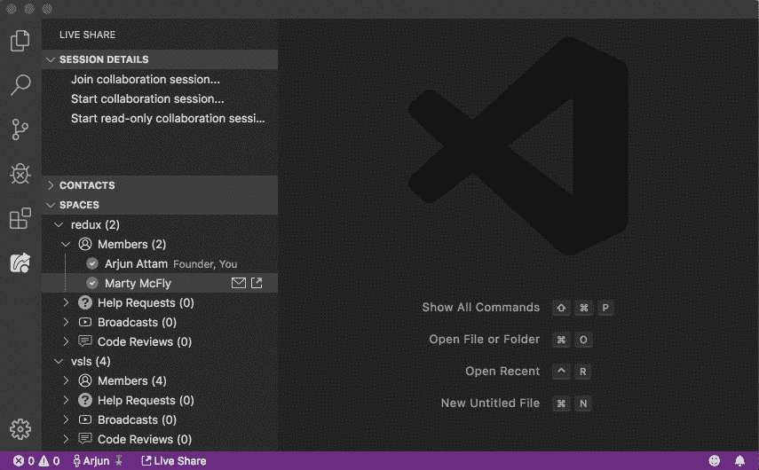

# 团队、教室和社区的虚拟协作工作区

> 原文：<https://dev.to/arjunattam/virtual-collaboration-workspaces-for-teams-classrooms-and-communities-1m2c>

我们编写的代码是我们周围许多其他开发人员的工作:它受到审查它的队友、我们使用的开源库和我们引用的堆栈溢出答案的影响。代码不是孤立编写的——它是我们与周围其他开发人员互动的结果。

GitHub、Stack Overflow 和 Slack(举几个例子)在连接我们和其他开发者方面做得非常好。但是它们与在编辑器中编写代码的过程是脱节的，而这正是最需要帮助的地方。我们希望减少寻求和提供帮助的障碍，并实现协作，而不必跨越多个应用程序，或费力地处理令人分心的通知。我们希望为团队、教室和社区构建虚拟工作空间以进行协作。

为了原型化这些想法，我们构建了 [Live Share Spaces](https://aka.ms/vsls-spaces) ，这是 VS 代码的一个扩展。今天，我们很高兴与您分享它。

# 开始使用实时共享空间

可以通过[扩展市场](https://marketplace.visualstudio.com/items?itemName=vsls-contrib.spaces)安装实时共享空间。一旦你有了扩展，你就可以发现和创建空间。空间基本上只是一个可以代表任何东西的名字:一个团队(`project-xyz`)、一个语言生态系统(`elixir`)或者一个事件(`advent-of-code-2019`)。

# 丰富的连接方式，在编辑器内

Live Share Spaces 建立在 [VS Live Share](https://visualstudio.microsoft.com/services/live-share/) 之上，为开发者提供丰富的实时协作体验。实时共享会话中的开发人员可以共同编辑、调试和跳转到共享服务器和终端会话中。Live Share Spaces 基于 VS Live Share 的功能:空间中的成员可以共享他们的在线状态，以显示他们有空或忙。他们还可以邀请成员参加实时共享会话。

Live Share Spaces 还增加了更多成员协作的方式。每个空间都有一个**聊天频道**，成员们可以在这里互相发消息。每个空间还有一个**自述**，新成员可以通过它了解空间，并找到有用的链接开始使用。

# 寻求和提供帮助

Live Share Spaces 旨在让会员能够非常轻松地表达他们寻求帮助的意图。成员可以创建**帮助请求**来通知其他成员他们的意图。其他成员可以加入请求以提供帮助，这将使他们处于由第一用户主持的实时共享会话中。

除了帮助请求之外，成员还可以创建实时共享会话，进行实时的代码审查。在 Live Share 上审查代码比创建一个 pull 请求然后等待评论要快得多。成员们还可以为**广播**创建会话，为团队棕色袋子和社区聚会直播他们的工作。在所有这些会议中，用户可以使用[现有的实时分享功能](https://dev.to/lostintangent/you-can-t-spell-collaboration-without-communication-2a3o)，如音频通话和评论。

# 邀请成员并管理共享空间

要邀请新成员加入您的空间，您可以创建并共享空间的深层链接。这些链接也可以作为徽章分享到您的回购自述文件中。

空间中的第一个成员称为创建者。创始人就像是为其他成员策划体验的管理员:例如，他们可以将空间设为私有，阻止/取消阻止成员，以及编辑空间自述文件。创始人还可以将其他成员提升为创始人，以分担管理空间的责任。

# 告诉我们你的想法！

我们很高兴在野外发布这个实验，并渴望听到你关于这个看起来是否有趣的意见。为您的团队/社区创建一个空间，或者让我们知道阻碍您这样做的问题。

你可以在 [GitHub](https://github.com/vsls-contrib/spaces) 上找到我们和代码库。您也可以在`vsls`空间与我们联系。使用 [vsls.space](http://vsls.space) 深度链接加入 VS 代码中的空格(或者 [vsls.space？圈内人](http://vsls.space?insiders)，如果你更喜欢圈内人的话)。期待在那里见到你！