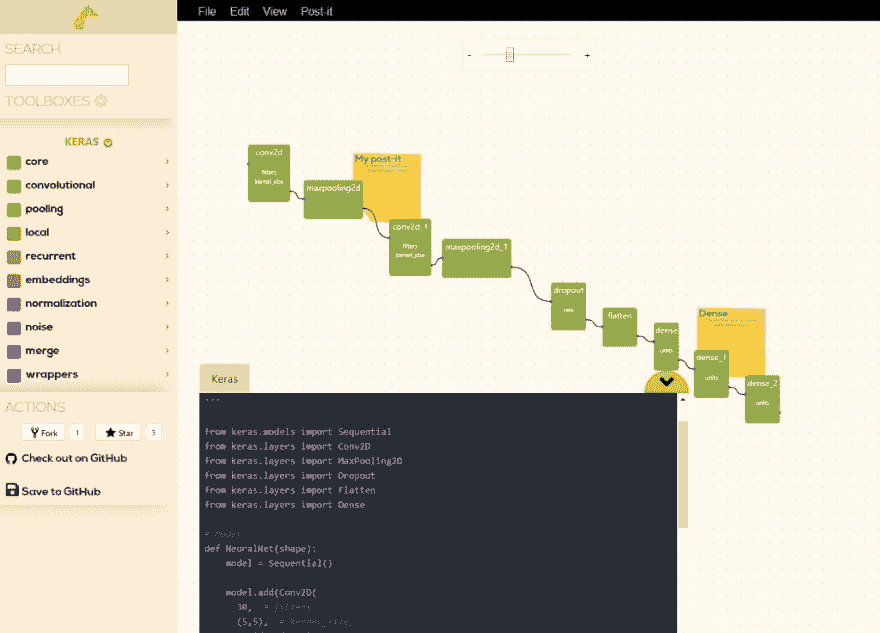

# 使用 GiraffeTools 的视觉机器学习(Keras)

> 原文：<https://dev.to/timvanmourik/visual-machine-learning-keras-with-giraffetools-3pai>

***注意:关于 GiraffeTools 的主要文章可以在这里找到* * *

当我开始进入‘机器学习’的兔子洞时，这是一次令人费解和困惑的经历。在构建了我的第一个数字识别网络之后，我觉得名为 Conv2D、MaxPooling 或 DropOut 的晦涩模块的串联并不十分直观。尽管结果出色地预测了我输入模型的每一个新的手写数字，但我感觉自己并不知道自己在做什么。更重要的是，我知道如何将它应用到我自己的数据中。

对于机器学习领域的新手来说，这是一个相当大的障碍。除此之外，还要熟练掌握在您的数据上运行网络所需的编码。如果我们能降低这个障碍，岂不是很酷？

### 简介:带长颈鹿工具的 Keras

如果你能以图形方式构建你的机器学习网络会怎么样？并且轻松地将网络与您的其余代码集成并共享结果？要是有工具来做一个 **G** 图形 **I** 界面**R**E 生产 **A** 分析 **F** 或工作**F**F**E**实验就好了！

这就是 GiraffeTools:一个完全[开源的](https://github.com/GiraffeTools/GiraffeTools) web 应用程序，允许你构建 Keras 网络。它会自动创建代码，您可以将这些代码作为新提交直接保存到 GitHub 存储库中。您的模型现在可以在 https://giraffe.tools/workflow/的[[**YOUR _ GITHUB _ HANDLE**]](https://giraffe.tools/workflow/%5BYOUR_GITHUB_HANDLE%5D)/[**YOUR _ REPOSITORY**/[**YOUR _ BRANCH _ OR _ COMMIT**]访问。

举个例子，用 Keras 建立一个简单的数字识别网络。我的 **TimVanMourik** Github 账户内我的**keras-giraffe tools-digital-recognition**库的 **master** 分支可在以下位置查看:

> [https://giraffe . tools/workflow/TimVanMourik/keras-giraffe tools-digit-recognition/master](https://giraffe.tools/porcupine/TimVanMourik/keras-giraffetools-digit-recognition/master)

[](https://res.cloudinary.com/practicaldev/image/fetch/s--HkBIFDkv--/c_limit%2Cf_auto%2Cfl_progressive%2Cq_auto%2Cw_880/https://cdn-images-1.medium.com/max/1024/1%2ALeAUSZgqZrRlL57SXvk8Ug.png)

<figcaption>[https://giraffe.tools/](https://giraffe.tools/)[工作流](https://giraffe.tools/porcupine/TimVanMourik/keras-giraffetools-digit-recognition/master)[/TimVanMourik/keras-giraffe tools-digit-recognition/master](https://giraffe.tools/porcupine/TimVanMourik/keras-giraffetools-digit-recognition/master)</figcaption>

我是如何构建的呢？

*   我将 Keras 模块拖放到编辑器中
*   我将它们连接起来，生成一个顺序网络(在本教程之后设计)
*   GiraffeTools 自动生成类似的 Python-Keras 代码
*   “保存到 GitHub”按钮将 Python 代码保存到我的存储库([这个 Python 文件](https://github.com/TimVanMourik/keras-giraffetools-digit-recognition/blob/master/GIRAFFE/code/neural_net.py))，以及可视化管道表示([这个 JSON 文件](https://github.com/TimVanMourik/keras-giraffetools-digit-recognition/blob/master/GIRAFFE/porcupipeline.pork))
*   我手动编写 Python 代码加载 MNIST 数据，加载 GiraffeTools NeuralNet ( [普通 python](https://github.com/TimVanMourik/keras-giraffetools-digit-recognition/blob/master/digit_recognition.py) 或 [Jupyter 笔记本](https://github.com/TimVanMourik/keras-giraffetools-digit-recognition/blob/master/digit_recognition.ipynb)

```
# Load MNIST data
from keras.datasets import mnist
# Load NeuralNet as defined and saved by the editor
from GIRAFFE.code.neural\_net import NeuralNet 
```

*   正如您对任何 Keras 网络所做的那样，从这里您可以构建、编译和安装您的 NeuralNet:

```
# Preprocess MNIST data
...
# build the model
model = NeuralNet(num_classes)
# Compile the model
model.compile(
   loss='categorical_crossentropy',
   optimizer='adam', 
   metrics=['accuracy']
)
# Fit the model
model.fit(
   X_train, 
   y_train,
   validation_data=(X_test, y_test),         
   epochs=10,         
   batch_size=200
) 
```

此示例的所有代码可从以下位置获得:

[TimVanMourik/keras-giraffe tools-数字识别](https://github.com/TimVanMourik/keras-giraffetools-digit-recognition)

### 入门

最简单的方法就是叉上面的回购，从那里开始！如果你想从头开始，那就去吧:[https://giraffe.tools/workflow](https://giraffe.tools/workflow)。

但是有一个警告:此时您必须指向存储库根目录下的 GIRAFFE.yml 文件中的 keras 节点。这是如何工作的你可以在 GiraffeTools 的主文章中阅读[这里](https://dev.to/timvanmourik/giraffetools-a-generic-online-workflow-editor-4f6j-temp-slug-2730789)。TLDR 是:如果指向您的函数库文件，您也可以将 GiraffeTools 用于任何其他数据分析管道。我为 Keras 应用程序预先制作并链接了这个。

### 您的输入！

我相对来说是机器学习的新手，所以非常感谢任何有助于改善这一点的帮助！通过评论区，GitHub，或者 [GiraffeTools Slack](https://giraffe.tools/slack) 。此外，我很想把 PyTorch 也连接起来，但是我从来没有用过它。如果你有 PyTorch 的经验，请联系我们，我们一起打造！