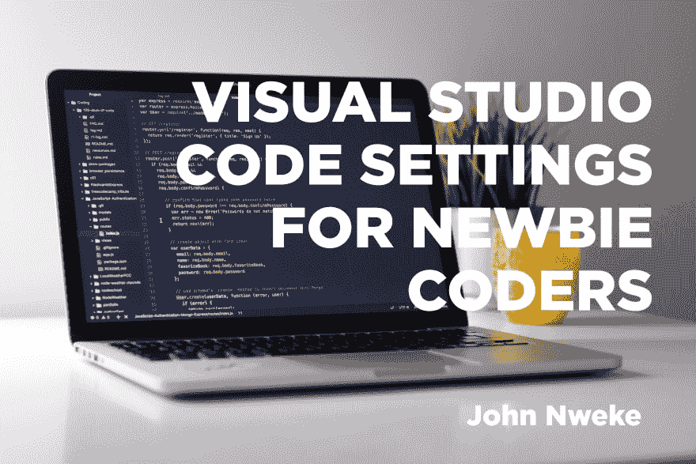
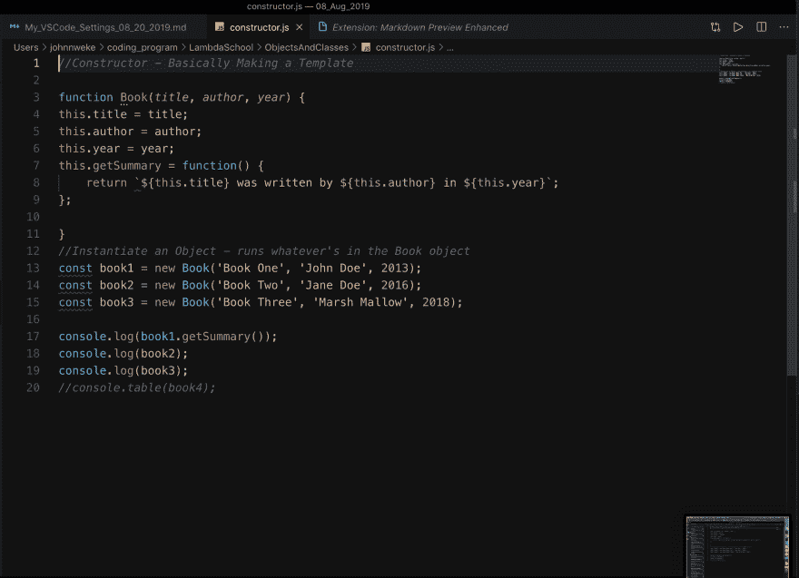
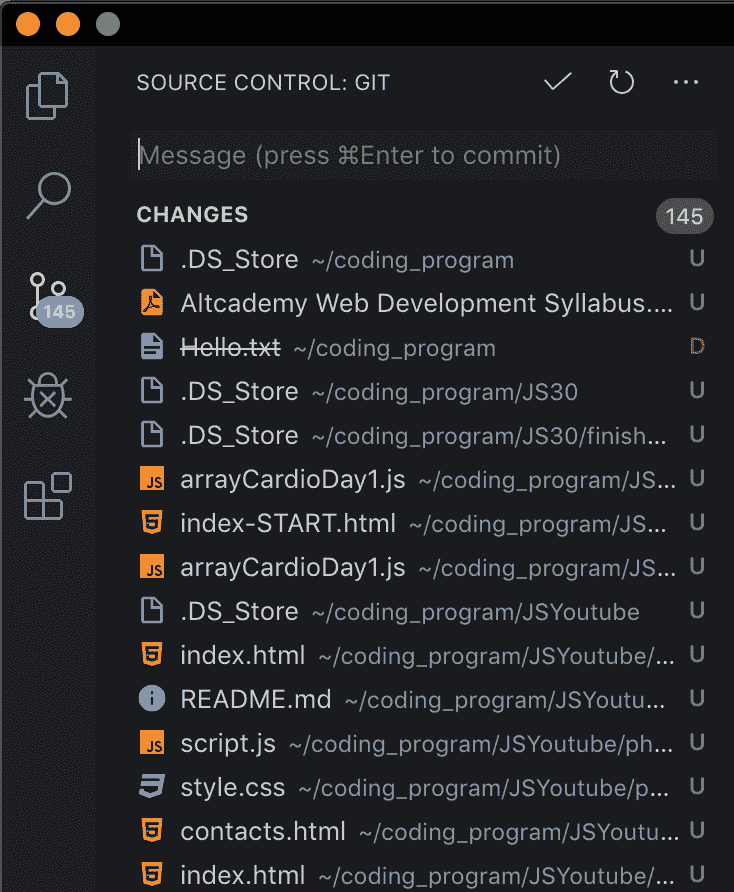
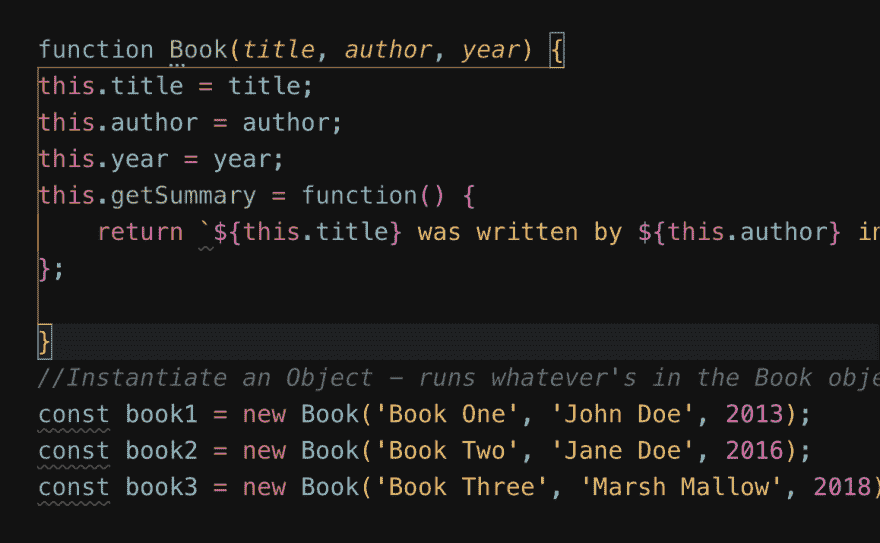
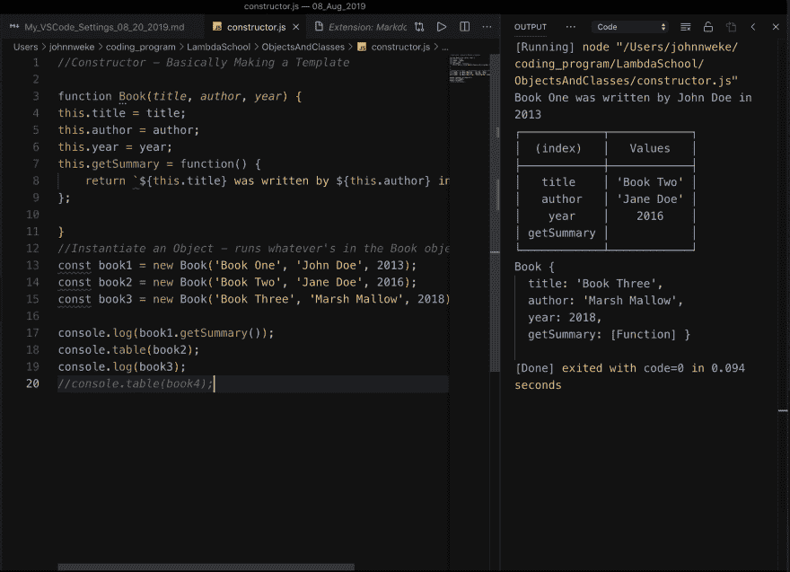
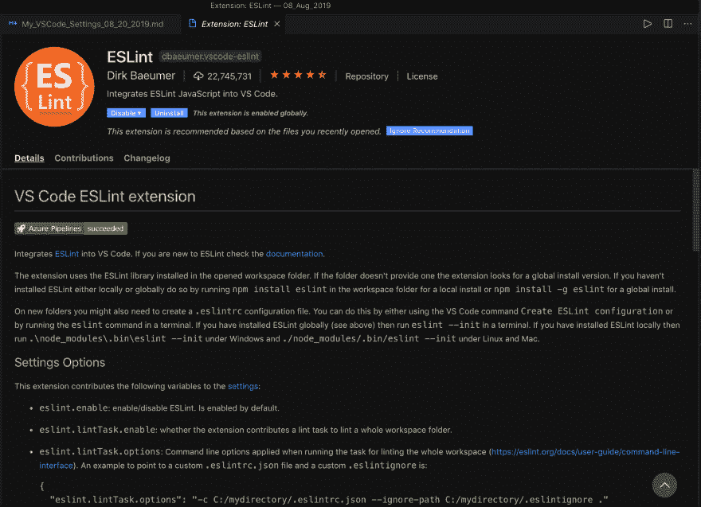
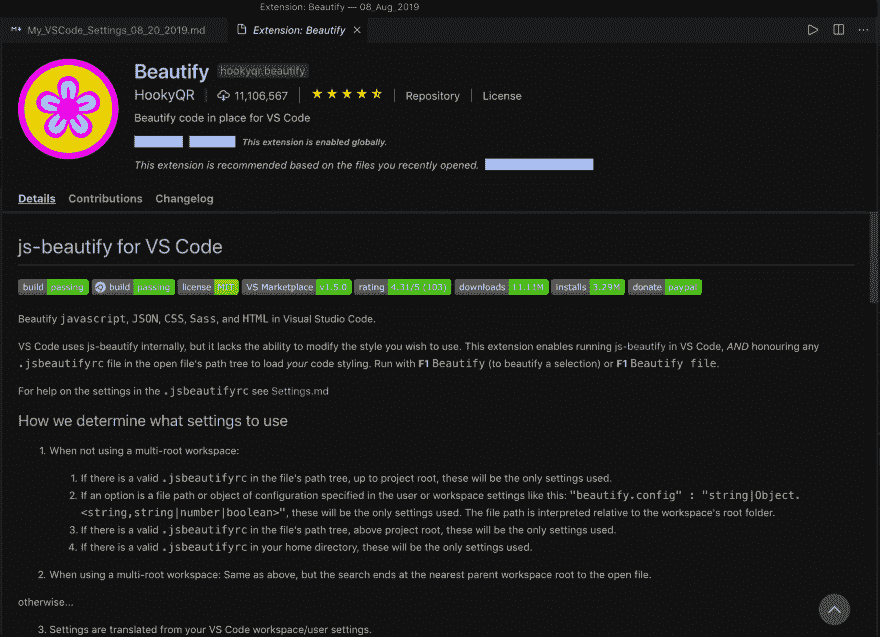
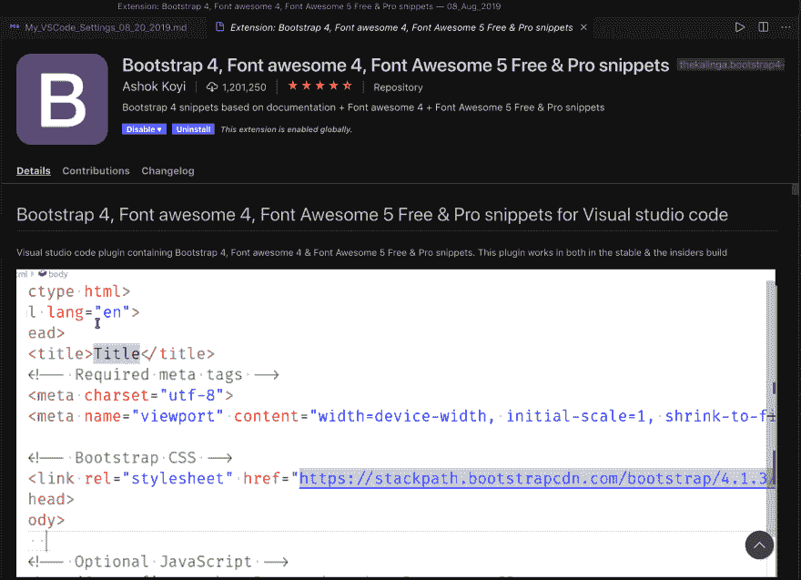

# 新手程序员的 Visual Studio 代码设置

> 原文：<https://dev.to/johnnweke/visual-studio-code-settings-for-newbie-coders-34pc>

# VS 新手程序员的代码设置

*图片:[@ clemhlrdt](https://twitter.com/clemhlrdt)via un splash；设计:[@ John _ nwe ke](https://twitter.com/john_nweke)T5】*

众所周知， [Visual Studio 代码](https://code.visualstudio.com)是当今开发的头号代码编辑器。如今，使用 VS 代码并对其深信不疑的程序员比例高得惊人——这也是有充分理由的！它有 400 多种设置，可以调整以适应每个用户的需求，加上一堆它能做的额外事情[。](https://vscodecandothat.com/)

然而，仅仅因为它有 400 个设置并不意味着你需要改变所有的设置。很多次，我发现自己陷入了*的兔子洞，忙着无所事事*，而我却改变了代码编辑器上的几个设置。各位，这不值得。如果你正在学习西班牙语，最好花时间学习和说，而不是制作漂亮的小卡片，上面写着“你好！”

我写了一个简短的扩展列表，供您立即设置和运行。如果我错过了，让我知道！

* * *

## 面向新程序员的 Visual Studio 代码扩展列表

### **1。One Dark Pro Monokai Darker**

这是我目前使用的颜色主题。颜色更好，更丰富。注释是灰色的，所以重点是代码！

**其他选项:** Atom One Dark，Sublime Material，Visual Studio Dark

* * *

### **2。素材图标主题**

这将把侧面板上的文件图标变成容易识别的图标——这样你就能立即知道你是在 HTML 文件、CSS 文件还是 JS 文件中。

* * *

### **3。支架对着色机**

没有什么比花了 5 个小时调试代码却发现错过了右括号更令人沮丧的了！括号对着色程序帮助您直观地看到每个括号或花括号是如何与其配对连接的。\
提示:VS 代码也会自动为您关闭括号和花括号。那不是很棒吗？

* * *

### **4。代码运行器**

这使得你可以直接在 VS 代码中运行你的代码——并且省去你在谷歌 Chrome 控制台的几个标签之间来回切换的压力。VSCode 现在是您的终端！您可以选择想要运行的编程语言，或者将默认语言设置为 Javascript。\
[T3】](https://res.cloudinary.com/practicaldev/image/fetch/s--egbykTC0--/c_limit%2Cf_auto%2Cfl_progressive%2Cq_auto%2Cw_880/https://i.ibb.co/9qtRkFc/Code-runner-Image-2.png)

* * *

### **5。ESLint 和 JSHint**

它们是两个不同的扩展，但是它们作为一对工作得很好，允许你找出你的代码有什么问题。ESLint 会告诉您 Javascript 代码中是否有问题。JS Hint(就像它的名字一样)为您的 Javascript 提供了提示(也提供了一些 ESLints 函数)。相当不错。

* * *

### **6。美化**

这有助于使您的代码可读，并在必要的地方添加制表符(或空格)，以便您可以看到您的代码是如何嵌套的。

* * *

### **7。降价预览增强**

这让你可以使用 [Markdown 语法](https://www.makeuseof.com/tag/printable-markdown-cheat-sheet/)在 VS 代码中写文章(就像这篇文章),看看最终产品会是什么样子。

* * *

### **8。自举 4，字体牛逼 4，字体牛逼 5 免费&专业片段**

不要让长得可笑的名字欺骗了你——这是一个超级有用的扩展，它允许你以快捷方式将 Bootstrap 4 插入到你的项目中。如果你将使用 Bootstrap 来原型化你的想法(这是你应该做的)，这将帮助你在很短的时间内完成。

* * *

就是这样！如果您是编程或 VS 代码的新手，这些是您需要设置和运行的基础。不要花 3 周时间调整你的代码编辑器；继续实际编写一些代码。你怎么想呢?

顶部见，约翰。

推特: [@john_nweke](https://twitter.com/john_nweke)