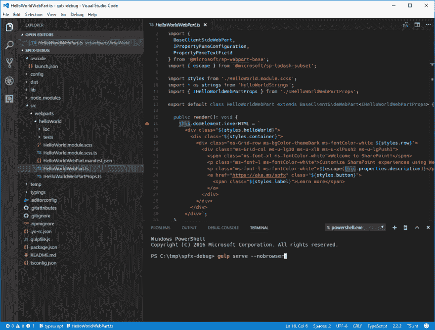
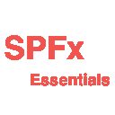

# Visual Studio 代码:使用 SPFx 的基本扩展

> 原文：<https://dev.to/fabiofranzini/visual-studio-code-the-essential-extensions-for-working-with-spfx-3m0p>

当我们使用 SPFx (SharePoint Framework)时，我们将使用的代码编辑器几乎完全是 Visual Studio 代码。

对于那些不熟悉的人来说，Visual Studio Code 是微软为 Windows、Linux 和 macOS 开发的源代码编辑器，具有开源许可证，基于 electronic。该编辑器支持调试、集成 Git 控件、语法高亮、智能感知、代码片段和代码重构。

在这篇文章中，我想收集那些不应该错过使用 SPFx 开发 Visual Studio 代码的扩展。

以下是我推荐的几个:

*   [SPFx 调试配置](https://marketplace.visualstudio.com/items?itemName=eliostruyf.spfx-debug):该扩展包含 SharePoint 框架调试配置，用于在 Visual Studio 代码中调试您的代码。
*   [SPFx 片段](https://marketplace.visualstudio.com/items?itemName=eliostruyf.spfx-snippets) : SharePoint 框架片段。
*   [SPFx 本地化](https://marketplace.visualstudio.com/items?itemName=eliostruyf.vscode-spfx-localization):管理项目本地化的 SharePoint 框架扩展。
*   [SPFx 任务运行器](https://marketplace.visualstudio.com/items?itemName=eliostruyf.vscode-spfx-task-runner):轻松运行 SPFx 任务，启动服务器，打包解决方案等。
*   [SPFx 移除组件](https://marketplace.visualstudio.com/items?itemName=eliostruyf.vscode-spfx-remove-components):轻松从 SPFx 解决方案中移除组件
*   [Rencore SPFx 脚本检查](https://marketplace.visualstudio.com/items?itemName=RencoreGmbH.vscode-spfx-script-check):检查外部脚本的性能，并获取代码片段以将其包含在 SharePoint 框架项目中。
*   [Rencore 部署 SPFx 包](https://marketplace.visualstudio.com/items?itemName=RencoreGmbH.vscode-spfx-deploy-package):轻松将 SharePoint 框架解决方案包部署到 SharePoint Online。
*   [Rencore 租户级 SPFx 扩展部署信息](https://marketplace.visualstudio.com/items?itemName=RencoreGmbH.rencore-tenant-wide-spfx-extension-deployment):轻松为您的 SPFx 扩展添加租户级部署信息。

其他与 SPFx 不直接相关但非常有用的扩展有:

*   npm Intellisense:Visual Studio 代码插件，在导入语句中自动完成 NPM 模块。
*   [JSON 到 TS](https://marketplace.visualstudio.com/items?itemName=MariusAlchimavicius.json-to-ts) :将 JSON 对象转换成 TypeScript 接口。这将为您节省大量创建新界面的时间。
*   React 组件 : React 组件可以节省你搭建 React 组件的时间。
*   [VSCode React Refactor](https://marketplace.visualstudio.com/items?itemName=planbcoding.vscode-react-refactor) :这个简单的扩展为 React 开发者提供了重构代码的动作。
*   React Playground :这个插件帮助自动提供 React 组件的 webview playground。

 

<figcaption>SPFx 要领</figcaption>

其中一些扩展直接打包在一个名为" [SPFx Essentials](https://marketplace.visualstudio.com/items?itemName=eliostruyf.spfx-essentials) 的扩展中，这个扩展是由这些扩展的作者之一，传奇人物 [Elio Struyf](https://twitter.com/eliostruyf) 创建的，我个人非常感谢他，因为这些扩展在 SPFx 的开发过程中每天都在帮助我。

总之，我推荐安装的扩展有:

*   [SPFx 要领](https://marketplace.visualstudio.com/items?itemName=eliostruyf.spfx-essentials)
*   [反应成分](https://marketplace.visualstudio.com/items?itemName=dericcain.react-components)
*   [VSCode React Refactor](https://marketplace.visualstudio.com/items?itemName=planbcoding.vscode-react-refactor)
*   [反应操场](https://marketplace.visualstudio.com/items?itemName=wmira.react-playground-vscode)