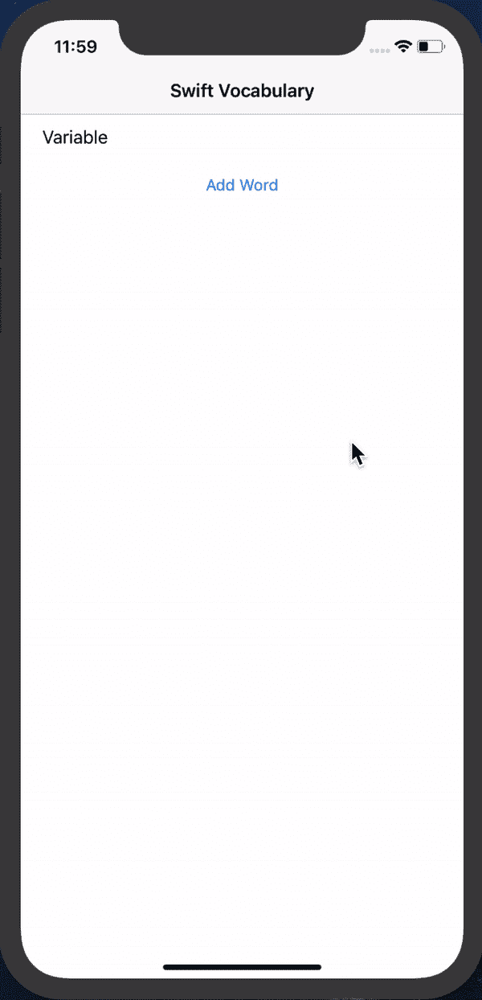
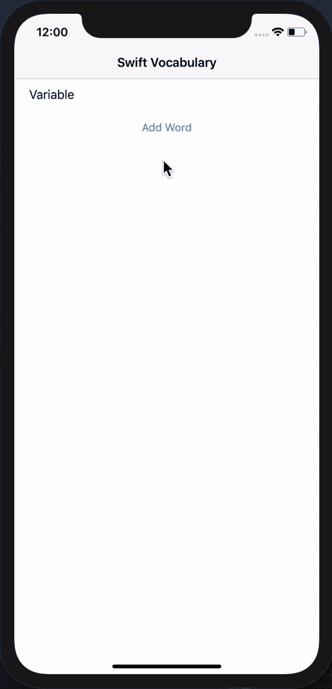
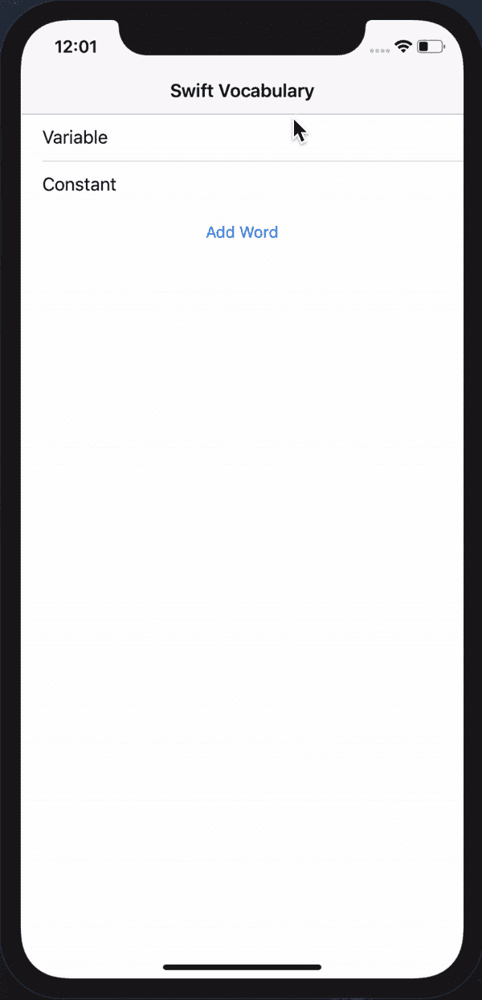

# 词汇单词

> 原文：<https://dev.to/casualty/vocabulary-words-49b3>

# 雨燕词汇

## 托马斯迪 / [迅捷词汇](https://github.com/thomasdye/SwiftVocabulary)

<article class="markdown-body entry-content container-lg" itemprop="text">

# 快速词汇

### 单击一个单元格以转到它的定义视图控制器

[](https://raw.githubusercontent.com/thomasdye/SwiftVocabulary/master/swiftvocabulary1.gif)

### 点按底部的“添加单词”以提交单词、定义和示例

[](https://raw.githubusercontent.com/thomasdye/SwiftVocabulary/master/swiftvocabulary2.gif)

### 向左滑动以删除单元格

[](https://raw.githubusercontent.com/thomasdye/SwiftVocabulary/master/swiftvocabulary3.gif)

</article>

[View on GitHub](https://github.com/thomasdye/SwiftVocabulary)

## 让我们来做一个例子

```
struct VocabularyWord {
    let word: String
    let definition: String
    let example: String
} 
```

## 现在让我们使用词汇单词类型创建一个数组

```
 var vocabWords: [VocabularyWord] = [VocabularyWord(word: "word1", definition: "definition1", example: "example1"), VocabularyWord(word: "word2", definition: "definition2", example: "example2")] 
```

## 现在我们需要将它们添加到它们的单元格中

```
 override func numberOfSections(in tableView: UITableView) -> Int {

        return 1
    }

    override func tableView(_ tableView: UITableView, numberOfRowsInSection section: Int) -> Int {

        return vocabWords.count
    }

    override func tableView(_ tableView: UITableView, cellForRowAt indexPath: IndexPath) -> UITableViewCell {
        let cell = tableView.dequeueReusableCell(withIdentifier: "ReuseIdentifier", for: indexPath)

        let word = vocabWords[indexPath.row]
        cell.textLabel?.text = word.word
        return cell
    } 
```

## 现在我们可以将单元格链接到定义视图

```
 override func prepare(for segue: UIStoryboardSegue, sender: Any?) {
        if segue.identifier == NameOfSegueHere" {

            guard let indexPath = tableView.indexPathForSelectedRow,
                let definitionVC = segue.destination as? ViewControllerNameHere else { return }

            let cellWord = vocabWords[indexPath.row]

            definitionVC.cellWord = cellWord

        }
    } 
```

## 我们还可以添加这个很酷的功能来删除不想要的物品

```
 override func tableView(_ tableView: UITableView, commit editingStyle: UITableViewCell.EditingStyle, forRowAt indexPath: IndexPath) {
        if editingStyle == UITableViewCell.EditingStyle.delete {
            vocabWords.remove(at: indexPath.row)
            tableView.deleteRows(at: [indexPath], with: UITableView.RowAnimation.automatic)
        }

    } 
```