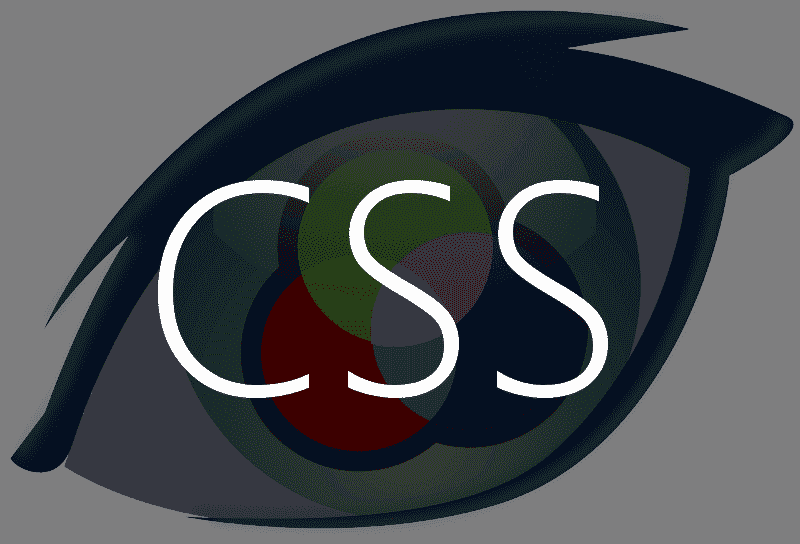

# VOV。CSS —简介

> 原文：<https://dev.to/vaibhav111tandon/vov-css-the-intro-1igm>

### VOV。CSS —简介

<figure> 

<figcaption>图片来自 nicolapietroluongo.com</figcaption>

</figure>

为了实现小动画，我们通常要写很多行代码，作为一个懒人，我对为我的所有项目一次又一次地写同样的 CSS 一点也不感兴趣。

面对这样的问题，我有了一个想法，创建自己的动画库。是的，我知道有成千上万的人，所以为什么不加上我自己的呢？

这是一个基于类实现的小型 CSS 库，所有代码都是使用关键帧编写的，因此易于处理和使用。

[VOV。CSS](https://vaibhav111tandon.github.io/vov.css/) 使用起来非常简单，你所需要做的就是将 CSS 文件添加到你的 HTML 文件中。

运筹学

您也可以在 HTML 文件的头部分添加 CDN。