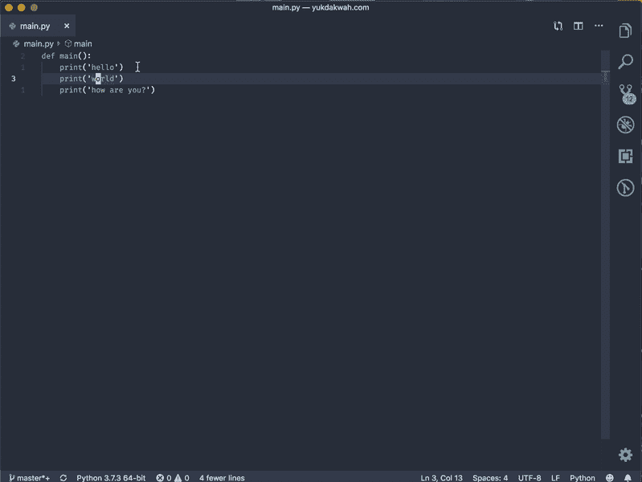
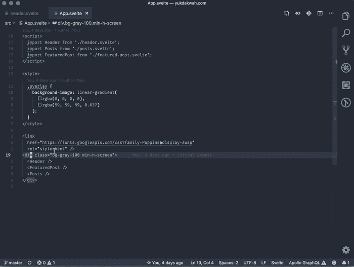
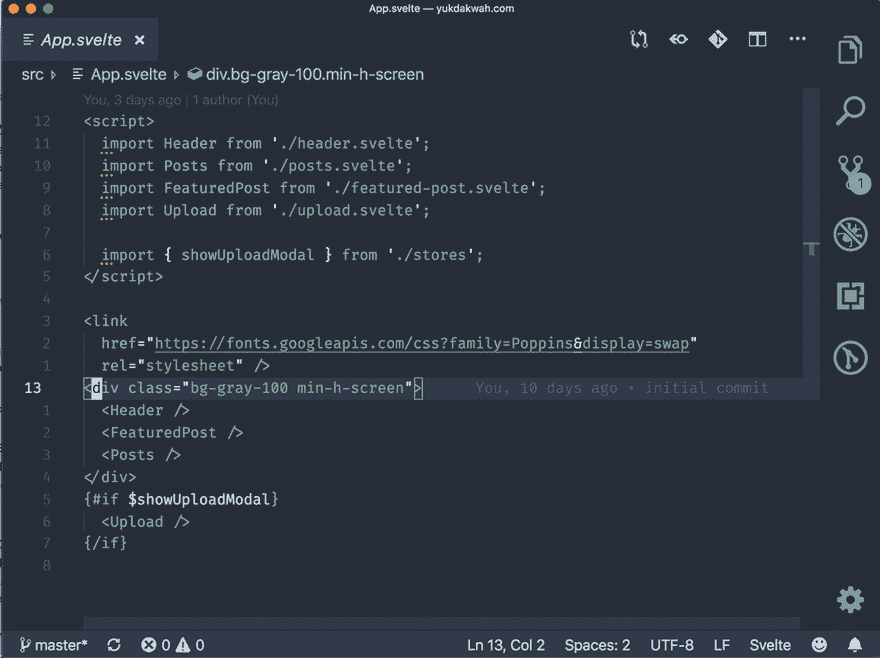

# GIF 格式的 VSCode 提示和技巧集

> 原文：<https://dev.to/muhajirdev/vscode-tips-tricks-collection-in-gif-2nai>

嘿大家好。

我刚刚发布了 [VSCode.xyz](https://vscode.xyz) ，这是一个 GIF 格式的 Visual Studio 代码提示&技巧的集合。

我很想听听你们的反馈。

这里有一些有趣的提示和技巧

## 探索更多

你可以在 [vscode.xyz](https://vscode.xyz) 浏览更多 gif

