# Vue 仪表板——开源和免费

> 原文：<https://dev.to/sm0ke/vue-dashboard-open-source-apps-1gd1>

各位编码员好，

这篇文章展示了一个精选列表，其中包含在许可许可(麻省理工学院 LGPL 分校)下发布的开源和免费的 **Vue 仪表盘**，并得到了所有公司的积极支持。对于新手来说， **Vue** 是一个领先的 JS 框架，用于编写由 **[管理仪表板](https://www.admin-dashboards.com)** 提供的快速内容的交互式用户界面。

* * *

> *披露* - **本帖包含附属链接**。

如果你用这些链接买东西(没有额外的费用)，我可能会赚取佣金，产品或服务。**谢谢！**

* * *

## [检视材料仪表板](https://www.creative-tim.com/product/vue-material-dashboard-2?AFFILIATE=128200)

Vue Material Dashboard 2 是一个基于 Vue3 & Bootstrap5 的新管理模板。如果您是一名开发人员，希望创建一个对开发人员友好的、功能丰富的、高度可定制的管理仪表板，下面是您的选择。

*   👉 [Vue 材料仪表板](https://www.creative-tim.com/product/vue-material-dashboard-2?AFFILIATE=128200) -产品页面
*   👉 [Vue 材料仪表板](https://demos.creative-tim.com/vue-material-dashboard-2/#/dashboard?AFFILIATE=128200) -现场演示

[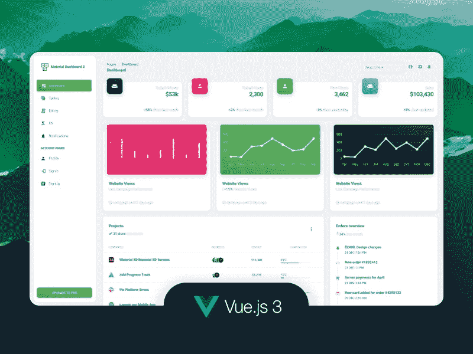](https://res.cloudinary.com/practicaldev/image/fetch/s--WVAePreC--/c_limit%2Cf_auto%2Cfl_progressive%2Cq_auto%2Cw_880/https://dev-to-uploads.s3.amazonaws.com/uploads/articles/szuqyo94fc46ajn0mf69.png)

* * *

## [柔性视图 3](https://www.wrappixel.com/templates/flexy-vuejs-admin-free/?ref=157)

Flexy Vuetify Vue3 Dashboard Lite 是一个基本但非常有用的 Vuetify dashboard 模板，可用于您的项目。如果你正在为你的后端项目寻找一个现代而干净的管理模板，Flexy Admin 是正确的选择。

*   👉 [Flexy Vue 模板](https://www.wrappixel.com/templates/flexy-vuejs-admin-free/?ref=157) -产品页面
*   👉 [Flexy Vue 模板](https://flexy-vuejs-free.netlify.app/dashboard) -现场演示

[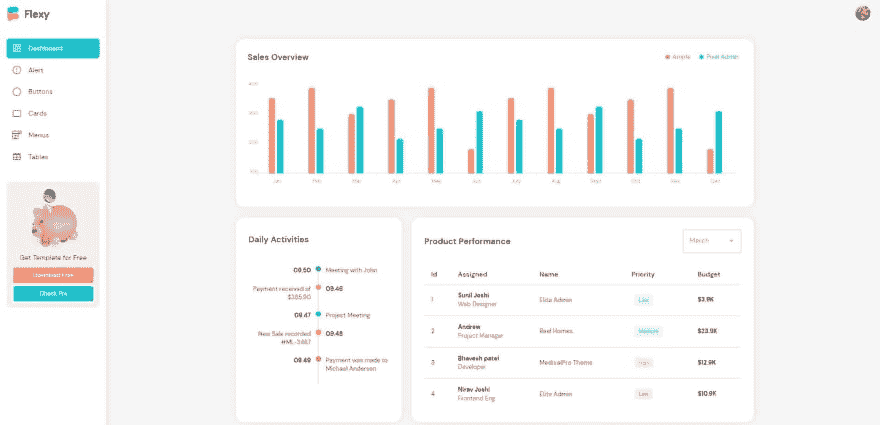](https://res.cloudinary.com/practicaldev/image/fetch/s--4MfAsoua--/c_limit%2Cf_auto%2Cfl_progressive%2Cq_auto%2Cw_880/https://user-images.githubusercontent.com/51854817/186126220-ef01d34a-d5a4-40e5-85fa-8260066c9771.png)

* * *

## [缪斯观 Ant 仪表盘](https://www.creative-tim.com/product/muse-vue-ant-design-dashboard?AFFILIATE=128200)

**Muse Vue Ant Design Dashboard**是一个漂亮的 Ant Design Vue admin dashboard，有大量的组件，设计得看起来很漂亮，很有条理。所有组件在颜色上都有变化，您可以使用 SASS 文件和类轻松修改。使用这个模板，设计人员和开发人员可以节省大量从原型到全功能代码的时间，因为所有的元素都实现了。

*   👉 [Muse Vue Ant 仪表盘](https://bit.ly/3xJ13IH) -产品页面
*   👉 [Muse Vue Ant 仪表盘](https://bit.ly/3xGJlp1) -现场演示

[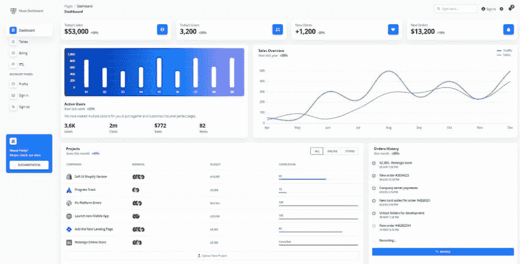](https://res.cloudinary.com/practicaldev/image/fetch/s--KwLt6vEv--/c_limit%2Cf_auto%2Cfl_progressive%2Cq_auto%2Cw_880/https://dev-to-uploads.s3.amazonaws.com/uploads/articles/djpt2np2eva6gy4w6d82.jpg)

* * *

## [视图软 UI 控制板](https://www.creative-tim.com/product/vue-soft-ui-dashboard?AFFILIATE=128200)

Vue Soft UI Dashboard 由 70 多个前端独立元素组成，如按钮、输入、导航条、导航标签、卡片或提醒，让您自由选择和组合。所有组件在颜色上都有变化，您可以使用 SASS 文件和类轻松地修改这些变化。您将节省大量从原型到全功能代码的时间，因为所有元素都已实现。

*   👉 [Vue 软 UI 仪表板](https://www.creative-tim.com/product/vue-soft-ui-dashboard?AFFILIATE=128200) -产品页面
*   👉 [Vue 软 UI 仪表盘](https://demos.creative-tim.com/vue-soft-ui-dashboard/#/dashboard?AFFILIATE=128200) -现场演示

[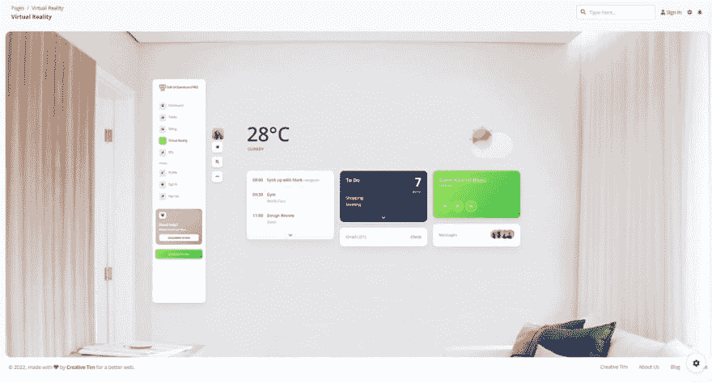](https://res.cloudinary.com/practicaldev/image/fetch/s--OmEDGPD5--/c_limit%2Cf_auto%2Cfl_progressive%2Cq_auto%2Cw_880/https://dev-to-uploads.s3.amazonaws.com/uploads/articles/s0381lpi49v9vnwvhkqs.png)

* * *

## [【Xtreme view admin lite】](https://www.wrappixel.com/templates/xtreme-vuesax-admin-lite/?ref=157)

Xtreme BootstrapVue Admin Lite 易于使用，是基于 Vue CLI、Vuex 和 BootstrapVue 组件框架的强大 VueJs 管理仪表板模板。

*   👉 [Xtreme Vue Admin Lite](https://www.wrappixel.com/templates/xtreme-vuesax-admin-lite/?ref=157) -产品页面
*   🎁WrapPixel 制作的更多 [VueJS 模板](https://www.wrappixel.com/templates/category/vuejs-templates/?ref=157)

如果你正在为你自己或你的客户的项目构建后端管理面板，Xtreme BootstrapVue Admin Lite 是完美的选择。它具有易于使用的特性，并且高度可定制。

* * *

## [视图控制板黑](https://www.creative-tim.com/product/vue-black-dashboard?AFFILIATE=128200)

Vue Dashboard Black 是一个漂亮的 Bootstrap4 和 **Admin Dashboard** ，拥有大量的组件和独特的 UI。Vue [黑色仪表盘](https://appseed.us/ui-kit/black-design/)拥有超过 16 个独立组件，让您自由选择和组合。这意味着有成千上万种可能的组合。

*   👉 [Vue 仪表盘黑色](https://www.creative-tim.com/product/vue-black-dashboard?AFFILIATE=128200) - `product page`
*   👉 [Vue 仪表盘黑色](https://demos.creative-tim.com/vue-black-dashboard/#/dashboard?AFFILIATE=128200) - `LIVE demo`

[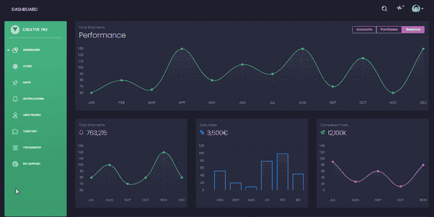](https://res.cloudinary.com/practicaldev/image/fetch/s--rAA2rdRI--/c_limit%2Cf_auto%2Cfl_progressive%2Cq_auto%2Cw_880/https://raw.githubusercontent.com/admin-dashboards/vue-dashboard-black/master/media/vue-dashboard-black-screen.png)

* * *

## [【vista 控制板-尾风 CSS】](https://www.creative-tim.com/product/vue-notus?AFFILIATE=128200)

以前的设计也可以在另一个流行的 UI 框架 Vue 中下载。这个免费的 Tailwind CSS 模板附带了预构建的示例，因此开发过程是无缝的，从我们的页面切换到真正的网站非常容易。

*   👉[顺风启动装置](https://www.creative-tim.com/product/vue-notus?AFFILIATE=128200) - `product page`
*   👉[顺风启动装置](https://demos.creative-tim.com/vue-notus/#/?AFFILIATE=128200) - `LIVE Demo`

* * *

## [检视面板检视](https://www.creative-tim.com/product/vuetify-material-dashboard?AFFILIATE=128200)

Vue 化 **Vue 仪表板**完全按照材料设计规范开发。每个组件都是手工制作的，为您的下一个伟大的应用程序带来最好的 UI 工具。开发并没有停留在谷歌规范中概述的核心组件上。在社区成员和赞助商的支持下，将会设计出更多的组件，并提供给每个人享用。

*   👉[检视立体材料](https://www.creative-tim.com/product/vuetify-material-dashboard?AFFILIATE=128200) - `product page`
*   👉[检视立体材料](https://demos.creative-tim.com/vuetify-material-dashboard/#/?AFFILIATE=128200) - `LIVE demo`

[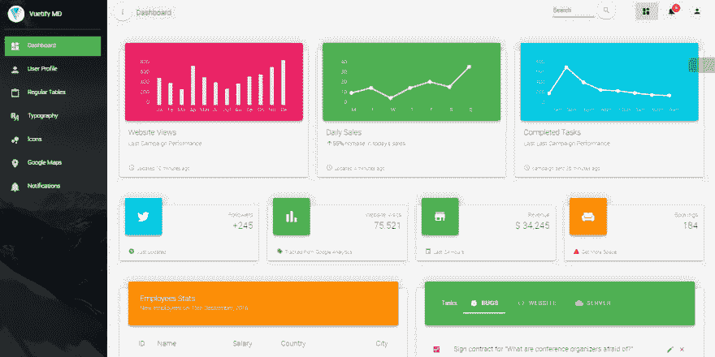](https://res.cloudinary.com/practicaldev/image/fetch/s--pc7rzVNx--/c_limit%2Cf_auto%2Cfl_progressive%2Cq_auto%2Cw_880/https://raw.githubusercontent.com/admin-dashboards/vue-dashboard/master/media/vuetify-material-dashboard-screen.png)

* * *

## [视图控制板-氩](https://www.creative-tim.com/product/bootstrap-vue-argon-dashboard?AFFILIATE=128200)

bootstrap**Vue Argon Dashboard**由 100 多个独立组件组成，让您自由选择和组合。所有组件的颜色都可能不同，您可以使用 SASS 文件轻松修改。您将节省大量从原型到全功能代码的时间，因为所有元素都已实现。

*   👉 [Vue 仪表盘氩气](https://www.creative-tim.com/product/bootstrap-vue-argon-dashboard?AFFILIATE=128200) - `product page`
*   👉 [Vue 仪表盘氩气](https://demos.creative-tim.com/bootstrap-vue-argon-dashboard/#/dashboard?AFFILIATE=128200) - `LIVE demo`

[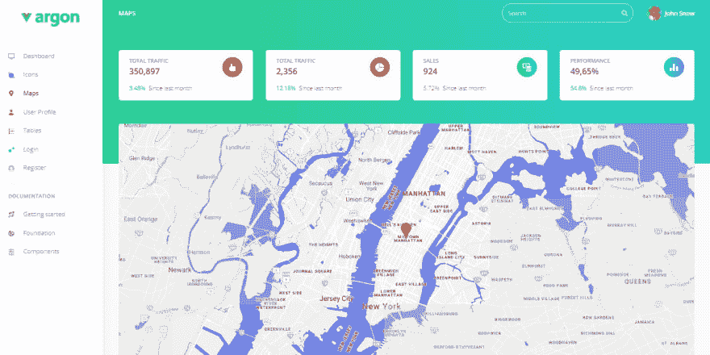](https://res.cloudinary.com/practicaldev/image/fetch/s--qsTu4bJC--/c_limit%2Cf_auto%2Cfl_progressive%2Cq_auto%2Cw_880/https://raw.githubusercontent.com/admin-dashboards/vue-dashboard/master/media/vue-dashboard-argon-screen-maps.png)

* * *

## [【vista 仪表板灯启动】](https://www.creative-tim.com/product/vue-light-bootstrap-dashboard?AFFILIATE=128200)

**Vue Dashboard**Light Bootstrap 是建立在 Bootstrap 4 和 Vue 之上的漂亮资源。它将帮助您立即开始开发仪表板。 **Vue 仪表盘灯光自举**是原灯光自举仪表盘的官方 **Vue** 版本。使用仪表板非常简单，但是需要 Javascript、Vue 和 Vue-Router 的基本知识。

*   👉 [Vue 光自举](https://www.creative-tim.com/product/vue-light-bootstrap-dashboard?AFFILIATE=128200) - `product page`
*   👉 [Vue 光自举](https://demos.creative-tim.com/vue-light-bootstrap-dashboard/#/admin/overview?AFFILIATE=128200) - `LIVE demo`

[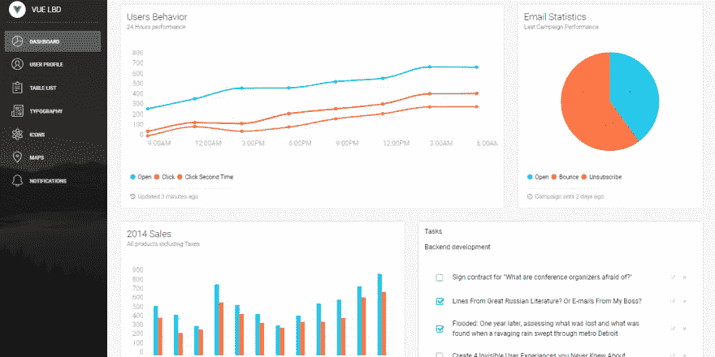](https://res.cloudinary.com/practicaldev/image/fetch/s--GhUcg3HO--/c_limit%2Cf_auto%2Cfl_progressive%2Cq_auto%2Cw_880/https://raw.githubusercontent.com/admin-dashboards/vue-dashboard/master/media/vue-light-bootstrap-screen.png)

* * *

## [视图控制板—白色设计](https://bit.ly/2JFjfQj)

**Vue Dashboard White** 是一个漂亮的 Bootstrap 4 和 Vue.js 管理仪表板，其中包含大量组件，这些组件构建在一起，看起来非常棒。您将节省大量从原型到全功能代码的时间，因为所有元素都已实现。每个元素都有颜色、样式、悬停、焦点的多种状态，您可以轻松访问和使用。

*   ✨ [Vue 仪表板白色](https://bit.ly/2JFjfQj) -产品页面
*   ✨更多 **[Vue 模板](https://bit.ly/3lkqRV4)** 由 Creative-Tim 提供

[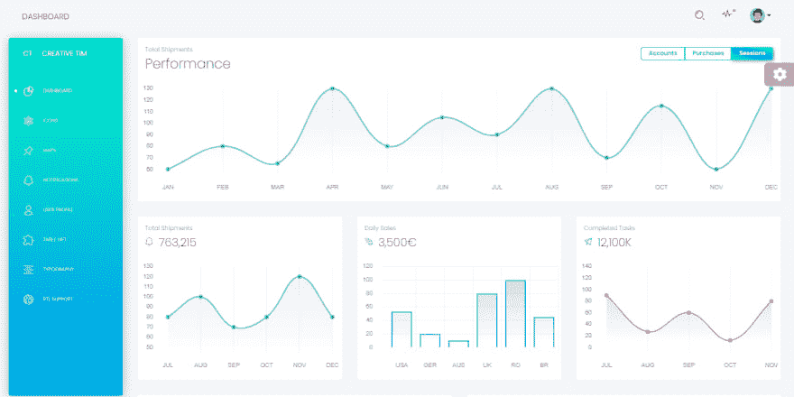](https://res.cloudinary.com/practicaldev/image/fetch/s--bDvDnW8Q--/c_limit%2Cf_auto%2Cfl_progressive%2Cq_auto%2Cw_880/https://raw.githubusercontent.com/admin-dashboards/vue-dashboard-white-design/master/media/vue-dashboard-white-design-screen.png)

* * *

## ✨ [材料验证管理模板](https://themeselection.com/products/materio-free-vuetify-vuejs-admin-template/)

由 ThemeSelection 制作并免费发布的现代 VueJS 仪表板模板。使用该产品，您的应用程序将完全响应，确保它们在桌面、平板电脑和移动设备上看起来令人惊叹，功能完美。

*   ✨ [材料认证管理模板](https://themeselection.com/products/materio-free-vuetify-vuejs-admin-template/) -产品页面
*   ✨ [材料认证管理模板](https://themeselection.com/demo/materio-vuetify-vuejs-admin-template-free/demo/dashboard) -现场演示

[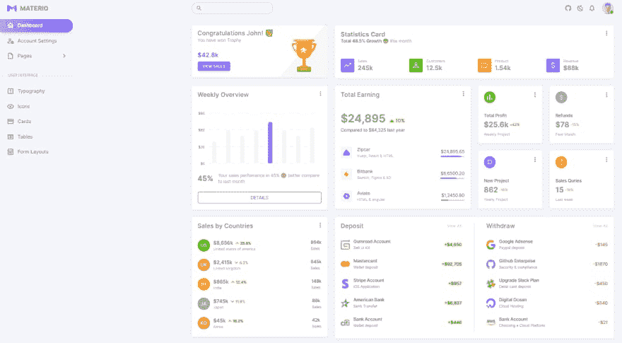](https://res.cloudinary.com/practicaldev/image/fetch/s--EeZPg-4L--/c_limit%2Cf_auto%2Cfl_progressive%2Cq_auto%2Cw_880/https://dev-to-uploads.s3.amazonaws.com/uploads/articles/yuruhoz87i27ixs7t2k8.png)

* * *

## [【vista dashboard paper】](https://bit.ly/2IkUsAs)

**Vue Dashboard Paper** 是一个漂亮而简单的管理面板，建立在 Bootstrap 和 [Vue](https://vuejs.org/) 之上，它将帮助你立即开始开发**管理面板**。使用 Vue 仪表板非常简单，但是需要 Javascript、Vue 和 Vue 路由器的基本知识。

*   ✨ [Vue 仪表板纸](https://bit.ly/2IkUsAs) -产品页面
*   ✨ **[Vue 仪表板纸 PRO](https://bit.ly/3mOtSyH)** -更多页面和组件

[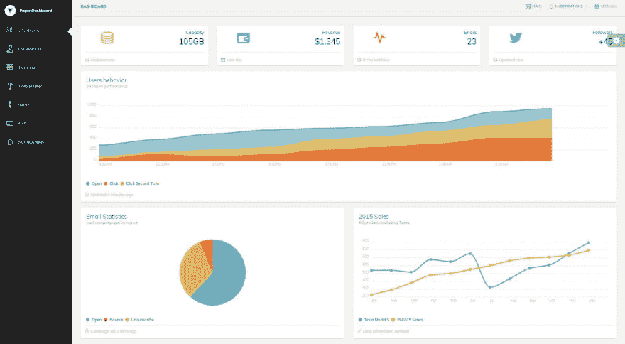](https://res.cloudinary.com/practicaldev/image/fetch/s--1UiTyvXh--/c_limit%2Cf_auto%2Cfl_progressive%2Cq_auto%2Cw_880/https://raw.githubusercontent.com/app-generator/static/master/admin-dashboards/vue-dashboard-paper-screen.jpg)

* * *

## [检视材料材料材料 Lite](https://bit.ly/37zL4Bw)

使用我们的 MaterialPro Vuejs Admin Lite，您可以为您的 web 应用程序或产品创建高质量、外观漂亮的界面。它带有谷歌的基于材料的设计和一些很棒的组件，当你创建一个项目时，这使你的生活更容易。它附带了一些设计精美的页面模板，帮助您轻松创建新页面。

*   [检视材料材料材料 Lite](https://bit.ly/37zL4Bw) 产品页
*   ✨ **[Vue 仪表盘-材质精简版](https://bit.ly/3lR5VFn)** -更多页面和组件

[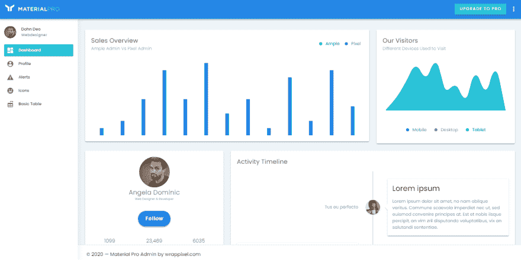](https://res.cloudinary.com/practicaldev/image/fetch/s--fFuzJ27j--/c_limit%2Cf_auto%2Cfl_progressive%2Cq_auto%2Cw_880/https://raw.githubusercontent.com/admin-dashboards/vue-dashboard-materialpro-lite/master/media/vue-dashboard-materialpro-lite-screen.png)

* * *

## 视图控制板-建筑

作为一个基础框架，ArchitectUI Vue 由@ Vue/CLI 3 . 4 . 1 版和 Bootstrap 4 Vue 实现提供支持。它包含 15 个精选的 Vue 小部件和组件，它们完美地相互集成，以创建一种通用的设计语言。为了使用这个 Vue 主题，你至少需要基本的编码技能。别担心，这个主题有非常简单的编码，并且使用 Vue 路由器作为导航链接。

*   vista 控制板建筑 github repo
*   [vista 控制板建筑演示](https://vue-dashboard-architectui-free.admin-dashboards.com/)

[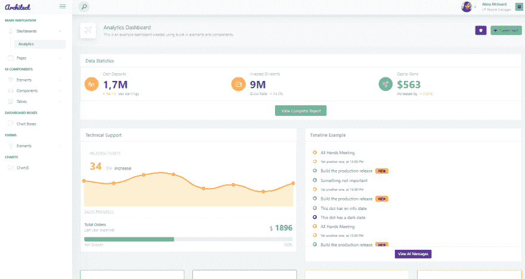](https://res.cloudinary.com/practicaldev/image/fetch/s--tcJBrTjQ--/c_limit%2Cf_auto%2Cfl_progressive%2Cq_auto%2Cw_880/https://raw.githubusercontent.com/admin-dashboards/static/master/vue-dashboard-architectui-free-screen.png)

* * *

### 类似的帖子，来自其他出版商

*   [vue . js Admin Dashboards](https://madewithvuejs.com/blog/the-best-vue-js-admin-dashboards)——由 MadeWithVuejs.com**提供的索引**，其中超过 50%是商业内容。

* * *

> **感谢阅读！**如需更多资源，请随时访问:

*   ✨更多[免费仪表盘](https://appseed.us/admin-dashboards/open-source)在 Django 制作，Flask 和 [React](https://appseed.us/apps/react)
*   ✨更多[管理仪表板](https://www.admin-dashboards.com/) -一个巨大的产品索引