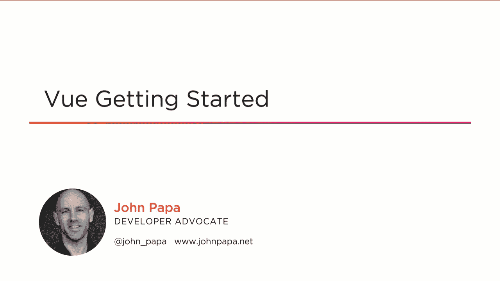

# Vue:开始

> 原文：<https://dev.to/pluralsight/vue-getting-started-3cf0>

在我们的开发职业中，我唯一像热爱编码一样热爱的事情就是教学！如果你关注我，你就会知道我对 web 开发和 JavaScript 有着深深的热情。最近我创建了一个新的课程来帮助开发者学习 Vue。所以如果你准备好学习 Vue，请考虑观看我在 Pluralsight 上的新 Vue 入门课程。

> Pluralsight 有 10 天免费试用和一个有限的⏰时间(9 月 9 日- 9 月 20 日)优惠在哪里可以买到💰高级和个人年度订阅优惠 100 美元。👉https://pluralsight.pxf.io/QdWQo

你可以在这里找到 [Vue 课程](https://pluralsight.pxf.io/QdWQo)

以下是本课程的部分/章节:

1.  课程概述
2.  Vue 入门
3.  显示数据和响应事件
4.  显示列表和条件内容
5.  组件内的交互
6.  组件通信
7.  访问数据
8.  使用路由导航 Vue 应用
9.  使用 Vuex 管理数据状态

以下是官方课程描述:

> 您对如何使用 Vue 的基本功能感兴趣吗？在 Vue:入门课程中，您将学习如何开始使用 Vue 开发 web 应用程序的基础知识。首先，您将了解如何使用 Vue CLI 创建和运行您的应用程序，以及如何构建作为应用程序构建块的组件。接下来，您将学习如何使用模板构建用户界面，以及如何选择正确的数据绑定特性。最后，您将探索如何使用 HTTP 获取和发送数据，添加菜单以使用路由导航您的应用程序，以及如何使用 Vuex 管理数据和状态。完成本课程后，您将了解构建自己的 Vue 应用程序所需的所有基础知识。