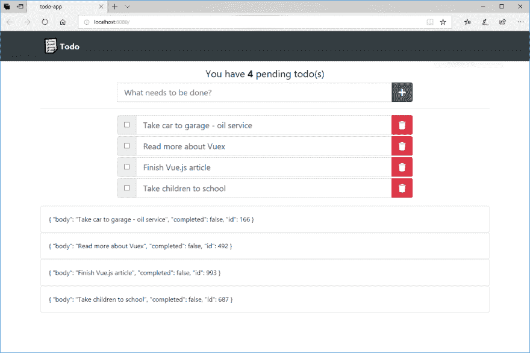
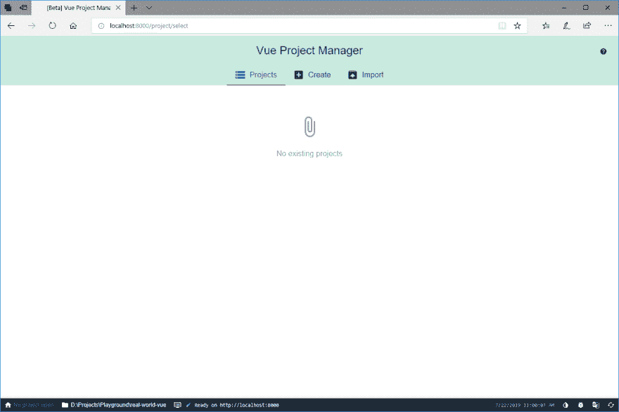
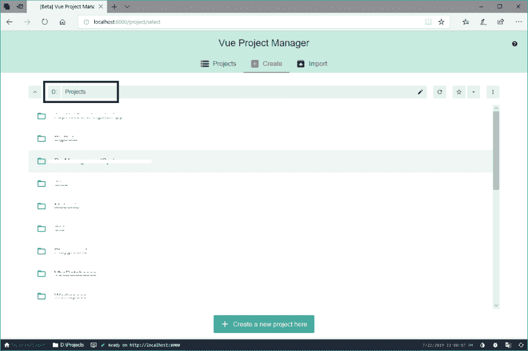
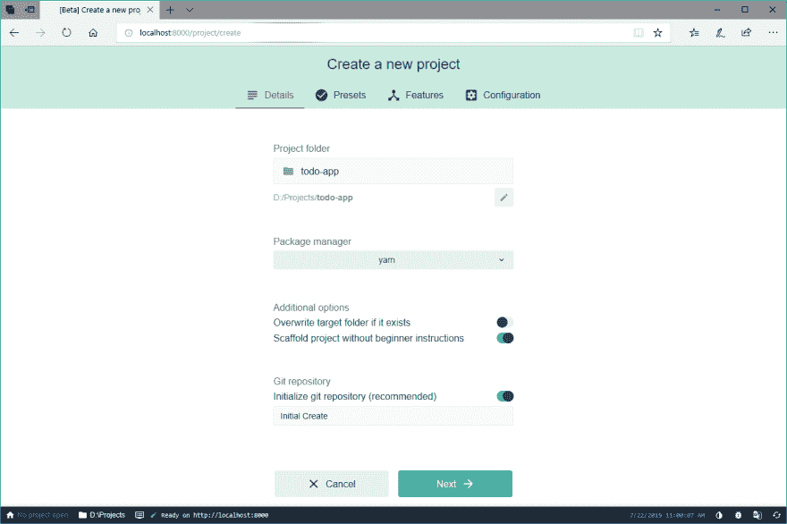
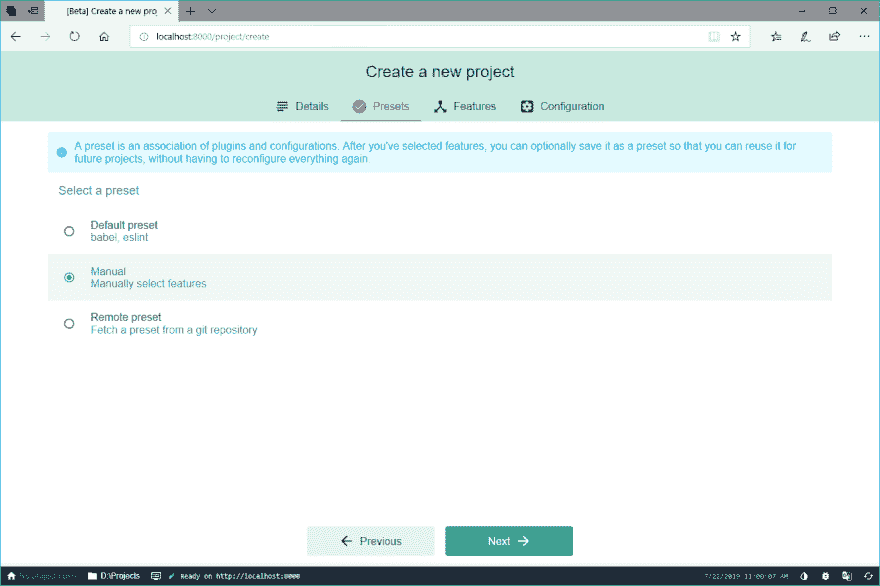
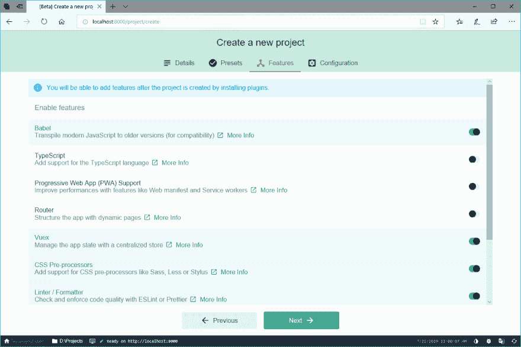
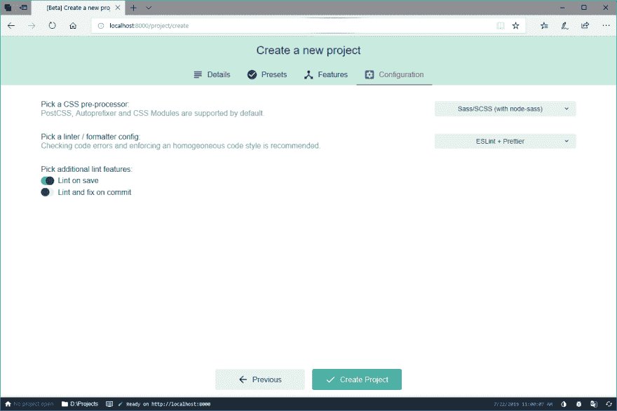
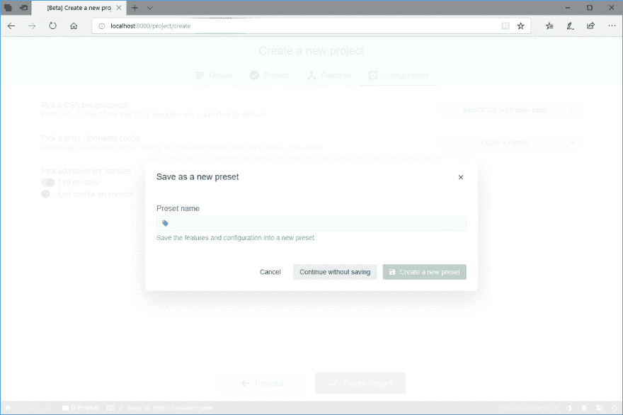
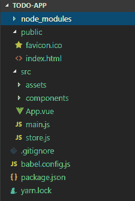

# 面向 Angular 开发者的 Vue.js

> 原文：<https://dev.to/thisdotmedia/vue-js-for-angular-developers-566g>

在写作时，我专注于 Angular 和全栈开发，Angular 用于前端。

最近，我有机会使用 Vue.js 编写一个概念验证应用程序，以使用 Vue.js 和 Vue CLI 创建一个基本的 Todo 应用程序。

让我们来看一看，浏览一下应用程序，并探索 Vue.js。我们还将比较 Vue.js 中的一些概念和技术与 Angular world 中的概念和技术。

简而言之，无论你是在开发 Angular 还是 Vue 应用程序，都有一些基本的概念和技术，涉及到应用程序的架构和构造，它们都适用。例如，**智能/表示性**组件是通用的，适用于两个世界。

现在，工具肯定不同了。以 **Vuex** 为例，它是用于客户端状态管理的 Vue.js 库。你可以将它与 **NGRX** 或任何其他基于角度的状态管理库进行比较。

本文的主要观点是，无论你使用什么框架来开发你的应用程序，概念都是你的，无论你是用 Vue 还是 Angular 开发，你都可以带着它们。

下面先睹为快，看看我们今天将共同打造的最终产品:

[](https://res.cloudinary.com/practicaldev/image/fetch/s--ogJ63-e7--/c_limit%2Cf_auto%2Cfl_progressive%2Cq_auto%2Cw_880/https://thepracticaldev.s3.amazonaws.com/i/a7bu8eb8eog060etn0yj.PNG)

这篇文章的源代码可以在这个 GitHub [repo](https://github.com/bhaidar/todo-vue) 获得。
让我们开始编写 Todo 应用程序吧！

## 创建 Vue app

首先，确保通过运行以下命令安装最新版本的 Vue CLI:
`yarn global add @vue/cli`

该命令在您的计算机上下载并安装 Vue CLI 的最新版本。

之后，我将使用 Vue CLI UI 而不是命令行创建一个新的 Vue.js 应用程序。

运行以下命令:`vue ui`

此命令会打开一个新的浏览器，如下所示:

[](https://res.cloudinary.com/practicaldev/image/fetch/s--3shhYEoy--/c_limit%2Cf_auto%2Cfl_progressive%2Cq_auto%2Cw_880/https://thepracticaldev.s3.amazonaws.com/i/85d6525kz0xgtmotjpel.PNG)

Vue UI 的主页允许您管理现有项目、创建新项目和导入现有项目。

点击**创建**选项卡，您将看到类似如下的内容:

[](https://res.cloudinary.com/practicaldev/image/fetch/s--qvF15SfL--/c_limit%2Cf_auto%2Cfl_progressive%2Cq_auto%2Cw_880/https://thepracticaldev.s3.amazonaws.com/i/ydxeflt0vmev7y3riivz.PNG)

将系统路径更改为要创建新项目的目录。在我的例子中，我选择了路径`D:\Projects`

找到并点击**在此创建新项目**按钮。将打开一个新页面，如下所示:

[](https://res.cloudinary.com/practicaldev/image/fetch/s--eSjcAlj5--/c_limit%2Cf_auto%2Cfl_progressive%2Cq_auto%2Cw_880/https://thepracticaldev.s3.amazonaws.com/i/xjsf04mwylqaaonz55q9.PNG)

在此页面上，您可以指定以下内容:

*   **项目文件夹** : todo-app
*   项目经理:纱线
*   **Git 储存库**:开启

然后，单击下一个按钮的**，进入您选择预设的页面。**

[](https://res.cloudinary.com/practicaldev/image/fetch/s--75Y0Fdip--/c_limit%2Cf_auto%2Cfl_progressive%2Cq_auto%2Cw_880/https://thepracticaldev.s3.amazonaws.com/i/gbte4wletb6hctde0zbp.PNG)

您可以选择**默认预设**来创建具有默认功能和选项的应用程序。我选择了**手动**选项，这样我就可以定制我的应用程序生成。

找到并点击**下一个**按钮，转到您选择希望应用程序包含哪些功能的页面。

[](https://res.cloudinary.com/practicaldev/image/fetch/s--Pdxscy9z--/c_limit%2Cf_auto%2Cfl_progressive%2Cq_auto%2Cw_880/https://thepracticaldev.s3.amazonaws.com/i/9sl8m33ah1dk6gy8js1j.PNG)

对于这款应用，我选择使用以下功能:

*   巴比伦式的城市
*   Vuex(用于状态管理)
*   CSS 预处理程序
*   棉绒/格式器

完成后，找到并点击**下一个**按钮，进入您必须配置 CSS 预处理程序的页面，因为您已经添加了这个特性。

[](https://res.cloudinary.com/practicaldev/image/fetch/s--H1x8SsnD--/c_limit%2Cf_auto%2Cfl_progressive%2Cq_auto%2Cw_880/https://thepracticaldev.s3.amazonaws.com/i/i6tcbrj55lusn39yi9sa.PNG)

在我的例子中，我将选择 **Sass/SCSS(带有节点 sass)** 作为 CSS 预处理器。

至于林挺和格式化，我已经决定使用**ESLint+beautiful**将这两个惊人的世界结合在一起！

最后，每当我保存一个文件时，我希望我的项目得到 **linted** 。

点击**创建项目**按钮开始生成您的项目文件。

[](https://res.cloudinary.com/practicaldev/image/fetch/s---qXWZbJH--/c_limit%2Cf_auto%2Cfl_progressive%2Cq_auto%2Cw_880/https://thepracticaldev.s3.amazonaws.com/i/7vnt1vzsn5x9mucr2me2.PNG)

**NB** :在项目文件生成过程开始之前，会出现一个提示，询问您是否要将当前设置保存为预置。如果您愿意，这将保存所有首选项和配置供将来使用。现在，我将继续，而不将其保存为预设。

一旦生成过程结束，您将创建以下项目:

[](https://res.cloudinary.com/practicaldev/image/fetch/s--TvT1q50E--/c_limit%2Cf_auto%2Cfl_progressive%2Cq_auto%2Cw_880/https://thepracticaldev.s3.amazonaws.com/i/p3n9z5gxcj6y6kq92zdp.PNG)

公共文件夹包含将用于运行您的应用程序的`index.html`文件。
Src 文件夹包含您的所有 Vue 组件和任何资产，如 CSS 或图像。
剩下的都是配置文件。

现在应用程序已经生成，让我们开始构建应用程序源代码。

## 剖析一个 Vue.js app

让我们研究一下`main.ts`文件，并检查 Vue.js 应用程序是如何启动的:

```
import Vue from 'vue'
import App from './App.vue'
import store from './store'

new Vue({
  store,
  render: h => h(App)
}).$mount('#app') 
```

Enter fullscreen mode Exit fullscreen mode

该文件创建了主`Vue`组件的一个新实例，并传递给它一个包含配置设置的对象参数。

输入参数的第一个参数是从`./store`文件导入的`store`对象。

在这个级别注入`store`对象，以便所有子组件都可以使用 store 对象。

`render()`方法返回`app.vue`根组件，以便为该应用程序呈现。

最后，用一个 DOM 元素调用`$mount(#app)`方法，以便 Vue 在`index.html`页面中呈现这个 DOM 元素中的根组件并激活应用程序。⁰

```
<div id="app"></div> 
```

Enter fullscreen mode Exit fullscreen mode

让我们探索一下我们将用于此应用程序的商店。

## Vuex -状态管理简化

在 [Vuex](https://vuex.vuejs.org/guide/) 的核心是`Store`对象，帮助你的 Vue 应用进行状态管理:

商店是:

*   天生被动。商店内部发生的任何变化都会自动反映到 Vue 组件中。
*   您不能直接改变商店的状态。你可以通过**提交一个突变**来完成，通过一个没有任何副作用的纯函数来更新存储的状态。

为了触发变异，你**分派一个动作**。

让我们看看 Todo 应用商店是什么样子的。你可以在这个 GitHub [repo](https://github.com/bhaidar/todo-vue/blob/master/src/store.js) 上查看全店实现。

`store.js`文件首先将`Vuex`注册为应用程序的一个插件，这样您可以稍后访问商店的状态:
`Vue.use(Vuex)`

然后，代码创建一个新的`Vuex.Store()`对象实例，传递一个对象参数来配置存储的状态、突变、动作和 getters。

状态定义如下:

```
state: {
    todos: []
  }, 
```

Enter fullscreen mode Exit fullscreen mode

此应用程序中的状态是跟踪待办事项列表。

我们来讨论一下这家店的单个突变:

```
ADD_TODO(state, todo) {
      state.todos = [
        { body: todo, completed: false, id: generateRandom(1, 1000) },
        ...state.todos
      ]
    } 
```

Enter fullscreen mode Exit fullscreen mode

除了要添加到存储状态的 todo 项之外，变异还接受现有的`state`对象作为输入参数。

您可以在上面提到的商店的源代码中检查其余的变化。

> 在[NGRX](https://ngrx.io/)-Angular 的反应状态下，所有的突变都被分组在一个**减速器**内。这个缩减器保存所有的变异，并根据调度的动作，执行一个单一的变异。

让我们继续一个商店的`actions`。

```
addTodo({ commit }, todo) {
  commit('ADD_TODO', todo)
} 
```

Enter fullscreen mode Exit fullscreen mode

动作方法接收存储对象作为输入以及动作有效负载。在代码中，`addTodo()`动作只从 store 对象中提取了`commit`方法。然后，它调用`commit()`方法，将变异的名称和 todo 项作为参数传递，以保存在存储的状态中。因此，调度一个动作会提交一个新的变异来更新存储的状态。

> 类似于 NGRX，一个动作触发 Reducer 在存储上执行变异。

最后，store 对象上定义的 getters 是一些方便的方法，添加这些方法是为了允许组件被动地从存储的状态中读取数据。每当存储的状态改变时，监听 getters 的组件将得到通知并自动更新。

这里有一个应用程序中使用的 getter 示例:

```
pendingTodos: state => state.todos.filter(todo => !todo.completed) 
```

Enter fullscreen mode Exit fullscreen mode

给定一个状态，getter 过滤掉所有已完成的 todo 项目，只返回那些仍未完成的项目。

> Vuex Getters 相当于 NGRX 中的选择器。

现在我们知道了 Vuex 商店是如何工作的，让我们继续，开始构建 todo 应用程序的 UI 和功能。

## 构建待办事宜 app

让我们从应用程序的`App.vue`根组件开始:

该组件为主页定义了一个主标题:

```
<header>
      <div class="navbar navbar-dark bg-dark box-shadow">
        <div class="container d-flex justify-content-between">
          <TodoBrand />
        </div>
      </div>
</header> 
```

Enter fullscreen mode Exit fullscreen mode

该应用程序正在使用[Bootstrap 4]进行布局，我添加了以下两行，以在应用程序中添加对 Bootstrap 的支持。

找到`public\index.html`并将以下内容添加到文档的`<head>`中:

```
 <link href="https://stackpath.bootstrapcdn.com/bootstrap/4.3.1/css/bootstrap.min.css" rel="stylesheet"
    integrity="sha384-ggOyR0iXCbMQv3Xipma34MD+dH/1fQ784/j6cY/iJTQUOhcWr7x9JvoRxT2MZw1T" crossorigin="anonymous">
  <link rel="stylesheet" href="https://use.fontawesome.com/releases/v5.7.0/css/all.css"
    integrity="sha384-lZN37f5QGtY3VHgisS14W3ExzMWZxybE1SJSEsQp9S+oqd12jhcu+A56Ebc1zFSJ" crossorigin="anonymous"> 
```

Enter fullscreen mode Exit fullscreen mode

`App.vue`组件的头部定义了一个定制的`TodoBrand` Vue.js 组件来呈现页面的品牌部分。

### TodoBrand 组件

在路径`src\components\TodoBrand.vue`下创建一个新的 Vue.js 组件，内容如下: