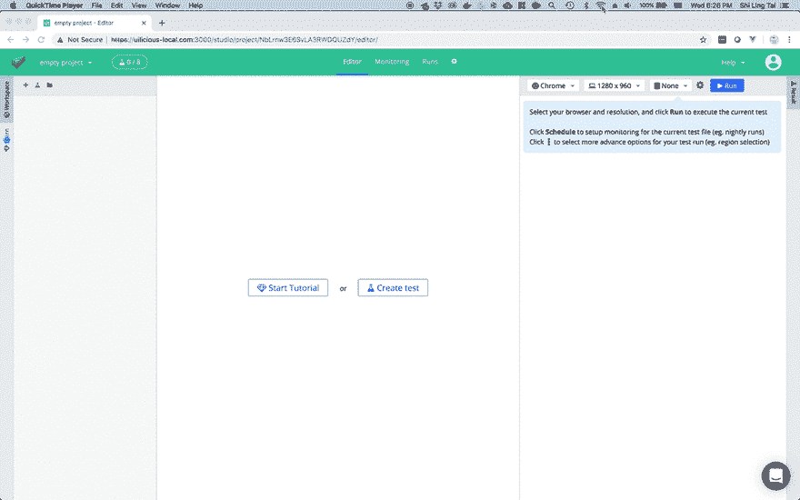

# 我在线吗？一个很小的 VueJS 插件(< 1kb)。

> 原文：<https://dev.to/uilicious/vue-online-prop-am-i-online-a-tiny-vuejs-plugin-1kb-61p>

我只想做一件事，只有一件事。

我只想让我所有的 Vue 组件中的一个反应属性`$online`告诉我用户是否连接到互联网。

我知道我知道，已经有一堆现有的`vue-online`包了，但是...不，谢谢，我不需要额外的 UI 组件...

于是我做了`vue-online-prop` ( [npm](https://www.npmjs.com/package/vue-online-prop) ， [github](https://github.com/shiling/vue-online-prop) )

设置:

```
import VueOnlineProp from "vue-online-prop"
Vue.use(VueOnlineProp) 
```

用法:

```
<div v-if="!$online"> 
    You are currently offline!
</div> 
```

Tada.

[](https://res.cloudinary.com/practicaldev/image/fetch/s--x2CWLINz--/c_limit%2Cf_auto%2Cfl_progressive%2Cq_66%2Cw_880/https://thepracticaldev.s3.amazonaws.com/i/53del7kraqs4ct2u4qnw.gif)

仅此而已！

* * *

### (临时演员)它是如何制成的

##### 如何用 Javascript 检查我是否在线

您可以使用`navigator.onLine`通过 Javascript 查询互联网连接，并使用窗口上的`online`和`offline`事件监听连接的变化。

👉[`navigator.onLine`](https://developer.mozilla.org/en-US/docs/Web/API/NavigatorOnLine/onLine)上的 MDN 文档

##### 创建 VueJS 插件

这个插件简单地监听窗口上的`online`和`offline`事件，并将`navigator.onLine`的值设置为一个由插件管理的反应属性`status`。当使用`Vue.use(VueOnlineProp)`安装插件时，它会添加一个`beforeCreate` mixin，将每个组件中的反应属性`status`绑定到`$online`属性。（👉代码如下