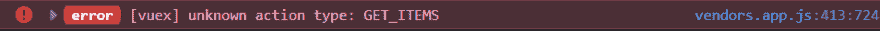

# Nuxt 中的 Vuex:从经典商店模式到模块

> 原文：<https://dev.to/jeremywynn/vuex-in-nuxt-going-from-classic-store-mode-to-modules-3cjh>

在 Nuxt 中使用 [Vuex 存储](https://nuxtjs.org/guide/vuex-store)时，有两种存储模式可供选择:

*   Classic(已弃用):单个文件“store/index.js”的存在导致 Nuxt 导入 Vuex 并创建 store。
*   模块:“store”目录中的每一个“. js”都成为一个命名空间模块，每个模块都有自己的状态、突变、动作、getters 等。

当开始学习时，选择经典路线并从单个`store/index.js`文件开始会更容易。我在一个项目中处理的一个这样的文件可以在这里被视为 Github 的要点。

不仅这个文件变得很长，我还使用了 3 种不同的状态类别:条目、加载和用户。为了更好地说明，我将相关代码分组放在每一项下。例如，所有涉及项目突变的功能都分组在突变中的`// Items`注释下。

模块涅槃的第一步是创建 3 个文件:`store/items.js` [【要点】](https://gist.github.com/jeremywynn/6595c1cfbd9845d7764303ea46386871)`store/loading.js`[【要点】](https://gist.github.com/jeremywynn/d0c416224c4724868c6f4dd7819e4d28)`store/user.js`[【要点】](https://gist.github.com/jeremywynn/56408fd331316faa4cf3067326691592)，然后将`store/index.js`内的所有代码移动到它们相关的目的地。在我的情况下，`store/index.js`可以删除。

## 更新 Vuex 存储方法

现在代码已经在模块中了，所有可能已经在组件中使用的方法都必须更新，以与旧的`store/index.js`中的突变、动作和状态进行交互。例如，`getItems`动作可以在经典模式下通过使用:

`dispatch("getItems")`

当将一个操作移动到它自己单独的模块文件中时，保持分派方法不变可能会导致如下错误:

由于`getItems`不再位于`store/index.js`中，因此需要将分派方法更新到其新的模块化位置:

`dispatch("items/getItems")`

`items/`部分指的是`store/items.js`文件。`getItems`部分指的是该文件中动作的名称。

## Vuex 地图助理员

Vuex 提供了`mapState`、`mapGetters`、`mapActions`、`mapMutations`等地图助手。利用这些方法使代码不那么冗长，这在一个组件中多次使用存储方法时很有帮助。例如，不使用:

`this.$store.dispatch("deleteItem", payload)`

在组件的方法中，通过执行以下操作来使用`mapActions`:

1.  在组件中从 Vuex 导入所需的助手:`import { mapActions } from "vuex"`
2.  在组件的方法对象内部，添加映射器:`...mapActions({ removeItem: "items/deleteItem" }),`
3.  那么，新的调度动作可以重写为:`this.removeItem(payload)`

## 调度动作内的模块动作

在`store/items.js`中，我使用调度方法来触发`triggerBusyState`和`stopBusyState`的动作来启动和停止一个有趣的动画加载器。由于这两个动作现在在`store/loading.js`中被模块化了，像`dispatch("triggerBusyState")`这样旧的分派方式将不再适用。在其他操作中调度操作需要像这样完成:

`dispatch("loading/triggerBusyState", null, { root: true })`

第二个参数(在本例中为`null`)需要存在，并且`{ root: true }`对象将指示 Vuex 从根`store`开始寻找`triggerBusyState`，而不是从它当前的调用位置`store/items`开始。

## 一些笔记

刚才的`store/index.js`实际上是模块存储模式，其中这个文件代表根模块。这篇文章可以更好地描述如何将过度拥挤的根模块文件中的所有内容转移到单独的、更整洁的模块文件中。

如果需要，有一个根模块`store/index.js`也是可以的。例如，`nuxtServerInit` [动作](https://nuxtjs.org/guide/vuex-store/#the-nuxtserverinit-action)只在根模块中起作用。

我的最终工作模块模式存储文件(gists): [items.js](https://gist.github.com/jeremywynn/49e416e8aac1264c130f730496fbadf4) 、 [loading.js](https://gist.github.com/jeremywynn/05bda1fe2e0b4c901d08f44f3703af02) 和 [user.js](https://gist.github.com/jeremywynn/a3244a10d1514317e1df1c8a97030190) 。