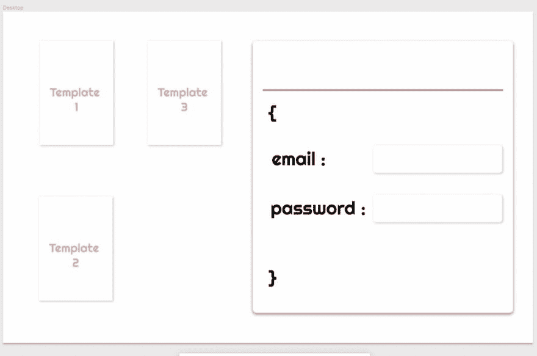

# 非设计师的网页设计-第一部分

> 原文：<https://dev.to/logeekal/web-design-by-for-a-non-designer-part-1-55gl>

## 为什么这篇文章

我的目的是讲述我在为我的网络应用程序做网页设计时的思考过程，并向这里的专家寻求建议和验证。

## 你们太棒了

我最近加入了 Dev.to 社区，我必须说我喜欢阅读这里的讨论，人们的热情是有感染力的。

## 关于我的背景

因为，这是我的第一篇文章，我将给出一些关于我的背景。我来自印度，已经在印度 9 年了。我主要从事数据建模和 Oracle 应用程序实现。我多年来一直想从事网络开发工作。

最近，我换了一个我喜欢的工作，这个工作涉及到网络和多种技术。我做的第一件事是启动我的个人项目，因为我想学习一些技术，这样我就可以跟上网络的最新发展。

## 项目

3 个月前，我开始了名为[简历生成器](https://github.com/logeekal/ResumeBuilder/tree/dev)的个人项目。它的灵感来自于[的 NovoResume](https://novoresume.com/) ，这是一个了不起的网站，但却是付费的。

它涉及不同的简历模板，用户可以下载 pdf 格式。我有一个想法，建立所有这些作为开源，使模板建设可以更加民主，人们可以要求在这个网站上创建某些模板。

我决定进行这个项目有三个原因:

1.  这是一个非常 UI 驱动的项目，我想学习 React。

2.  这是一个非常注重 ***设计*** 的项目，我在设计过程和 CSS 方面都非常糟糕。因此，这是从头开始构建一切的好机会。

3.  开源和免费在线教育给了我很多，简历生成器似乎是一个很多人都可以利用的东西。

## 设计

现在让我们吃肉吧。我已经完成了我的 web 应用程序的一些后端部分，我想现在可能是开始设计一个好的主页并给我的 web 应用程序一种设计语言的好时机。所以在做了很多蹩脚的 CSS 模型并废弃它们之后，我决定遵循下面的过程:

### 1。选定一个好的设计工具来创建模型

在 CSS 上创建 UI 需要时间，尤其是当你正在学习的时候。此外，很难想象你的设计是如何向前发展的。所以我决定我需要开发一个工具，在那里我可以创建快速的模型，并很好地理解我想要遵循的设计语言。

免费工具不多，我发现的唯一好的选择是:

*   Adobe XD
*   [图](http://figma.com)

> 我决定使用 Figma，因为它是一个 Web 应用程序，非常容易上手。个人使用也完全免费。

### 2。决定页面的内容

好了，现在我们已经用工具分类了，我需要考虑一下我想在我的主页上放什么。

*   ***标志***

我还没设计好。但是现在我会把它作为占位符。

*   ***签到/注册页面。*T3】**

我想给登录/注册页面一个“开发”的感觉，所以我决定用一个类似 JSON 的模板让它看起来有点怪。不知道它怎么样，但我喜欢它的开胃菜。欢迎任何形式的评论/批评。

但是现在它太白了，每次我想用颜色的时候都搞砸了。无论如何，我很高兴我在这方面取得了进展。

[https://codepen.io/logeekal/embed/wLJNRM?height=600&default-tab=result&embed-version=2](https://codepen.io/logeekal/embed/wLJNRM?height=600&default-tab=result&embed-version=2)

*   ***一些轮播的简历模板。*T3】**

我当然需要一些“名人堂”简历模板的旋转木马/收集，将在主页上显示。

所以这些是我需要在我的页面上安排的事情，经过两个小时的涉猎，我想到了如下非常简单的设计:

我知道这很糟糕，但我想分享一些我觉得很难的事情。

1.  尽管 Figma 提供了精确的桌面屏幕分辨率模板，我还是无法理解缩放。如果你仔细看看这个简单的设计，登录页面相当庞大，是半个页面。世界上哪个登录页面有这么大？

2.  阴性/空白空间 -我喜欢阴性空间，但我不知道如何使用它，如果我试图使用，我会像我的登录页面一样，没有颜色-只有阴性空间&没有颜色。

3.  字体设计 -我确定我想用无衬线字体。这就是为什么我的登录页面选择了[正义](https://fonts.google.com/specimen/Righteous)，它看起来很光滑，直到我把它放在我的 Figma 模型的主页上，恶心！它看起来很可怕。

4.  我觉得这是我最具挑战性的任务，到目前为止，我还不知道我是否能自己完成，或者最终会抄袭别人的作品。:(

暂时就这样了。
我将每周在这个帖子上添加内容，并记录这个设计完成的整个过程，因为它可能会帮助我的任何开发伙伴，他们可能处于与 ***“我如何才能学会设计”*** 相同的困境中

=========================

非常欢迎任何意见/建议/评论/批评。如果你认为这能帮助我朝着正确的方向前进，请发表评论。

### 好玩的琐事

看看[用户在你面前](https://userinyerface.com)的一些非常糟糕的设计，比我的还糟糕:p。

***.........未完待续。*T3】**

非设计师的网页设计第二部分
[大步前进|非设计师的网页设计第三部分](https://dev.to/logeekal/making-strides-web-design-by-for-a-non-designer-part-3-3k05)