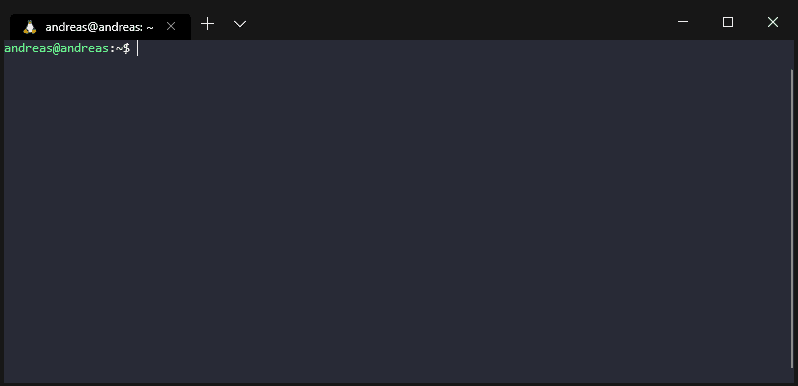
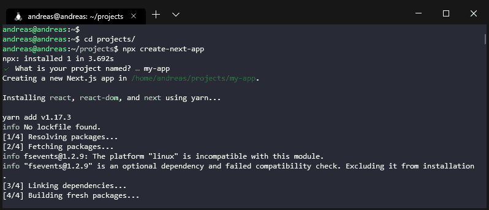
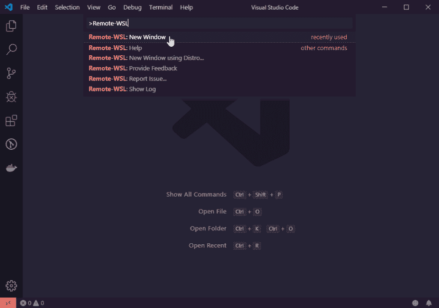
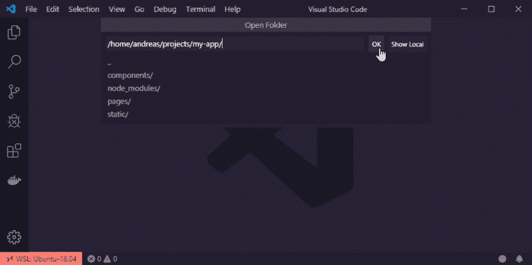
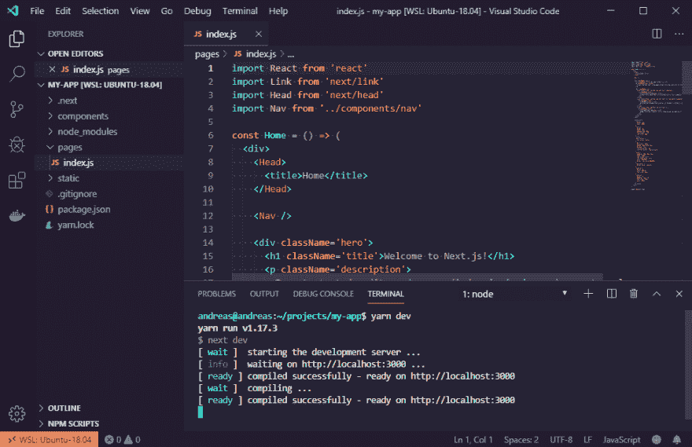
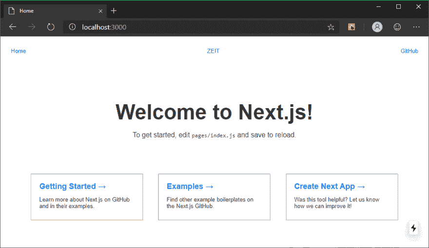
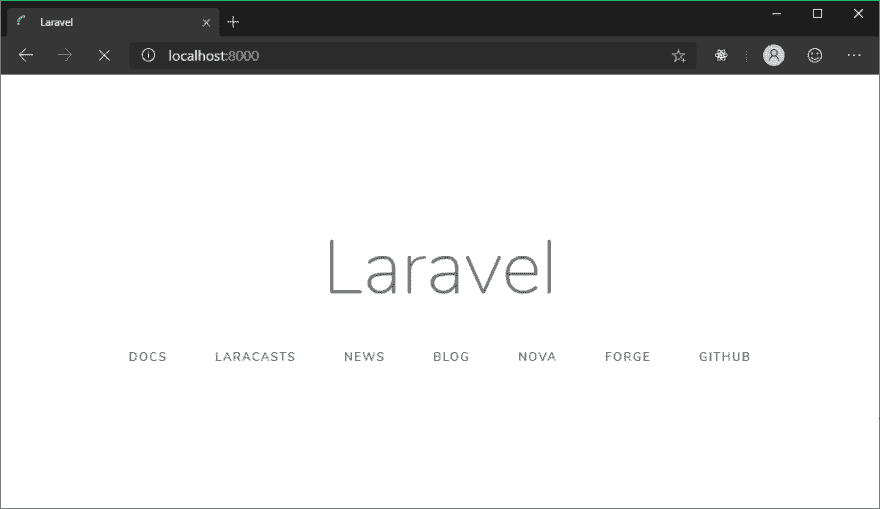

# 使用 WSL 2 在 Windows 上进行 Web 开发

> 原文：<https://dev.to/andreasbergqvist/web-development-on-windows-using-wsl-2-5207>

所以，我一直在测试新的 WSL 2(Linux 2 的 Windows 子系统)。
目前在使用 Windows 10 Insider 预览版构建时可用。
这意味着你需要设置你的 Windows 10 系统来安装预览版。
*安装自担风险:-)*

关于如何安装 WSL 2 的信息可以在这里找到:
[https://pure infotech . com/install-windows-subsystem-Linux-2-windows-10/](https://pureinfotech.com/install-windows-subsystem-linux-2-windows-10/)

这个版本的 WSL 可以被认为是一个更完整的 Linux 环境。就像在你的 Windows 电脑上运行的虚拟机。当然，速度更快，重量更轻，与 Windows 的集成程度更高。我不是建筑方面的专家，但是你可以找到关于这方面的其他文章=)

我只是在寻找一个平稳的 Windows 开发体验(是的，我是一个网络开发人员，你更喜欢 Windows...奇怪的...).

### Linux

所以，你现在基本上有了一个裸机 Linux 安装(我安装的是 Ubuntu 18.04)。因此，如果你想运行 Node、PHP 或其他应用程序，你需要安装合适的软件包。有很多关于如何做到这一点的指南。

你知道:

```
sudo apt install this
sudo apt install that 
```

### 新的 Windows 终端

我也在使用新的 Windows 终端。这是在 Windows 应用商店中找到的(也是预览版)。

[](https://res.cloudinary.com/practicaldev/image/fetch/s--1onR5iFK--/c_limit%2Cf_auto%2Cfl_progressive%2Cq_auto%2Cw_880/https://thepracticaldev.s3.amazonaws.com/i/5neejb36qxyeypzlod8x.png)

在我使用它的这段时间里，有了一些更新，我通常会说我喜欢它。对 Windows 开发人员体验的巨大补充。

在这里，我创建了一个 Next.js 项目:
[](https://res.cloudinary.com/practicaldev/image/fetch/s--tWWqdpd1--/c_limit%2Cf_auto%2Cfl_progressive%2Cq_auto%2Cw_880/https://thepracticaldev.s3.amazonaws.com/i/z6x6pfk8290uih6jgqve.png)

### 与 VS 代码集成

安装" Remote - WSL" VS 代码扩展:
[https://marketplace.visualstudio.com/items?itemName = ms-vs code-remote . remote-wsl](https://marketplace.visualstudio.com/items?itemName=ms-vscode-remote.remote-wsl)

现在，从 VS 代码命令面板(CTRL+Shift+P)运行“Remote-WSL: New Window”

[](https://res.cloudinary.com/practicaldev/image/fetch/s--ziEzypH3--/c_limit%2Cf_auto%2Cfl_progressive%2Cq_auto%2Cw_880/https://thepracticaldev.s3.amazonaws.com/i/p2c5n81o2znw341hk85p.png)

现在，当你选择“打开文件夹”时，你可以从你的文件夹列表中选择:
[](https://res.cloudinary.com/practicaldev/image/fetch/s--43pKR9di--/c_limit%2Cf_auto%2Cfl_progressive%2Cq_auto%2Cw_880/https://thepracticaldev.s3.amazonaws.com/i/62hzj8cfr1aj169miu2q.png)

您现在可以直接访问和编辑文件，并使用终端:
[](https://res.cloudinary.com/practicaldev/image/fetch/s--0gzTF2uA--/c_limit%2Cf_auto%2Cfl_progressive%2Cq_auto%2Cw_880/https://thepracticaldev.s3.amazonaws.com/i/z5vy0wdykoar5sw0ohje.png)

即使 Linux 发行版有自己的 IP 地址，你也可以通过本地主机:
[](https://res.cloudinary.com/practicaldev/image/fetch/s--8pB8UWnK--/c_limit%2Cf_auto%2Cfl_progressive%2Cq_auto%2Cw_880/https://thepracticaldev.s3.amazonaws.com/i/z16rio8aoo6z4ndwvzkf.png)

### 让我们测试一个 Laravel 项目(PHP)

首先，确保你已经安装了 PHP-FMP 和 Composer。

运行:

```
composer global require laravel/installer
laravel new blog
cd blog
php artisan serve --host=0.0.0.0 
```

注意`--host=0.0.0.0`。这是我得到 localhost:8000 在浏览器中工作的唯一方法:
[](https://res.cloudinary.com/practicaldev/image/fetch/s--JOOolShF--/c_limit%2Cf_auto%2Cfl_progressive%2Cq_auto%2Cw_880/https://thepracticaldev.s3.amazonaws.com/i/3egyyll9tv9jxnmbd9op.png)

### 缺什么？

#### 自动启动服务

你安装的服务(如 PHP-FPM 或 MySQL)需要在每次系统重启后手动启动。我读到过第三方解决方案可能会解决这个问题，但我更愿意将它集成到 WSL 中。

#### 自定义主机名

我喜欢把我不同的网站命名为 sitename.local，并以这种方式访问它们。这是可能的，但是由于 WSL 系统在每次重启后都会改变 IP 地址，所以 hosts 文件需要手动更新。

### 未来和码头

Docker for Windows 已经宣布将支持通过 WSL 运行。目前有一个技术预览，我还没有测试。但是那看起来真的很酷！

## 总结

在我测试它的时候，大多数事情看起来都很好，随着更多的修复，我可以说在 Windows 上使用 WSL 2 的 web 开发有一个光明的未来。