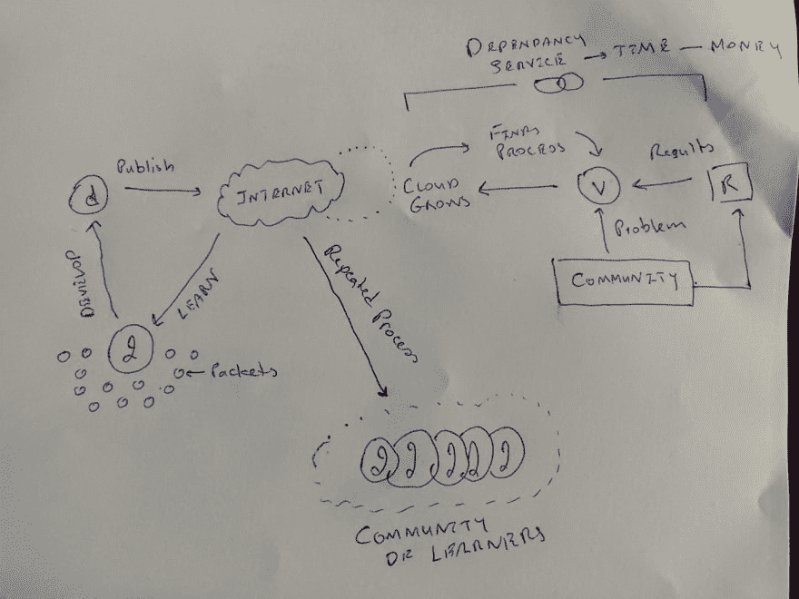

# 机会之网

> 原文：<https://dev.to/th3n00bc0d3r/web-of-opportunities-545b>

事情总会突然出现在你的脑海中，就像宇宙从尘埃中创造出恒星一样，长久以来的想法也是在爆炸中产生的。它在一瞬间点亮了你的头脑，扭曲了你的位面，或者我们可以说在我们前进的过程中改变了我们的思维。互联网，这是一个令人惊叹的词，它改变了所有与之相关的事物。它有一种影响用户的方式，也许没有人会想到如此无机、无生命或自动化的东西能做到这一点。互联网，如果被定义的话，可以被认为是一个全球性的数据交换，它的用户输入数据，同样的用户转换成对他们有价值的信息。

一幅地图刚刚在我脑海中形成，我想与大家分享，以提高我对数字时代的理解。在这张地图中，互联网是一个数据和信息的云，通过定义数据是一组占据存储空间的数字、字符串和变量，一旦某人或某个用户访问该存储空间并使该数据产生一些结论性结果，它就成为我们的信息。因此，在这种情况下，我是一个互联网用户，我吸取信息和数据，将它们收集到我的脑海里，形成一个个小的包，缩小这些包的范围，形成对我来说更舒适和有用的信息。我设计了更多的包，自动化我的任务、我的问题、我的解决方案，最终自动化我的生活。创新将是一个过程，在这个过程中，我从一开始就让我周围的生活变得更加舒适。我为自己创造的这些小包和纳米工艺，不知何故在我的家人和朋友中蔓延开来。现在，对他们来说，我自己就是一个纳米互联网，同样是一个规模小得多的存储库。这个过程不断重复，我的家人和朋友为他们自己制造了更多的纳米过程，而我作为这个过程的观察者，最终倾向于发现更多的用途和案例，让生活变得更有创意。

这种信息的外观开始引起 I 的兴趣，然后 I 开始变成 we，因为它开始开发那些准备在称为互联网的存储库中作为数据或信息发布的包。一旦它上传了，事情就发生了，互联网上的云会稍微变大。

现在想象一下，还有其他人在重复这个过程，因为这就是互联网在成为现实时所做的一切。存储库的规模和影响都在增长，也许这就是为什么在更大的社区中会有子社区等等。

“我不能独自改变世界，但我可以扔一块石头在水面上激起许多涟漪。”特蕾莎修女

现在让我们再一次想象第三个被称为观察者的实体带着一个对他和他的社区来说是可怕的问题来到互联网，但是令人惊讶的是，一些其他社区已经设计了一个过程，倾向于至少投射问题的解决方案。极度需要的观众把他们所有的东西都拿来，把这个过程应用到他们的社区中。随着流程的应用，它会产生结果，然后这些结果会被上传或共享回流程中。这种循环重复，它发现调整过程以迎合社区，并形成一个解决方案，其中我们所知的错误只是一个更迎合特定社区的过程。

在我眼花缭乱的头脑中，我认为，一旦任何事情开始自我重复，我们就可以将其合理化，难道宇宙不是在类似的原则上工作的吗，就像牛顿使引力合理化一样，他能够推导出一个现在人类可以利用的定律，这同样可以用于爱因斯坦和无数其他人。一旦我们合理化' ' '这就是我们所说的互联网'，通过人工智能可以发现许多管理它的规律，这并不意味着世界末日，现在我觉得这有点可笑，因为在牛顿发现引力之后，世界没有结束，而是开始了。也许我们需要我们发现的法律，而不是我们制定的法律，即“网络中立”。