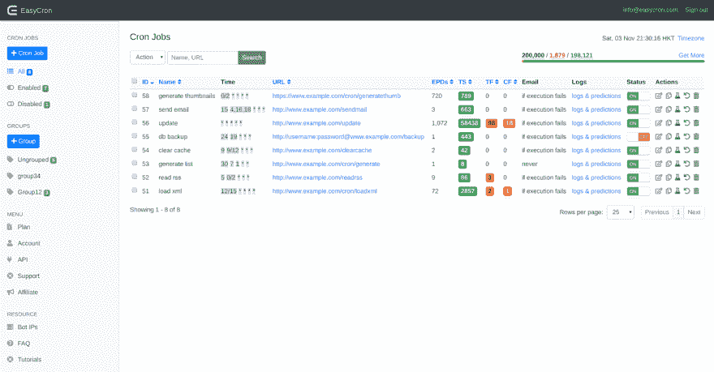
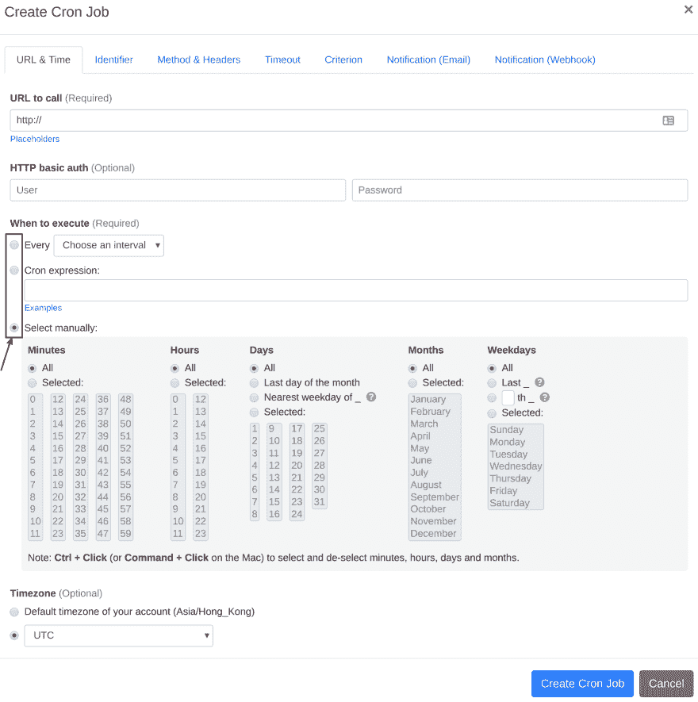

# Webcron 对站长很有用

> 原文：<https://dev.to/ann/webcron-is-useful-to-webmasters-41je>

还在用 Linux Cron？现在你可以免费换到 Easycron 更强大更易用的 webcron！

你不需要在你的机器上安装任何软件。我们是“网络克隆”。您将在 web 界面中管理您的 cron 作业。

[https://www.easycron.com/](https://www.easycron.com/)

