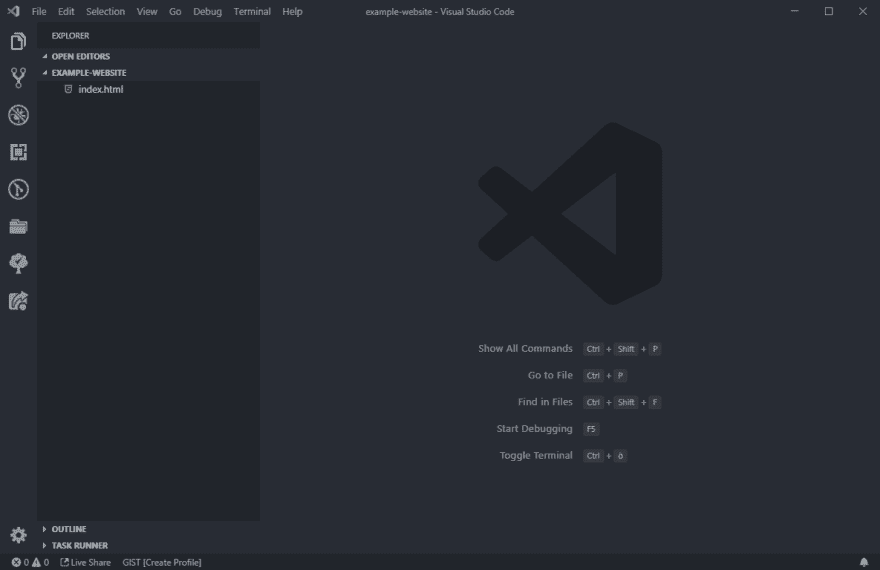
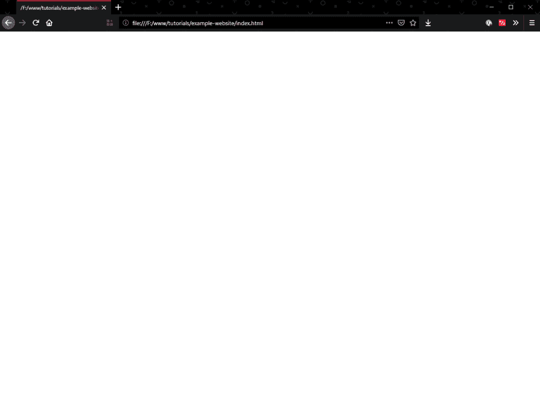
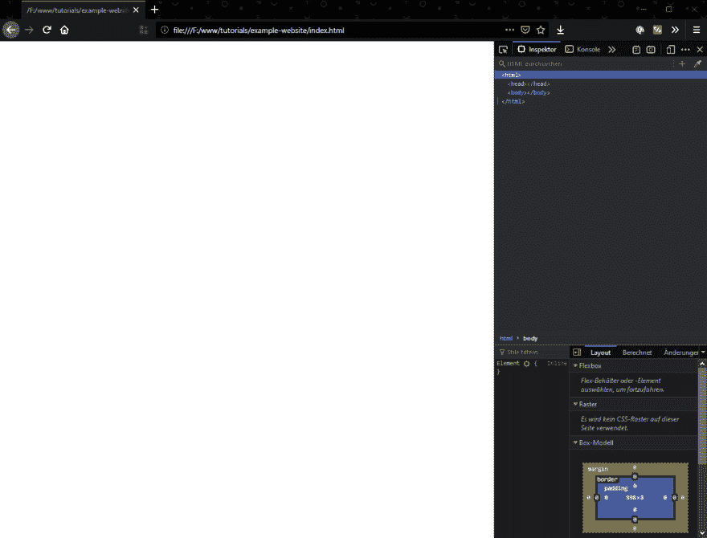
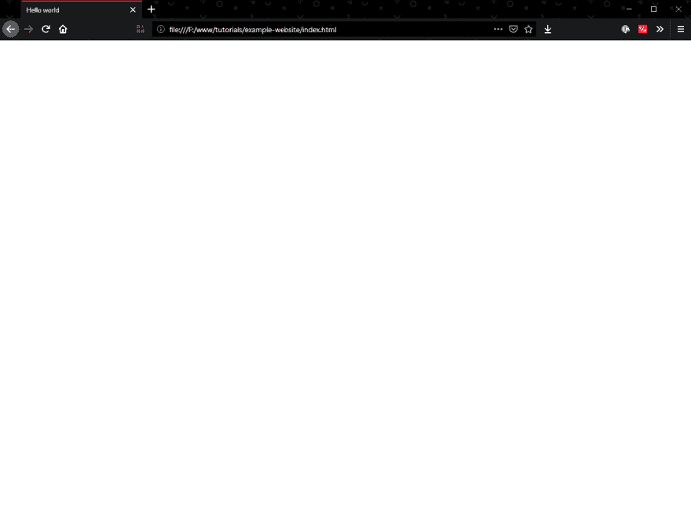
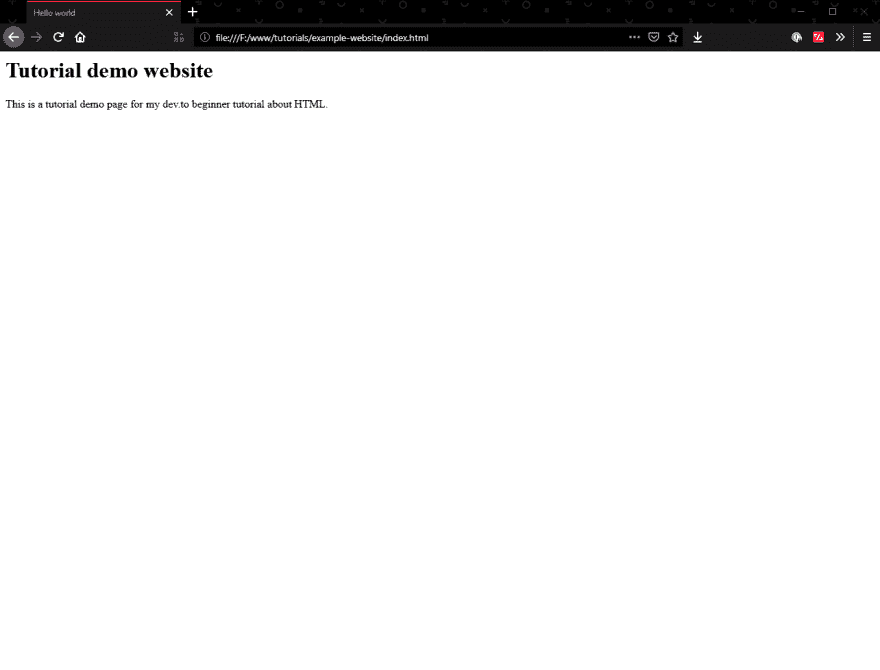
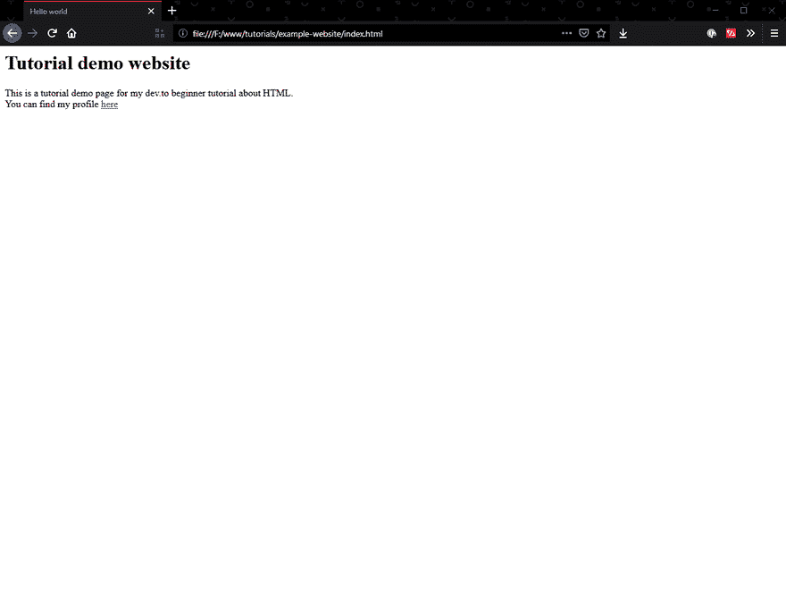
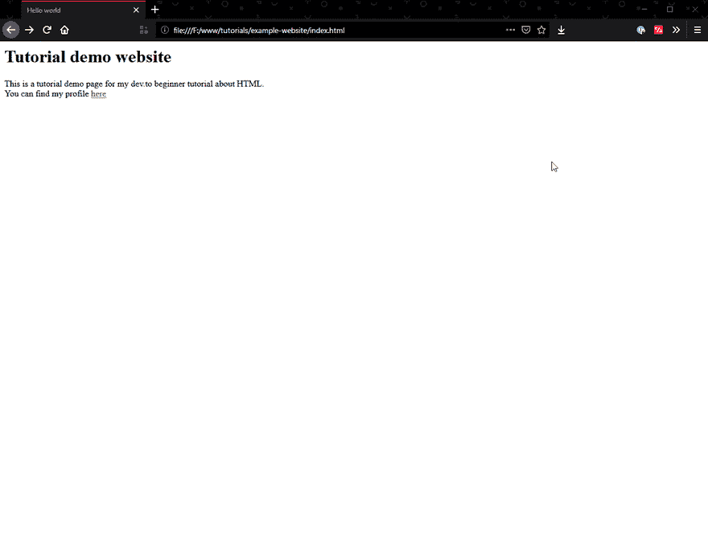

# 网站开发初学者 02 -让我们开始一个项目

> 原文：<https://dev.to/bdbch/webdevelopment-for-beginners-lets-start-a-project-m65>

欢迎来到我的第二部分**新手网站开发**系列！在这一部分，我们将开始创建我们自己的第一个项目，并写下一些代码。但是在我们写代码之前，我会向你解释你实际上要写什么样的代码。

# 遇见 HTML

HTML 是浏览器用来创建将被呈现的节点的“树结构”的标记语言。它是每一个网站的核心，如果你想学习 web 开发，你不会来 HTML。但是如果你能在~~门户~~盒子中思考，这实际上非常容易**。**

一个 HTML 文件是由许多标签组成的。

```
<header>
  <p>Hello world</p>
</header> 
```

这里我使用了两个标签，分别叫做`header`和`p`。`<header>`用来告诉你的浏览器它是一个标题元素，而`<p>`是**段落**的简写。

一些浏览器默认为它们的元素提供样式(例如，标题、段落和列表总是有由浏览器决定的默认样式)。另一方面,`<header>`元素不提供任何样式，其行为与任何其他没有浏览器提供样式的元素相同。

因此这段代码将打印出一个标题元素，其中有一个包含“Hello world”的段落。

# 有哪些标签？

**一吨**。随着 HTML5 的出现，我们收到了很多新的标签来玩。大部分都是**语义**标签。语义标签用来告诉你的浏览器某样东西是哪种元素。例如，告诉你的浏览器，这是一个标题元素。这些信息对屏幕阅读器、搜索引擎等也有帮助)。

你可以在 [MDN (Mozilla 开发者网络)](https://developer.mozilla.org/docs/Web/HTML/Element)上看到 HTML 元素的完整列表。

正如你所看到的，他们有很多，每个人都有自己的角色。在本教程中，你将学到一些你非常需要的元素。

# 让我们开始创建一个网站

关于 HTML 已经说得够多了，让我们创建一个项目并使用它。我建议为你的网站创建一个文件夹。我叫我的`example-website`。在这个新文件夹中，我们将创建一个名为`index.html`的文件。索引文件总是大多数网络服务器加载的第一页，所以`index.html`会是你的主页。

我在 Visual Studio 代码中的工作区现在看起来像这样。

[](https://res.cloudinary.com/practicaldev/image/fetch/s--7V7S-MOH--/c_limit%2Cf_auto%2Cfl_progressive%2Cq_auto%2Cw_880/https://i.imgur.com/MSrOKYu.png)

现在，您可以打开浏览器，拖动`index.html`文件打开它。

[](https://res.cloudinary.com/practicaldev/image/fetch/s--gGJ74opp--/c_limit%2Cf_auto%2Cfl_progressive%2Cq_auto%2Cw_880/https://i.imgur.com/5kQwasz.png)

这看起来很无聊。在 Firefox 和 Chrome 中，你可以通过按 F12 或 Command+Shift+I 来打开开发者工具，对我来说是这样的:

[](https://res.cloudinary.com/practicaldev/image/fetch/s--uEvAaecH--/c_limit%2Cf_auto%2Cfl_progressive%2Cq_auto%2Cw_880/https://i.imgur.com/fFIRhp8.png)

正如你所看到的，我们在屏幕的右边有一些代码，但是我们实际上还没有写一行代码。怎么会这样呢？原因是每个 HTML 文件都需要有一个`<html>`、`<body>`和`<head>`标签。

标签是整个文档的包装器。一切都存在于这个文件中，它是你的文档的根节点。

标签是放置元信息的地方，比如页面标题、描述和其他浏览器信息。它也是大多数样式资源将被加载的地方。

标签是聚会实际进行的地方。这是你的网站的内容，将被你的访问者看到。由于每个网站都需要这些标签，我们将开始在我们的`index.html`中自己编写它们。

```
<html>

<head>
  Hello world
</head>

<body>
</body>

</html> 
```

格式只是我自己的选择，也是更漂亮定义的最佳实践。你可以随心所欲地写你的代码，但是如果你愿意的话，你可以试着坚持我的缩进风格。

如你所见，我们定义了网站的 html、head 和 body 标签，但我还添加了一个带有 *Hello world* 的``标签。它是做什么的？我们会在你的浏览器中重新加载你的网站，然后你自己去看！

[](https://res.cloudinary.com/practicaldev/image/fetch/s--1o2NHNvO--/c_limit%2Cf_auto%2Cfl_progressive%2Cq_auto%2Cw_880/https://i.imgur.com/6BC43tm.png)

如您所见，我们现在在浏览器选项卡中为我们的网站定义了一个标题。标签是一个为你的浏览器和搜索引擎或爬虫提供元信息的标签。

但是你的页面还是白色的。咩。我们给这个网站加个标题和一些描述怎么样？

```
<html>

<head>
  Hello world
</head>

<body>
  <h1>Tutorial demo website</h1>
  <p>This is a tutorial demo page for my dev.to beginner tutorial about HTML.</p>
</body>

</html> 
```

我们在这里添加了一个`<h1>`和`<p>`标签。我们已经讨论过表示段落的`<p>`标签。但是`<h1>`是什么意思呢？`h`代表标题，它后面的数字是标题的类型。

如果你把它想成一个 Word 文档，你会有 6 种类型的标题。每个人都有自己的优先权。`<h1>`到`<h6>`意味着`<h1>`具有**最高优先级**，应该用于页面标题，而`<h6>`具有**最低优先级**，应该用于非常小的章节标题。

如果我们现在加载我们的页面，我们应该会看到:

[](https://res.cloudinary.com/practicaldev/image/fetch/s--nGoHo1LG--/c_limit%2Cf_auto%2Cfl_progressive%2Cq_auto%2Cw_880/https://i.imgur.com/thN9jM1.png)

酷！现在你有了第一个用 HTML 编写的文档。相当无聊，但至少有所收获。

如果我们还可以添加到您的开发人员个人资料的链接，岂不是很酷？让我们试试这个！

```
<html>

<head>
  Hello world
</head>

<body>
  <h1>Tutorial demo website</h1>
  <p>
    This is a tutorial demo page for my dev.to beginner tutorial about HTML.<br />
    You can find my profile <a href="https://dev.to/bdbch/">here</a>
  </p>
</body>

</html> 
```

这是怎么回事？我们把这一段重新编排了一下。如你所见，我们在这里使用了一个`<br />`。为什么用这种奇怪的方式写它？这是一个**自闭**标签。`br`代表一行 **br** eak 也就是说，它本身不能有内容。如果一个标签不能有自己的子元素，它就是一个自结束元素，可以这样写:`<tag />`。另一个例子是我稍后会给你们看的图片。

您可以看到另一个新标签。然后是一些奇怪的浆果。这个胡言乱语就是一个`attribute`。HTML 标签可以有很多这样的标签，它们可以修改标签的行为。

标签是一个锚(或链接),这意味着点击它可以将你的网站链接到另一个页面。因为你必须告诉锚链接到哪里，你可以使用**属性**给它需要的信息。

这个`<a>`标签现在将链接到我的开发人员配置文件。让我们试一试！

[](https://res.cloudinary.com/practicaldev/image/fetch/s--qkQYG5_e--/c_limit%2Cf_auto%2Cfl_progressive%2Cq_66%2Cw_880/https://i.imgur.com/3BpXfZj.gif)

这下有用了。太棒了。但它会替换当前选项卡🤔，我们怎样才能解决这个问题呢？让我们引入另一个名为`target`的属性。这两个属性都是锚标记所独有的。目标定义了浏览器打开链接的位置。

```
<html>

<head>
  Hello world
</head>

<body>
  <h1>Tutorial demo website</h1>
  <p>
    This is a tutorial demo page for my dev.to beginner tutorial about HTML.<br />
    You can find my profile <a href="https://dev.to/bdbch/" target="_blank">here</a>
  </p>
</body>

</html> 
```

我们将`target`属性设置为`_blank`。这意味着它将在一个新窗口中打开。由于浏览器现在有标签，它将在一个新的标签中打开。

在这里，你可以看到`<a>`标签[的所有属性。](https://developer.mozilla.org/en-US/docs/Web/HTML/Element/a#Attributes)

[](https://res.cloudinary.com/practicaldev/image/fetch/s--GJ48UjAI--/c_limit%2Cf_auto%2Cfl_progressive%2Cq_66%2Cw_880/https://i.imgur.com/NC1lZDi.gif)

我们走吧。现在链接在一个新的选项卡中打开。

# 结论

我认为这应该足以获得 HTML 的第一个概念。我给你的建议是尝试一下[和](https://developer.mozilla.org/docs/Web/HTML/Element)中的一些元素。玩玩它们和它们的属性，了解更多关于它们的信息。

在下一部分，我们将添加**图片**，**列表**，并嵌入一个 YouTube 播放器！

下次见。