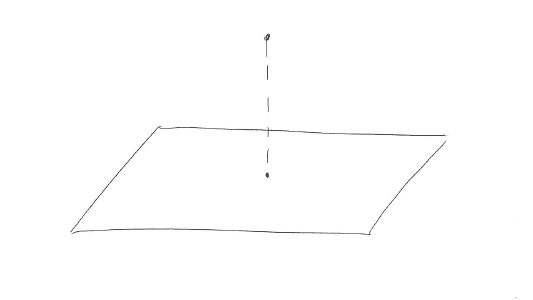
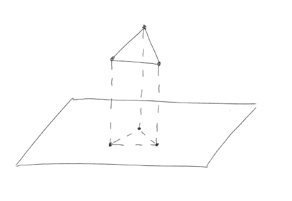
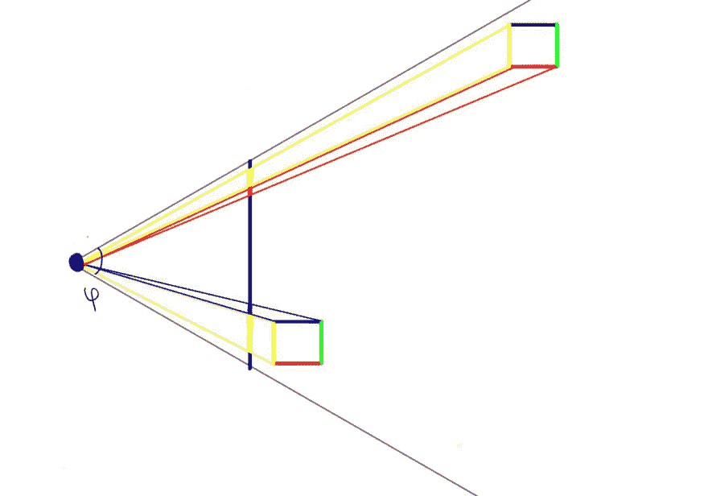

# WebGL 月份。第十四天。3d 简介

> 原文：<https://dev.to/lesnitsky/webgl-month-day-14-intro-to-3d-2ni2>

## 3d 简介

这是一系列与 WebGL 相关的博文。每天都会有新帖子

[](https://github.com/lesnitsky/webgl-month)
[T6】](https://twitter.com/lesnitsky_a)

[加入邮件列表](http://eepurl.com/gwiSeH),让新邮件直接进入你的收件箱

[此处提供源代码](https://github.com/lesnitsky/webgl-month)

建造于

[](https://github.com/lesnitsky/git-tutor)

* * *

嘿👋欢迎来到 WebGL 月。今天，在开始使用 3D 之前，我们将探讨一些重要的主题。

先说投影。如你所知，二维空间中的一个点在 X 轴和 Y 轴上有一个投影。

在三维空间中，我们不仅可以将一个点投影到轴上，还可以投影到平面上

这就是空间中的点如何被投影到平面上

[](https://res.cloudinary.com/practicaldev/image/fetch/s--YOQQFnc2--/c_limit%2Cf_auto%2Cfl_progressive%2Cq_auto%2Cw_880/https://git-tutor-assets.s3.eu-west-2.amazonaws.com/projection-point.jpg)

显示器也是一个平面，所以基本上三维空间中的每个点都可以投影到它上面。

正如我们所知，WebGL 只能渲染三角形，所以每个 3d 对象都应该由许多三角形组成。对象包含的三角形越多，对象看起来就越精确。

这就是三维空间中的三角形如何被投影到平面上

[](https://res.cloudinary.com/practicaldev/image/fetch/s--uxhRGuNA--/c_limit%2Cf_auto%2Cfl_progressive%2Cq_auto%2Cw_880/https://git-tutor-assets.s3.eu-west-2.amazonaws.com/projection-triangle.jpg)

请注意，在平面上，三角形看起来有点不同，因为三角形的顶点不在平行于我们投影该三角形(旋转)的平面上。

你可以在编辑器中构建 3D 模型，比如 [Blender](https://www.blender.org/) 或者 [3ds Max](https://www.autodesk.com/products/3ds-max/overview) 。有特殊的文件格式来描述 3d 对象，所以为了渲染这些对象，我们需要解析这些文件并构建三角形。我们将在接下来的 tutorilas 中探讨如何做到这一点。

3d 的一个更重要的概念是透视。更远的物体看起来更小

想象我们正从顶部看一些物体

[](https://res.cloudinary.com/practicaldev/image/fetch/s--MFXoj5Ez--/c_limit%2Cf_auto%2Cfl_progressive%2Cq_auto%2Cw_880/https://git-tutor-assets.s3.eu-west-2.amazonaws.com/perspective.jpg)

请注意，由于透视关系，立方体的投影面大小不同(底部比顶部大)。

在这个复杂的“如何渲染 3d”等式中的另一个变量是视野(到相机可见的对象的最大距离是多少，相机镜头有多宽)以及有多少对象适合“相机镜头”。

考虑所有这些细节似乎有很多工作要做，但幸运的是这项工作已经完成了，这就是我们需要线性代数和矩阵乘法的地方。同样，如果你不精通线性代数——不要担心，有一个很棒的软件包 [gl-matrix](http://glmatrix.net/) 可以帮你解决所有这些问题。

原来，为了在屏幕上获得一个点在三维空间中的二维坐标，我们只需要将该点的一个齐次坐标和一个特殊的“投影矩阵”相乘。这个矩阵描述了视野、摄像机视锥[的远近边界](https://en.wikipedia.org/wiki/Viewing_frustum)(模拟世界中可能出现在屏幕上的空间区域)。透视投影看起来更真实，因为它考虑了到对象的距离，所以我们将使用来自`gl-matrix`的 [mat4.perspective](http://glmatrix.net/docs/module-mat4.html#.perspective) 方法。

还有两个矩阵简化了 3d 渲染世界的生活

*   模型矩阵–包含对象变换(平移、旋转、缩放)的矩阵。如果没有应用转换-这是一个单位矩阵

```
1\. 0, 0, 0,
0, 1, 0, 0,
0, 0, 1, 0,
0, 0, 0, 1, 
```

*   [查看矩阵](http://glmatrix.net/docs/module-mat4.html#.lookAt)–描述“摄像机”位置和方向的矩阵

还有一篇关于 MDN 的好文章解释了这些概念

* * *

[](https://github.com/lesnitsky/webgl-month)
[T6】](https://twitter.com/lesnitsky_a)

[加入邮件列表](http://eepurl.com/gwiSeH),让新邮件直接进入你的收件箱

[此处提供源代码](https://github.com/lesnitsky/webgl-month)

建造于

[](https://github.com/lesnitsky/git-tutor)