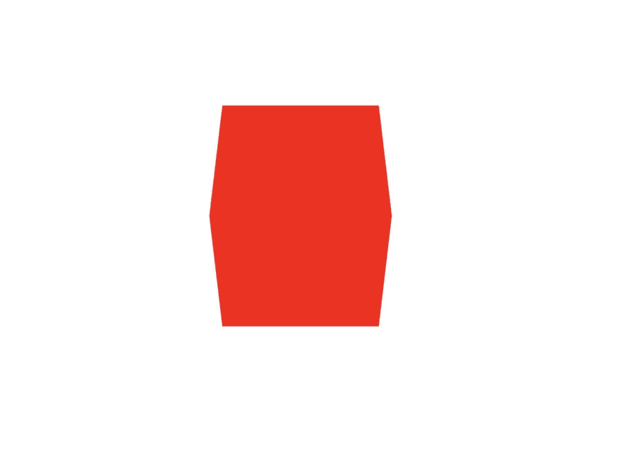
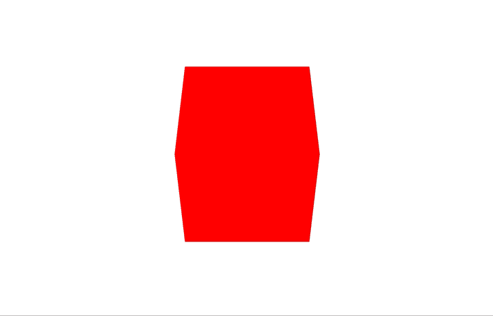

# WebGL 月份。第十五天。渲染 3d 立方体

> 原文：<https://dev.to/lesnitsky/webgl-month-day-15-rendering-a-3d-cube-190f>

## 渲染到三维立方体

这是一系列与 WebGL 相关的博文。每天都会有新帖子

[](https://github.com/lesnitsky/webgl-month)
[T6】](https://twitter.com/lesnitsky_a)

[加入邮件列表](http://eepurl.com/gwiSeH),让新邮件直接进入你的收件箱

[此处提供源代码](https://github.com/lesnitsky/webgl-month)

建造于

[](https://github.com/lesnitsky/git-tutor)

* * *

嘿👋欢迎来到 WebGL 月。
【昨天】我们已经探讨了 3d 渲染所需的一些概念，所以让我们最终渲染一些东西💪

我们需要一个新的切入点

📄index.html

```
 </head>
      <body>
          <canvas></canvas>
-         <script src="./dist/rotating-square.js"></script> +         <script src="./dist/3d.js"></script>
      </body>
  </html> 
```

📄src/3d.js

```
console.log('Hello 3d!'); 
```

📄web pack . config . js

```
 'week-1': './src/week-1.js',
          texture: './src/texture.js',
          'rotating-square': './src/rotating-square.js',
+         '3d': './src/3d.js',
      },

      output: { 
```

简单的顶点和片段着色器。请注意，我们现在使用`vec3`来表示位置，因为我们将在三维剪辑中工作。

📄src/shaders/3d.f.glsl

```
precision mediump float;

void main() {
    gl_FragColor = vec4(1, 0, 0, 1);
} 
```

📄src/shaders/3d.v.glsl

```
attribute vec3 position;

void main() {
    gl_Position = vec4(position, 1.0);
} 
```

我们还需要为我们的 WebGL 程序准备一个熟悉的以前教程的样板文件

📄src/3d.js

```
- console.log('Hello 3d!'); + import vShaderSource from './shaders/3d.v.glsl';
+ import fShaderSource from './shaders/3d.f.glsl';
+ import { compileShader, setupShaderInput } from './gl-helpers';
+ 
+ const canvas = document.querySelector('canvas');
+ const gl = canvas.getContext('webgl');
+ 
+ const width = document.body.offsetWidth;
+ const height = document.body.offsetHeight;
+ 
+ canvas.width = width * devicePixelRatio;
+ canvas.height = height * devicePixelRatio;
+ 
+ canvas.style.width = `${width}px`;
+ canvas.style.height = `${height}px`;
+ 
+ const vShader = gl.createShader(gl.VERTEX_SHADER);
+ const fShader = gl.createShader(gl.FRAGMENT_SHADER);
+ 
+ compileShader(gl, vShader, vShaderSource);
+ compileShader(gl, fShader, fShaderSource);
+ 
+ const program = gl.createProgram();
+ 
+ gl.attachShader(program, vShader);
+ gl.attachShader(program, fShader);
+ 
+ gl.linkProgram(program);
+ gl.useProgram(program);
+ 
+ const programInfo = setupShaderInput(gl, program, vShaderSource, fShaderSource); 
```

现在让我们为每个面定义立方体顶点。我们从正面开始

📄src/3d.js

```
 gl.useProgram(program);

  const programInfo = setupShaderInput(gl, program, vShaderSource, fShaderSource);
+ 
+ const cubeVertices = new Float32Array([
+     // Front face
+     -1.0, -1.0, 1.0,
+     1.0, -1.0, 1.0,
+     1.0, 1.0, 1.0,
+     -1.0, 1.0, 1.0,
+ ]); 
```

后端面

📄src/3d.js

```
 1.0, -1.0, 1.0,
      1.0, 1.0, 1.0,
      -1.0, 1.0, 1.0,
+ 
+     // Back face
+     -1.0, -1.0, -1.0,
+     -1.0, 1.0, -1.0,
+     1.0, 1.0, -1.0,
+     1.0, -1.0, -1.0,
  ]); 
```

顶面

📄src/3d.js

```
 -1.0, 1.0, -1.0,
      1.0, 1.0, -1.0,
      1.0, -1.0, -1.0,
+ 
+     // Top face
+     -1.0, 1.0, -1.0,
+     -1.0, 1.0, 1.0,
+     1.0, 1.0, 1.0,
+     1.0, 1.0, -1.0,
  ]); 
```

底面

📄src/3d.js

```
 -1.0, 1.0, 1.0,
      1.0, 1.0, 1.0,
      1.0, 1.0, -1.0,
+ 
+     // Bottom face
+     -1.0, -1.0, -1.0,
+     1.0, -1.0, -1.0,
+     1.0, -1.0, 1.0,
+     -1.0, -1.0, 1.0,
  ]); 
```

向右转

📄src/3d.js

```
 1.0, -1.0, -1.0,
      1.0, -1.0, 1.0,
      -1.0, -1.0, 1.0,
+ 
+     // Right face
+     1.0, -1.0, -1.0,
+     1.0, 1.0, -1.0,
+     1.0, 1.0, 1.0,
+     1.0, -1.0, 1.0,
  ]); 
```

向左转

📄src/3d.js

```
 1.0, 1.0, -1.0,
      1.0, 1.0, 1.0,
      1.0, -1.0, 1.0,
+ 
+     // Left face
+     -1.0, -1.0, -1.0,
+     -1.0, -1.0, 1.0,
+     -1.0, 1.0, 1.0,
+     -1.0, 1.0, -1.0,
  ]); 
```

现在我们需要定义顶点索引

📄src/3d.js

```
 -1.0, 1.0, 1.0,
      -1.0, 1.0, -1.0,
  ]);
+ 
+ const indices = new Uint8Array([
+     0, 1, 2, 0, 2, 3,       // front
+     4, 5, 6, 4, 6, 7,       // back
+     8, 9, 10, 8, 10, 11,    // top
+     12, 13, 14, 12, 14, 15, // bottom
+     16, 17, 18, 16, 18, 19, // right
+     20, 21, 22, 20, 22, 23, // left
+ ]); 
```

并创建总帐缓冲区

📄src/3d.js

```
 import vShaderSource from './shaders/3d.v.glsl';
  import fShaderSource from './shaders/3d.f.glsl';
  import { compileShader, setupShaderInput } from './gl-helpers';
+ import { GLBuffer } from './GLBuffer'; 
  const canvas = document.querySelector('canvas');
  const gl = canvas.getContext('webgl');
      16, 17, 18, 16, 18, 19, // right
      20, 21, 22, 20, 22, 23, // left
  ]);
+ 
+ const vertexBuffer = new GLBuffer(gl, gl.ARRAY_BUFFER, cubeVertices, gl.STATIC_DRAW);
+ const indexBuffer = new GLBuffer(gl, gl.ELEMENT_ARRAY_BUFFER, indices, gl.STATIC_DRAW); 
```

设置顶点属性指针

📄src/3d.js

```
 const vertexBuffer = new GLBuffer(gl, gl.ARRAY_BUFFER, cubeVertices, gl.STATIC_DRAW);
  const indexBuffer = new GLBuffer(gl, gl.ELEMENT_ARRAY_BUFFER, indices, gl.STATIC_DRAW);
+ 
+ vertexBuffer.bind(gl);
+ gl.vertexAttribPointer(programInfo.attributeLocations.position, 3, gl.FLOAT, false, 0, 0); 
```

setup viewport

📄src/3d.js

```
 vertexBuffer.bind(gl);
  gl.vertexAttribPointer(programInfo.attributeLocations.position, 3, gl.FLOAT, false, 0, 0);
+ 
+ gl.viewport(0, 0, canvas.width, canvas.height); 
```

并发出平局呼叫

📄src/3d.js

```
 gl.vertexAttribPointer(programInfo.attributeLocations.position, 3, gl.FLOAT, false, 0, 0);

  gl.viewport(0, 0, canvas.width, canvas.height);
+ 
+ gl.drawElements(gl.TRIANGLES, indexBuffer.data.length, gl.UNSIGNED_BYTE, 0); 
```

好的，我们做的一切都是对的，但是我们只是看到一个红色的画布？这是预期的结果，因为立方体的每个面的长度都是`2`，最左边的顶点在`-1`，最右边的顶点在`1`，所以我们需要添加一些昨天的矩阵魔法。

让我们为每个矩阵定义制服

📄src/shaders/3d.v.glsl

```
 attribute vec3 position;

+ uniform mat4 modelMatrix;
+ uniform mat4 viewMatrix;
+ uniform mat4 projectionMatrix;
+ 
  void main() {
      gl_Position = vec4(position, 1.0);
  } 
```

把每个矩阵相乘。

📄src/shaders/3d.v.glsl

```
 uniform mat4 projectionMatrix;

  void main() {
-     gl_Position = vec4(position, 1.0); +     gl_Position = projectionMatrix * viewMatrix * modelMatrix * vec4(position, 1.0);
  } 
```

现在我们需要定义相同矩阵的 JS 表示

📄src/3d.js

```
+ import { mat4 } from 'gl-matrix';
+ 
  import vShaderSource from './shaders/3d.v.glsl';
  import fShaderSource from './shaders/3d.f.glsl';
  import { compileShader, setupShaderInput } from './gl-helpers';
  vertexBuffer.bind(gl);
  gl.vertexAttribPointer(programInfo.attributeLocations.position, 3, gl.FLOAT, false, 0, 0);

+ const modelMatrix = mat4.create();
+ const viewMatrix = mat4.create();
+ const projectionMatrix = mat4.create();
+ 
  gl.viewport(0, 0, canvas.width, canvas.height);

  gl.drawElements(gl.TRIANGLES, indexBuffer.data.length, gl.UNSIGNED_BYTE, 0); 
```

我们将保持模型矩阵不变(mat4.create 返回一个单位矩阵)，这意味着立方体不会有任何变换(无平移、无旋转、无缩放)。

我们将使用`lookAt`方法来设置`viewMatrix`

📄src/3d.js

```
 const viewMatrix = mat4.create();
  const projectionMatrix = mat4.create();

+ mat4.lookAt(
+     viewMatrix,
+ );
+ 
  gl.viewport(0, 0, canvas.width, canvas.height);

  gl.drawElements(gl.TRIANGLES, indexBuffer.data.length, gl.UNSIGNED_BYTE, 0); 
```

第二个参数是观看者的位置。让我们把这个点放在立方体的前面

📄src/3d.js

```
 mat4.lookAt(
      viewMatrix,
+     [0, 7, -7],
  );

  gl.viewport(0, 0, canvas.width, canvas.height); 
```

第三个论点是我们要考虑的一点。我们立方体的坐标是(0，0，0)，这正是我们想要看到的

📄src/3d.js

```
 mat4.lookAt(
      viewMatrix,
      [0, 7, -7],
+     [0, 0, 0],
  );

  gl.viewport(0, 0, canvas.width, canvas.height); 
```

最后一个参数是上矢。我们可以设置一个视图矩阵，任何向量都将被视为指向世界的顶部，所以让 y 轴指向顶部

📄src/3d.js

```
 viewMatrix,
      [0, 7, -7],
      [0, 0, 0],
+     [0, 1, 0],
  );

  gl.viewport(0, 0, canvas.width, canvas.height); 
```

为了建立投影矩阵，我们将使用透视法

📄src/3d.js

```
 [0, 1, 0],
  );

+ mat4.perspective(
+     projectionMatrix,
+ );
+ 
  gl.viewport(0, 0, canvas.width, canvas.height);

  gl.drawElements(gl.TRIANGLES, indexBuffer.data.length, gl.UNSIGNED_BYTE, 0); 
```

视图和透视矩阵一起是一种“照相机”参数。我们已经有了摄像机的位置和方向，让我们设置其他参数。

`perspective`方法的第二个自变量是一个`field of view`(相机镜头有多宽)。更宽的角度——更多的物体将适合屏幕(你肯定听说过近年来手机中的“广角”相机，差不多就是这样)。

📄src/3d.js

```
 mat4.perspective(
      projectionMatrix,
+     Math.PI / 360 * 90,
  );

  gl.viewport(0, 0, canvas.width, canvas.height); 
```

下一个论点是画布的长宽比。它可以通过简单的除法来计算

📄src/3d.js

```
 mat4.perspective(
      projectionMatrix,
      Math.PI / 360 * 90,
+     canvas.width / canvas.height,
  );

  gl.viewport(0, 0, canvas.width, canvas.height); 
```

第四个和第五个参数设置与摄像机可见物体的距离。一些对象可能太近，另一些太远，所以它们不应该被渲染。第四个参数是到最近的渲染对象的距离，第五个参数是到最远的渲染对象的距离

📄src/3d.js

```
 projectionMatrix,
      Math.PI / 360 * 90,
      canvas.width / canvas.height,
+     0.01,
+     100,
  );

  gl.viewport(0, 0, canvas.width, canvas.height); 
```

最后，我们需要将矩阵传递给着色器

📄src/3d.js

```
 100,
  );

+ gl.uniformMatrix4fv(programInfo.uniformLocations.modelMatrix, false, modelMatrix);
+ gl.uniformMatrix4fv(programInfo.uniformLocations.viewMatrix, false, viewMatrix);
+ gl.uniformMatrix4fv(programInfo.uniformLocations.projectionMatrix, false, projectionMatrix);
+ 
  gl.viewport(0, 0, canvas.width, canvas.height);

  gl.drawElements(gl.TRIANGLES, indexBuffer.data.length, gl.UNSIGNED_BYTE, 0); 
```

看起来很像一个立方体🎉

[](https://res.cloudinary.com/practicaldev/image/fetch/s--K2JIE4B1--/c_limit%2Cf_auto%2Cfl_progressive%2Cq_auto%2Cw_880/https://git-tutor-assets.s3.eu-west-2.amazonaws.com/cube.jpg)

现在让我们借助模型矩阵和 gl-matrix 中的旋转方法实现一个旋转动画

📄src/3d.js

```
 gl.viewport(0, 0, canvas.width, canvas.height);

  gl.drawElements(gl.TRIANGLES, indexBuffer.data.length, gl.UNSIGNED_BYTE, 0);
+ 
+ function frame() {
+     mat4.rotateY(modelMatrix, modelMatrix, Math.PI / 180);
+ 
+     requestAnimationFrame(frame);
+ }
+ 
+ frame(); 
```

我们还需要更新一套制服

📄src/3d.js

```
 function frame() {
      mat4.rotateY(modelMatrix, modelMatrix, Math.PI / 180);

+     gl.uniformMatrix4fv(programInfo.uniformLocations.modelMatrix, false, modelMatrix);
+ 
      requestAnimationFrame(frame);
  } 
```

并发出平局呼叫

📄src/3d.js

```
 mat4.rotateY(modelMatrix, modelMatrix, Math.PI / 180);

      gl.uniformMatrix4fv(programInfo.uniformLocations.modelMatrix, false, modelMatrix);
+     gl.drawElements(gl.TRIANGLES, indexBuffer.data.length, gl.UNSIGNED_BYTE, 0); 
      requestAnimationFrame(frame);
  } 
```

酷！我们有一个轮换🎉

[](https://res.cloudinary.com/practicaldev/image/fetch/s--GuW-aVwo--/c_limit%2Cf_auto%2Cfl_progressive%2Cq_66%2Cw_880/https://git-tutor-assets.s3.eu-west-2.amazonaws.com/rotating-cube.gif)

今天就到这里，明天见👋

* * *

[](https://github.com/lesnitsky/webgl-month)
[T6】](https://twitter.com/lesnitsky_a)

[加入邮件列表](http://eepurl.com/gwiSeH),让新邮件直接进入你的收件箱

[此处提供源代码](https://github.com/lesnitsky/webgl-month)

建造于

[](https://github.com/lesnitsky/git-tutor)