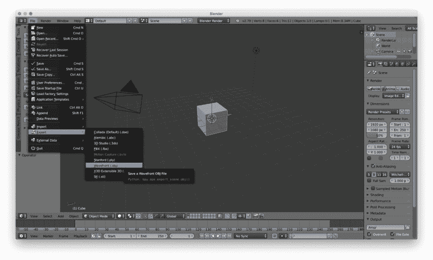
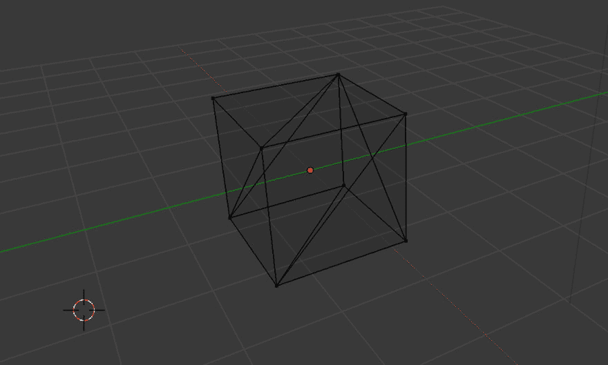
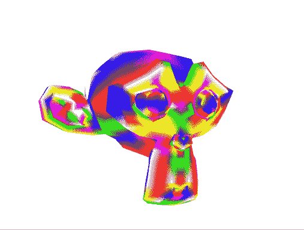

# WebGL 月份。第十七天。探索 OBJ 格式

> 原文：<https://dev.to/lesnitsky/webgl-month-day-17-exploring-obj-format-6fn>

## 第十七天。探索 OBJ 格式

这是一系列与 WebGL 相关的博文。每天都会有新帖子

[](https://github.com/lesnitsky/webgl-month)
[T6】](https://twitter.com/lesnitsky_a&hash=day17)

[加入邮件列表](http://eepurl.com/gwiSeH),让新邮件直接进入你的收件箱

[此处提供源代码](https://github.com/lesnitsky/webgl-month)

建造于

[](https://github.com/lesnitsky/git-tutor)

* * *

嘿👋

欢迎来到 WebGL 月。

昨天我们已经修复了我们的立方体示例，但是这个立方体的顶点是在我们的 js 代码中定义的。当渲染更复杂的对象时，这可能会变得更复杂。

幸运的是，像 [Blender](https://www.blender.org/) 这样的 3D 编辑器可以导出几种格式的对象定义。

让我们从 blender 导出一个立方体

[](https://res.cloudinary.com/practicaldev/image/fetch/s--M2nNzjwT--/c_limit%2Cf_auto%2Cfl_progressive%2Cq_auto%2Cw_880/https://git-tutor-assets.s3.eu-west-2.amazonaws.com/blender-screenshot.jpg)

让我们探索导出的文件

前两行以`#`开头，这只是一个注释

📄assets/objects/cube.obj

```
+ # Blender v2.79 (sub 0) OBJ File: ''
+ # www.blender.org 
```

`mtllib`行引用了对象
的材料文件，我们现在忽略它

📄assets/objects/cube.obj

```
 # Blender v2.79 (sub 0) OBJ File: ''
  # www.blender.org
+ mtllib cube.mtl 
```

`o`定义对象的名称

📄assets/objects/cube.obj

```
 # Blender v2.79 (sub 0) OBJ File: ''
  # www.blender.org
  mtllib cube.mtl
+ o Cube 
```

带`v`的线定义顶点位置

📄assets/objects/cube.obj

```
 # www.blender.org
  mtllib cube.mtl
  o Cube
+ v 1.000000 -1.000000 -1.000000
+ v 1.000000 -1.000000 1.000000
+ v -1.000000 -1.000000 1.000000
+ v -1.000000 -1.000000 -1.000000
+ v 1.000000 1.000000 -0.999999
+ v 0.999999 1.000000 1.000001
+ v -1.000000 1.000000 1.000000
+ v -1.000000 1.000000 -1.000000 
```

`vn`定义顶点法线。在这种情况下，法线垂直于立方体的面

📄assets/objects/cube.obj

```
 v 0.999999 1.000000 1.000001
  v -1.000000 1.000000 1.000000
  v -1.000000 1.000000 -1.000000
+ vn 0.0000 -1.0000 0.0000
+ vn 0.0000 1.0000 0.0000
+ vn 1.0000 0.0000 0.0000
+ vn -0.0000 -0.0000 1.0000
+ vn -1.0000 -0.0000 -0.0000
+ vn 0.0000 0.0000 -1.0000 
```

`usemtl`告诉该行后面的元素(面)使用哪种材料

📄assets/objects/cube.obj

```
 vn -0.0000 -0.0000 1.0000
  vn -1.0000 -0.0000 -0.0000
  vn 0.0000 0.0000 -1.0000
+ usemtl Material 
```

`f`线通过索引定义参考顶点和法线的对象面

📄assets/objects/cube.obj

```
 vn 0.0000 0.0000 -1.0000
  usemtl Material
  s off
+ f 1//1 2//1 3//1 4//1
+ f 5//2 8//2 7//2 6//2
+ f 1//3 5//3 6//3 2//3
+ f 2//4 6//4 7//4 3//4
+ f 3//5 7//5 8//5 4//5
+ f 5//6 1//6 4//6 8//6 
```

所以在这种情况下，第一个面由顶点`1, 2, 3 and 4`组成

另一件要提到的事情——我们的脸由 4 个顶点组成，但是 webgl 只能渲染三角形。我们可以在 JS 中把这些面分成三角形，或者在 Blender 中这样做

进入编辑模式(`Tab`键)，点击`Control + T`(在 macOS 上)。就这样，立方体的面现在被三角化了

[](https://res.cloudinary.com/practicaldev/image/fetch/s--OUrPrHtO--/c_limit%2Cf_auto%2Cfl_progressive%2Cq_auto%2Cw_880/https://git-tutor-assets.s3.eu-west-2.amazonaws.com/blender-triangulated-cube.png)

现在让我们装货。带有原始加载程序的对象文件

📄src/3d.js

```
 import fShaderSource from './shaders/3d.f.glsl';
  import { compileShader, setupShaderInput } from './gl-helpers';
  import { GLBuffer } from './GLBuffer';
+ import cubeObj from '../assets/objects/cube.obj'; 
  const canvas = document.querySelector('canvas');
  const gl = canvas.getContext('webgl'); 
```

📄web pack . config . js

```
 module: {
          rules: [
              {
-                 test: /\.glsl$/, +                 test: /\.(glsl|obj)$/,
                  use: 'raw-loader',
              }, 
```

并实现解析器来获取顶点和顶点索引

📄src/3d.js

```
 import vShaderSource from './shaders/3d.v.glsl';
  import fShaderSource from './shaders/3d.f.glsl';
- import { compileShader, setupShaderInput } from './gl-helpers'; + import { compileShader, setupShaderInput, parseObj } from './gl-helpers';
  import { GLBuffer } from './GLBuffer';
  import cubeObj from '../assets/objects/cube.obj';

  const programInfo = setupShaderInput(gl, program, vShaderSource, fShaderSource);

- const cubeVertices = new Float32Array([
-     // Front face
-     -1.0, -1.0, 1.0,
-     1.0, -1.0, 1.0,
-     1.0, 1.0, 1.0,
-     -1.0, 1.0, 1.0,
- 
-     // Back face
-     -1.0, -1.0, -1.0,
-     -1.0, 1.0, -1.0,
-     1.0, 1.0, -1.0,
-     1.0, -1.0, -1.0,
- 
-     // Top face
-     -1.0, 1.0, -1.0,
-     -1.0, 1.0, 1.0,
-     1.0, 1.0, 1.0,
-     1.0, 1.0, -1.0,
- 
-     // Bottom face
-     -1.0, -1.0, -1.0,
-     1.0, -1.0, -1.0,
-     1.0, -1.0, 1.0,
-     -1.0, -1.0, 1.0,
- 
-     // Right face
-     1.0, -1.0, -1.0,
-     1.0, 1.0, -1.0,
-     1.0, 1.0, 1.0,
-     1.0, -1.0, 1.0,
- 
-     // Left face
-     -1.0, -1.0, -1.0,
-     -1.0, -1.0, 1.0,
-     -1.0, 1.0, 1.0,
-     -1.0, 1.0, -1.0,
- ]);
- 
- const indices = new Uint8Array([
-     0, 1, 2, 0, 2, 3,       // front
-     4, 5, 6, 4, 6, 7,       // back
-     8, 9, 10, 8, 10, 11,    // top
-     12, 13, 14, 12, 14, 15, // bottom
-     16, 17, 18, 16, 18, 19, // right
-     20, 21, 22, 20, 22, 23, // left
- ]); + const { vertices, indices } = parseObj(cubeObj); 
  const faceColors = [
      [1.0, 1.0, 1.0, 1.0], // Front face: white
      gl.uniform4fv(programInfo.uniformLocations[`colors[${index}]`], color);
  });

- const vertexBuffer = new GLBuffer(gl, gl.ARRAY_BUFFER, cubeVertices, gl.STATIC_DRAW);
+ const vertexBuffer = new GLBuffer(gl, gl.ARRAY_BUFFER, vertices, gl.STATIC_DRAW);
  const colorsBuffer = new GLBuffer(gl, gl.ARRAY_BUFFER, new Float32Array(colors), gl.STATIC_DRAW);
  const indexBuffer = new GLBuffer(gl, gl.ELEMENT_ARRAY_BUFFER, indices, gl.STATIC_DRAW); 
```

📄src/gl-helpers.js

```
 uniformLocations,
      }
  }
+ 
+ export function parseObj(objSource) {
+     const vertices = [];
+     const indices = [];
+ 
+     return { vertices, indices };
+ } 
```

我们可以迭代每一行，搜索以`v`开头的行，以获得顶点坐标

📄src/gl-helpers.js

```
 }
  }

+ export function parseVec(string, prefix) {
+     return string.replace(prefix, '').split(' ').map(Number);
+ }
+ 
  export function parseObj(objSource) {
      const vertices = [];
      const indices = [];

+     objSource.split('\n').forEach(line => {
+         if (line.startsWith('v ')) {
+             vertices.push(...parseVec(line, 'v '));
+         }
+     });
+ 
      return { vertices, indices };
  } 
```

对人脸也是如此

📄src/gl-helpers.js

```
 return string.replace(prefix, '').split(' ').map(Number);
  }

+ export function parseFace(string) {
+     return string.replace('f ', '').split(' ').map(chunk => {
+         return chunk.split('/').map(Number);
+     })
+ }
+ 
  export function parseObj(objSource) {
      const vertices = [];
      const indices = [];
          if (line.startsWith('v ')) {
              vertices.push(...parseVec(line, 'v '));
          }
+ 
+         if (line.startsWith('f ')) {
+             indices.push(...parseFace(line).map(face => face[0]));
+         }
      });

      return { vertices, indices }; 
```

让我们也返回类型化数组

📄src/gl-helpers.js

```
 }
      });

-     return { vertices, indices };
+     return { 
+         vertices: new Float32Array(vertices), 
+         indices: new Uint8Array(indices),
+     };
  } 
```

好的，一切看起来都很好，但是我们有一个错误

```
glDrawElements: attempt to access out of range vertices in attribute 0 
```

这是因为指数。obj 文件以`1`开始，所以我们需要递减每个索引

📄src/gl-helpers.js

```
 }

          if (line.startsWith('f ')) {
-             indices.push(...parseFace(line).map(face => face[0])); +             indices.push(...parseFace(line).map(face => face[0] - 1));
          }
      }); 
```

让我们也改变我们给我们的脸上色的方式，只是为了能够用随机的颜色渲染任何有任意数量的脸的物体

📄src/3d.js

```
 const colors = [];

- for (var j = 0; j < faceColors.length; ++j) {
-     colors.push(j, j, j, j); + for (var j = 0; j < indices.length / 3; ++j) {
+     const randomColorIndex = Math.floor(Math.random() * faceColors.length);
+     colors.push(randomColorIndex, randomColorIndex, randomColorIndex);
  }

  faceColors.forEach((color, index) => { 
```

现有代码的另一个问题是，我们使用了`gl.UNSIGNED_BYTE`，所以索引缓冲区可能只有一个`Uint8Array`，它最多只能容纳`255`的数字，所以如果对象有超过 255 个顶点，它将被错误地渲染。让我们解决这个问题

📄src/3d.js

```
 gl.viewport(0, 0, canvas.width, canvas.height);

- gl.drawElements(gl.TRIANGLES, indexBuffer.data.length, gl.UNSIGNED_BYTE, 0);
+ gl.drawElements(gl.TRIANGLES, indexBuffer.data.length, gl.UNSIGNED_SHORT, 0); 
  function frame() {
      mat4.rotateY(modelMatrix, modelMatrix, Math.PI / 180);

      gl.uniformMatrix4fv(programInfo.uniformLocations.modelMatrix, false, modelMatrix);
-     gl.drawElements(gl.TRIANGLES, indexBuffer.data.length, gl.UNSIGNED_BYTE, 0); +     gl.drawElements(gl.TRIANGLES, indexBuffer.data.length, gl.UNSIGNED_SHORT, 0); 
      requestAnimationFrame(frame);
  } 
```

📄src/gl-helpers.js

```
 return { 
          vertices: new Float32Array(vertices), 
-         indices: new Uint8Array(indices), +         indices: new Uint16Array(indices),
      };
  } 
```

现在让我们渲染不同的物体，例如猴子

📄src/3d.js

```
 import fShaderSource from './shaders/3d.f.glsl';
  import { compileShader, setupShaderInput, parseObj } from './gl-helpers';
  import { GLBuffer } from './GLBuffer';
- import cubeObj from '../assets/objects/cube.obj'; + import monkeyObj from '../assets/objects/monkey.obj'; 
  const canvas = document.querySelector('canvas');
  const gl = canvas.getContext('webgl');

  const programInfo = setupShaderInput(gl, program, vShaderSource, fShaderSource);

- const { vertices, indices } = parseObj(cubeObj);
+ const { vertices, indices } = parseObj(monkeyObj); 
  const faceColors = [
      [1.0, 1.0, 1.0, 1.0], // Front face: white

  mat4.lookAt(
      viewMatrix,
-     [0, 7, -7], +     [0, 0, -7],
      [0, 0, 0],
      [0, 1, 0],
  ); 
```

酷！我们现在可以渲染从 blender 导出的任何对象🎉

[](https://res.cloudinary.com/practicaldev/image/fetch/s--J0KAOL8_--/c_limit%2Cf_auto%2Cfl_progressive%2Cq_66%2Cw_880/https://git-tutor-assets.s3.eu-west-2.amazonaws.com/rotating-monkey.gif)

今天就到这里，明天见👋

* * *

[](https://github.com/lesnitsky/webgl-month)
[T6】](https://twitter.com/lesnitsky_a)

[加入邮件列表](http://eepurl.com/gwiSeH),让新邮件直接进入你的收件箱

[此处提供源代码](https://github.com/lesnitsky/webgl-month)

建造于

[](https://github.com/lesnitsky/git-tutor)