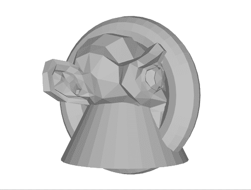
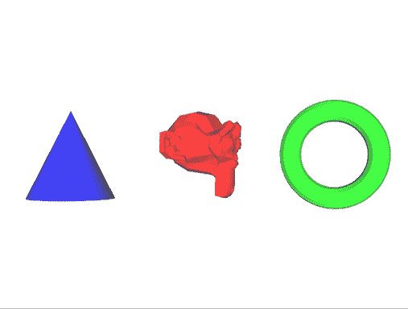

# WebGL 月份。第 19 天。渲染多个对象

> 原文：<https://dev.to/lesnitsky/webgl-month-day-19-rendering-multiple-objects-45m7>

这是一系列与 WebGL 相关的博文。每天都会有新帖子

[](https://github.com/lesnitsky/webgl-month)
[T6】](https://twitter.com/lesnitsky_a)

[加入邮件列表](http://eepurl.com/gwiSeH),让新邮件直接进入你的收件箱

[此处提供源代码](https://github.com/lesnitsky/webgl-month)

建造于

[](https://github.com/lesnitsky/git-tutor)

* * *

嘿👋

欢迎来到 WebGL 月。

在之前的教程中，我们只渲染了一个物体，但是典型的 3D 场景是由多个物体组成的。今天我们将学习如何渲染场景中的许多物体。

因为我们用纯色渲染对象，所以让我们去掉 colorIndex 属性，通过 uniform 传递单一颜色

📄src/3d.js

```
 const { vertices, normals } = parseObj(monkeyObj);

- const faceColors = [
-     [0.5, 0.5, 0.5, 1.0]
- ];
- 
- const colors = [];
- 
- for (var j = 0; j < vertices.length / 3; ++j) {
-     colors.push(0, 0, 0, 0);
- }
- 
- faceColors.forEach((color, index) => {
-     gl.uniform4fv(programInfo.uniformLocations[`colors[${index}]`], color);
- }); + gl.uniform3fv(programInfo.uniformLocations.color, [0.5, 0.5, 0.5]); 
  const vertexBuffer = new GLBuffer(gl, gl.ARRAY_BUFFER, vertices, gl.STATIC_DRAW);
- const colorsBuffer = new GLBuffer(gl, gl.ARRAY_BUFFER, new Float32Array(colors), gl.STATIC_DRAW);
  const normalsBuffer = new GLBuffer(gl, gl.ARRAY_BUFFER, normals, gl.STATIC_DRAW);

  vertexBuffer.bind(gl);
  gl.vertexAttribPointer(programInfo.attributeLocations.position, 3, gl.FLOAT, false, 0, 0);

- colorsBuffer.bind(gl);
- gl.vertexAttribPointer(programInfo.attributeLocations.colorIndex, 1, gl.FLOAT, false, 0, 0);
- 
  normalsBuffer.bind(gl);
  gl.vertexAttribPointer(programInfo.attributeLocations.normal, 3, gl.FLOAT, false, 0, 0); 
```

📄src/shaders/3d.v.glsl

```
 attribute vec3 position;
  attribute vec3 normal;
- attribute float colorIndex; 
  uniform mat4 modelMatrix;
  uniform mat4 viewMatrix;
  uniform mat4 projectionMatrix;
  uniform mat4 normalMatrix;
- uniform vec4 colors[6]; + uniform vec3 color;
  uniform vec3 directionalLightVector;

  varying vec4 vColor;
      vec3 transformedNormal = (normalMatrix * vec4(normal, 1.0)).xyz;
      float intensity = dot(transformedNormal, normalize(directionalLightVector));

-     vColor.rgb = vec3(0.3, 0.3, 0.3) + colors[int(colorIndex)].rgb * intensity;
+     vColor.rgb = vec3(0.3, 0.3, 0.3) + color * intensity;
      vColor.a = 1.0;
  } 
```

我们需要一个助手类来存储对象相关信息

📄src/Object3D.js

```
export class Object3D {
    constructor() {

    } 
} 
```

每个对象应该包含它自己的顶点和法线

📄src/Object3D.js

```
+ import { parseObj } from "./gl-helpers";
+ 
  export class Object3D {
-     constructor() {
-         
-     } +     constructor(source) {
+         const { vertices, normals } = parseObj(source);
+ 
+         this.vertices = vertices;
+         this.normals = normals;
+     }
  } 
```

以及存储对象变换模型矩阵

📄src/Object3D.js

```
 import { parseObj } from "./gl-helpers";
+ import { mat4 } from "gl-matrix"; 
  export class Object3D {
      constructor(source) {

          this.vertices = vertices;
          this.normals = normals;
+ 
+         this.modelMatrix = mat4.create();
      }
  } 
```

由于正规矩阵可以从模型矩阵中计算出来，因此定义一个 getter 是有意义的

📄src/Object3D.js

```
 this.normals = normals;

          this.modelMatrix = mat4.create();
+         this._normalMatrix = mat4.create();
+     }
+ 
+     get normalMatrix () {
+         mat4.invert(this._normalMatrix, this.modelMatrix);
+         mat4.transpose(this._normalMatrix, this._normalMatrix);
+ 
+         return this._normalMatrix;
      }
  } 
```

现在我们可以重构代码并使用新的助手类

📄src/3d.js

```
 import { compileShader, setupShaderInput, parseObj } from './gl-helpers';
  import { GLBuffer } from './GLBuffer';
  import monkeyObj from '../assets/objects/monkey.obj';
+ import { Object3D } from './Object3D'; 
  const canvas = document.querySelector('canvas');
  const gl = canvas.getContext('webgl');

  const programInfo = setupShaderInput(gl, program, vShaderSource, fShaderSource);

- const { vertices, normals } = parseObj(monkeyObj);
+ const monkey = new Object3D(monkeyObj); 
  gl.uniform3fv(programInfo.uniformLocations.color, [0.5, 0.5, 0.5]);

- const vertexBuffer = new GLBuffer(gl, gl.ARRAY_BUFFER, vertices, gl.STATIC_DRAW);
- const normalsBuffer = new GLBuffer(gl, gl.ARRAY_BUFFER, normals, gl.STATIC_DRAW); + const vertexBuffer = new GLBuffer(gl, gl.ARRAY_BUFFER, monkey.vertices, gl.STATIC_DRAW);
+ const normalsBuffer = new GLBuffer(gl, gl.ARRAY_BUFFER, monkey.normals, gl.STATIC_DRAW); 
  vertexBuffer.bind(gl);
  gl.vertexAttribPointer(programInfo.attributeLocations.position, 3, gl.FLOAT, false, 0, 0);
  normalsBuffer.bind(gl);
  gl.vertexAttribPointer(programInfo.attributeLocations.normal, 3, gl.FLOAT, false, 0, 0);

- const modelMatrix = mat4.create();
  const viewMatrix = mat4.create();
  const projectionMatrix = mat4.create();
- const normalMatrix = mat4.create(); 
  mat4.lookAt(
      viewMatrix,
      100,
  );

- gl.uniformMatrix4fv(programInfo.uniformLocations.modelMatrix, false, modelMatrix);
  gl.uniformMatrix4fv(programInfo.uniformLocations.viewMatrix, false, viewMatrix);
  gl.uniformMatrix4fv(programInfo.uniformLocations.projectionMatrix, false, projectionMatrix);

  gl.viewport(0, 0, canvas.width, canvas.height);

- gl.drawArrays(gl.TRIANGLES, 0, vertexBuffer.data.length / 3);
- 
  function frame() {
-     mat4.rotateY(modelMatrix, modelMatrix, Math.PI / 180);
- 
-     mat4.invert(normalMatrix, modelMatrix);
-     mat4.transpose(normalMatrix, normalMatrix); +     mat4.rotateY(monkey.modelMatrix, monkey.modelMatrix, Math.PI / 180); 
-     gl.uniformMatrix4fv(programInfo.uniformLocations.modelMatrix, false, modelMatrix);
-     gl.uniformMatrix4fv(programInfo.uniformLocations.normalMatrix, false, normalMatrix); +     gl.uniformMatrix4fv(programInfo.uniformLocations.modelMatrix, false, monkey.modelMatrix);
+     gl.uniformMatrix4fv(programInfo.uniformLocations.normalMatrix, false, monkey.normalMatrix); 
      gl.drawArrays(gl.TRIANGLES, 0, vertexBuffer.data.length / 3); 
```

现在让我们导入更多的对象

📄src/3d.js

```
 import { compileShader, setupShaderInput, parseObj } from './gl-helpers';
  import { GLBuffer } from './GLBuffer';
  import monkeyObj from '../assets/objects/monkey.obj';
+ import torusObj from '../assets/objects/torus.obj';
+ import coneObj from '../assets/objects/cone.obj';
+ 
  import { Object3D } from './Object3D';

  const canvas = document.querySelector('canvas');
  const programInfo = setupShaderInput(gl, program, vShaderSource, fShaderSource);

  const monkey = new Object3D(monkeyObj);
+ const torus = new Object3D(torusObj);
+ const cone = new Object3D(coneObj); 
  gl.uniform3fv(programInfo.uniformLocations.color, [0.5, 0.5, 0.5]); 
```

并将它们存储在一个集合中

📄src/3d.js

```
 const torus = new Object3D(torusObj);
  const cone = new Object3D(coneObj);

+ const objects = [
+     monkey,
+     torus,
+     cone,
+ ];
+ 
  gl.uniform3fv(programInfo.uniformLocations.color, [0.5, 0.5, 0.5]);

  const vertexBuffer = new GLBuffer(gl, gl.ARRAY_BUFFER, monkey.vertices, gl.STATIC_DRAW); 
```

我们将对集合进行迭代，而不是只对一只猴子发出 draw 调用

📄src/3d.js

```
 gl.viewport(0, 0, canvas.width, canvas.height);

  function frame() {
-     mat4.rotateY(monkey.modelMatrix, monkey.modelMatrix, Math.PI / 180); +     objects.forEach((object) => {
+         mat4.rotateY(object.modelMatrix, object.modelMatrix, Math.PI / 180); 
-     gl.uniformMatrix4fv(programInfo.uniformLocations.modelMatrix, false, monkey.modelMatrix);
-     gl.uniformMatrix4fv(programInfo.uniformLocations.normalMatrix, false, monkey.normalMatrix); +         gl.uniformMatrix4fv(programInfo.uniformLocations.modelMatrix, false, object.modelMatrix);
+         gl.uniformMatrix4fv(programInfo.uniformLocations.normalMatrix, false, object.normalMatrix); 
-     gl.drawArrays(gl.TRIANGLES, 0, vertexBuffer.data.length / 3);
+         gl.drawArrays(gl.TRIANGLES, 0, vertexBuffer.data.length / 3);
+     }); 
      requestAnimationFrame(frame);
  } 
```

好吧，但为什么我们仍然只有猴子渲染？

难怪，顶点和法线缓冲区保持不变，所以我们只是渲染同一个对象 N 次。让我们在每次渲染一个物体的时候更新顶点和法线缓冲

📄src/3d.js

```
 gl.uniformMatrix4fv(programInfo.uniformLocations.modelMatrix, false, object.modelMatrix);
          gl.uniformMatrix4fv(programInfo.uniformLocations.normalMatrix, false, object.normalMatrix);

+         vertexBuffer.setData(gl, object.vertices, gl.STATIC_DRAW);
+         normalsBuffer.setData(gl, object.normals, gl.STATIC_DRAW);
+ 
          gl.drawArrays(gl.TRIANGLES, 0, vertexBuffer.data.length / 3);
      }); 
```

[](https://res.cloudinary.com/practicaldev/image/fetch/s--fIV3_avN--/c_limit%2Cf_auto%2Cfl_progressive%2Cq_66%2Cw_880/https://git-tutor-assets.s3.eu-west-2.amazonaws.com/multiple-objects-1.gif)

酷，我们已经渲染了多个物体，但是它们都在同一个地方。让我们解决这个问题

每个物体都有一个存储空间位置的属性

📄src/3d.js

```
 const programInfo = setupShaderInput(gl, program, vShaderSource, fShaderSource);

- const monkey = new Object3D(monkeyObj);
- const torus = new Object3D(torusObj);
- const cone = new Object3D(coneObj); + const monkey = new Object3D(monkeyObj, [0, 0, 0]);
+ const torus = new Object3D(torusObj, [-3, 0, 0]);
+ const cone = new Object3D(coneObj, [3, 0, 0]); 
  const objects = [
      monkey, 
```

📄src/Object3D.js

```
 import { mat4 } from "gl-matrix";

  export class Object3D {
-     constructor(source) { +     constructor(source, position) {
          const { vertices, normals } = parseObj(source);

          this.vertices = vertices;
          this.normals = normals;
+         this.position = position; 
          this.modelMatrix = mat4.create();
          this._normalMatrix = mat4.create(); 
```

这一立场应该得到模型矩阵的尊重

📄src/Object3D.js

```
 this.position = position;

          this.modelMatrix = mat4.create();
+         mat4.fromTranslation(this.modelMatrix, position);
          this._normalMatrix = mat4.create();
      } 
```

还有一件事。我们还可以为每个对象定义特定的颜色

📄src/3d.js

```
 const programInfo = setupShaderInput(gl, program, vShaderSource, fShaderSource);

- const monkey = new Object3D(monkeyObj, [0, 0, 0]);
- const torus = new Object3D(torusObj, [-3, 0, 0]);
- const cone = new Object3D(coneObj, [3, 0, 0]); + const monkey = new Object3D(monkeyObj, [0, 0, 0], [1, 0, 0]);
+ const torus = new Object3D(torusObj, [-3, 0, 0], [0, 1, 0]);
+ const cone = new Object3D(coneObj, [3, 0, 0], [0, 0, 1]); 
  const objects = [
      monkey,
      cone,
  ];

- gl.uniform3fv(programInfo.uniformLocations.color, [0.5, 0.5, 0.5]);
- 
  const vertexBuffer = new GLBuffer(gl, gl.ARRAY_BUFFER, monkey.vertices, gl.STATIC_DRAW);
  const normalsBuffer = new GLBuffer(gl, gl.ARRAY_BUFFER, monkey.normals, gl.STATIC_DRAW);

          gl.uniformMatrix4fv(programInfo.uniformLocations.modelMatrix, false, object.modelMatrix);
          gl.uniformMatrix4fv(programInfo.uniformLocations.normalMatrix, false, object.normalMatrix);

+         gl.uniform3fv(programInfo.uniformLocations.color, object.color);
+ 
          vertexBuffer.setData(gl, object.vertices, gl.STATIC_DRAW);
          normalsBuffer.setData(gl, object.normals, gl.STATIC_DRAW); 
```

📄src/Object3D.js

```
 import { mat4 } from "gl-matrix";

  export class Object3D {
-     constructor(source, position) { +     constructor(source, position, color) {
          const { vertices, normals } = parseObj(source);

          this.vertices = vertices;
          this.modelMatrix = mat4.create();
          mat4.fromTranslation(this.modelMatrix, position);
          this._normalMatrix = mat4.create();
+ 
+         this.color = color;
      }

      get normalMatrix () { 
```

[](https://res.cloudinary.com/practicaldev/image/fetch/s--m0Hgrbwf--/c_limit%2Cf_auto%2Cfl_progressive%2Cq_66%2Cw_880/https://git-tutor-assets.s3.eu-west-2.amazonaws.com/multiple-objects-2.gif)

耶！我们现在可以用单独的变换和颜色渲染多个对象🎉

今天就到这里，明天见👋

* * *

[](https://github.com/lesnitsky/webgl-month)
[T6】](https://twitter.com/lesnitsky_a)

[加入邮件列表](http://eepurl.com/gwiSeH),让新邮件直接进入你的收件箱

[此处提供源代码](https://github.com/lesnitsky/webgl-month)

建造于

[](https://github.com/lesnitsky/git-tutor)