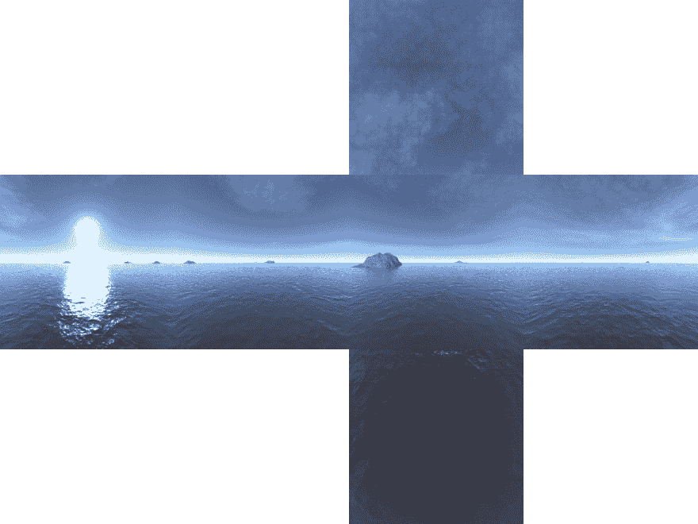

# WebGL 月份。第 23 天。WebGL 中的 Skybox

> 原文：<https://dev.to/lesnitsky/webgl-month-day-23-skybox-in-webgl-1eig>

这是一系列与 WebGL 相关的博文。每天都会有新帖子

[](https://github.com/lesnitsky/webgl-month)
[T6】](https://twitter.com/lesnitsky_a)

[加入邮件列表](http://eepurl.com/gwiSeH),让新邮件直接进入你的收件箱

[此处提供源代码](https://github.com/lesnitsky/webgl-month)

建造于

[](https://github.com/lesnitsky/git-tutor)

* * *

嘿👋

欢迎来到 WebGL 月。

在之前的教程中，我们已经渲染了没有任何环境的物体，但是如果我们想在场景中添加天空呢？

有一种特殊的纹理类型可以帮助我们

我们可以把我们的场景看作一个巨大的立方体，摄像机总是在这个立方体的中心。所以我们需要渲染这个立方体并应用纹理，如下图所示

[](https://res.cloudinary.com/practicaldev/image/fetch/s--jS7rZiAv--/c_limit%2Cf_auto%2Cfl_progressive%2Cq_auto%2Cw_880/https://git-tutor-assets.s3.eu-west-2.amazonaws.com/skybox.png)

顶点着色器将具有顶点位置和 texCoord 属性，视图和投影矩阵统一。我们不需要模型矩阵，因为我们的“世界”立方体是静态的

📄src/shaders/skybox.v.glsl

```
attribute vec3 position;
varying vec3 vTexCoord;

uniform mat4 projectionMatrix;
uniform mat4 viewMatrix;

void main() {

} 
```

如果我们的立方体顶点坐标在`[-1..1]`范围内，我们可以直接用这个坐标作为纹理坐标

📄src/shaders/skybox.v.glsl

```
 uniform mat4 viewMatrix;

  void main() {
- +     vTexCoord = position;
  } 
```

为了计算变换后的顶点的位置，我们需要将顶点位置、视图矩阵和投影矩阵相乘

📄src/shaders/skybox.v.glsl

```
 void main() {
      vTexCoord = position;
+     gl_Position = projectionMatrix * viewMatrix * vec4(position, 1.0);
  } 
```

片段着色器应该有一个可变的 vtex code 来接收来自顶点着色器的纹理坐标

📄src/shaders/skybox.f.glsl

```
precision mediump float;

varying vec3 vTexCoord;

void main() {

} 
```

和一种特殊类型的纹理-采样器立方体

📄src/shaders/skybox.f.glsl

```
 precision mediump float;

  varying vec3 vTexCoord;
+ uniform samplerCube skybox; 
  void main() {
- 
  } 
```

我们计算碎片颜色所需要的就是从立方体贴图纹理中读取颜色

📄src/shaders/skybox.f.glsl

```
 uniform samplerCube skybox;

  void main() {
+     gl_FragColor = textureCube(skybox, vTexCoord);
  } 
```

像往常一样，我们需要得到一个画布引用，webgl 上下文，并使画布全屏显示

📄src/skybox.js

```
const canvas = document.querySelector('canvas');
const gl = canvas.getContext('webgl');

const width = document.body.offsetWidth;
const height = document.body.offsetHeight;

canvas.width = width * devicePixelRatio;
canvas.height = height * devicePixelRatio;

canvas.style.width = `${width}px`;
canvas.style.height = `${height}px`; 
```

设置 webgl 程序

📄src/skybox.js

```
+ import vShaderSource from './shaders/skybox.v.glsl';
+ import fShaderSource from './shaders/skybox.f.glsl';
+ 
+ import { compileShader, setupShaderInput } from './gl-helpers';
+ 
  const canvas = document.querySelector('canvas');
  const gl = canvas.getContext('webgl');

  canvas.style.width = `${width}px`;
  canvas.style.height = `${height}px`;
+ 
+ const vShader = gl.createShader(gl.VERTEX_SHADER);
+ const fShader = gl.createShader(gl.FRAGMENT_SHADER);
+ 
+ compileShader(gl, vShader, vShaderSource);
+ compileShader(gl, fShader, fShaderSource);
+ 
+ const program = gl.createProgram();
+ 
+ gl.attachShader(program, vShader);
+ gl.attachShader(program, fShader);
+ 
+ gl.linkProgram(program);
+ gl.useProgram(program);
+ 
+ const programInfo = setupShaderInput(gl, program, vShaderSource, fShaderSource); 
```

创建立方体对象并为顶点位置设置缓冲区

📄src/skybox.js

```
 import fShaderSource from './shaders/skybox.f.glsl';

  import { compileShader, setupShaderInput } from './gl-helpers';
+ import { Object3D } from './Object3D';
+ import { GLBuffer } from './GLBuffer';
+ 
+ import cubeObj from '../assets/objects/cube.obj'; 
  const canvas = document.querySelector('canvas');
  const gl = canvas.getContext('webgl');
  gl.useProgram(program);

  const programInfo = setupShaderInput(gl, program, vShaderSource, fShaderSource);
+ 
+ const cube = new Object3D(cubeObj, [0, 0, 0], [0, 0, 0]);
+ const vertexBuffer = new GLBuffer(gl, gl.ARRAY_BUFFER, cube.vertices, gl.STATIC_DRAW); 
```

设置职位属性

📄src/skybox.js

```
 const cube = new Object3D(cubeObj, [0, 0, 0], [0, 0, 0]);
  const vertexBuffer = new GLBuffer(gl, gl.ARRAY_BUFFER, cube.vertices, gl.STATIC_DRAW);
+ 
+ vertexBuffer.bind(gl);
+ gl.vertexAttribPointer(programInfo.attributeLocations.position, 3, gl.FLOAT, false, 0, 0); 
```

设置视图、投影矩阵、将值传递给制服并设置视口

📄src/skybox.js

```
 import { GLBuffer } from './GLBuffer';

  import cubeObj from '../assets/objects/cube.obj';
+ import { mat4 } from 'gl-matrix'; 
  const canvas = document.querySelector('canvas');
  const gl = canvas.getContext('webgl');

  vertexBuffer.bind(gl);
  gl.vertexAttribPointer(programInfo.attributeLocations.position, 3, gl.FLOAT, false, 0, 0);
+ 
+ const viewMatrix = mat4.create();
+ const projectionMatrix = mat4.create();
+ 
+ mat4.lookAt(viewMatrix, [0, 0, 0], [0, 0, -1], [0, 1, 0]);
+ 
+ mat4.perspective(projectionMatrix, (Math.PI / 360) * 90, canvas.width / canvas.height, 0.01, 100);
+ 
+ gl.uniformMatrix4fv(programInfo.uniformLocations.viewMatrix, false, viewMatrix);
+ gl.uniformMatrix4fv(programInfo.uniformLocations.projectionMatrix, false, projectionMatrix);
+ 
+ gl.viewport(0, 0, canvas.width, canvas.height); 
```

定义一个函数来渲染我们的场景

📄src/skybox.js

```
 gl.uniformMatrix4fv(programInfo.uniformLocations.projectionMatrix, false, projectionMatrix);

  gl.viewport(0, 0, canvas.width, canvas.height);
+ 
+ function frame() {
+     gl.drawArrays(gl.TRIANGLES, 0, vertexBuffer.data.length / 3);
+ 
+     requestAnimationFrame(frame);
+ } 
```

现在是有趣的部分。立方体每一面的纹理应该存储在单独的文件中，所以我们需要加载所有的图像。[看看这个网站的其他纹理](http://www.custommapmakers.org/skyboxes.php)

📄src/skybox.js

```
 import vShaderSource from './shaders/skybox.v.glsl';
  import fShaderSource from './shaders/skybox.f.glsl';

- import { compileShader, setupShaderInput } from './gl-helpers';
+ import { compileShader, setupShaderInput, loadImage } from './gl-helpers';
  import { Object3D } from './Object3D';
  import { GLBuffer } from './GLBuffer';

  import cubeObj from '../assets/objects/cube.obj';
  import { mat4 } from 'gl-matrix';

+ import rightTexture from '../asseimg/skybox/right.JPG';
+ import leftTexture from '../asseimg/skybox/left.JPG';
+ import upTexture from '../asseimg/skybox/up.JPG';
+ import downTexture from '../asseimg/skybox/down.JPG';
+ import backTexture from '../asseimg/skybox/back.JPG';
+ import frontTexture from '../asseimg/skybox/front.JPG';
+ 
  const canvas = document.querySelector('canvas');
  const gl = canvas.getContext('webgl');

      requestAnimationFrame(frame);
  }
+ 
+ Promise.all([
+     loadImage(rightTexture),
+     loadImage(leftTexture),
+     loadImage(upTexture),
+     loadImage(downTexture),
+     loadImage(backTexture),
+     loadImage(frontTexture),
+ ]).then((images) => {
+     frame();
+ }); 
```

现在我们需要创建一个 webgl 纹理

📄src/skybox.js

```
 loadImage(backTexture),
      loadImage(frontTexture),
  ]).then((images) => {
+     const texture = gl.createTexture();
+ 
      frame();
  }); 
```

并传递一个特殊的纹理类型绑定方法——`gl.TEXTURE_CUBE_MAP`

📄src/skybox.js

```
 loadImage(frontTexture),
  ]).then((images) => {
      const texture = gl.createTexture();
+     gl.bindTexture(gl.TEXTURE_CUBE_MAP, texture); 
      frame();
  }); 
```

然后我们需要设置纹理

📄src/skybox.js

```
 const texture = gl.createTexture();
      gl.bindTexture(gl.TEXTURE_CUBE_MAP, texture);

+     gl.texParameteri(gl.TEXTURE_CUBE_MAP, gl.TEXTURE_MIN_FILTER, gl.LINEAR);
+     gl.texParameteri(gl.TEXTURE_CUBE_MAP, gl.TEXTURE_MAG_FILTER, gl.LINEAR);
+     gl.texParameteri(gl.TEXTURE_CUBE_MAP, gl.TEXTURE_WRAP_S, gl.CLAMP_TO_EDGE);
+     gl.texParameteri(gl.TEXTURE_CUBE_MAP, gl.TEXTURE_WRAP_T, gl.CLAMP_TO_EDGE);
+ 
      frame();
  }); 
```

并将每个图像上传到 gpu

目标是:

*   `gl.TEXTURE_CUBE_MAP_POSITIVE_X`–右
*   `gl.TEXTURE_CUBE_MAP_NEGATIVE_X`–左侧
*   `gl.TEXTURE_CUBE_MAP_POSITIVE_Y`–顶部
*   `gl.TEXTURE_CUBE_MAP_NEGATIVE_Y`–底部
*   `gl.TEXTURE_CUBE_MAP_POSITIVE_Z`–前部
*   `gl.TEXTURE_CUBE_MAP_NEGATIVE_Z`–返回

因为所有这些值都是整数，所以我们可以迭代所有图像并将图像索引添加到`TEXTURE_CUBE_MAP_POSITIVE_X`目标

📄src/skybox.js

```
 gl.texParameteri(gl.TEXTURE_CUBE_MAP, gl.TEXTURE_WRAP_S, gl.CLAMP_TO_EDGE);
      gl.texParameteri(gl.TEXTURE_CUBE_MAP, gl.TEXTURE_WRAP_T, gl.CLAMP_TO_EDGE);

+     images.forEach((image, index) => {
+         gl.texImage2D(gl.TEXTURE_CUBE_MAP_POSITIVE_X + index, 0, gl.RGBA, gl.RGBA, gl.UNSIGNED_BYTE, image);
+     });
+ 
      frame();
  }); 
```

最后，让我们重复使用[之前教程](https://dev.to/lesnitsky/webgl-month-day-21-rendering-a-minecraft-terrain-24b5)中的代码来实现相机旋转动画

📄src/skybox.js

```
 import { GLBuffer } from './GLBuffer';

  import cubeObj from '../assets/objects/cube.obj';
- import { mat4 } from 'gl-matrix'; + import { mat4, vec3 } from 'gl-matrix'; 
  import rightTexture from '../asseimg/skybox/right.JPG';
  import leftTexture from '../asseimg/skybox/left.JPG';

  gl.viewport(0, 0, canvas.width, canvas.height);

+ const cameraPosition = [0, 0, 0];
+ const cameraFocusPoint = vec3.fromValues(0, 0, 1);
+ const cameraFocusPointMatrix = mat4.create();
+ 
+ mat4.fromTranslation(cameraFocusPointMatrix, cameraFocusPoint);
+ 
  function frame() {
+     mat4.translate(cameraFocusPointMatrix, cameraFocusPointMatrix, [0, 0, -1]);
+     mat4.rotateY(cameraFocusPointMatrix, cameraFocusPointMatrix, Math.PI / 360);
+     mat4.translate(cameraFocusPointMatrix, cameraFocusPointMatrix, [0, 0, 1]);
+ 
+     mat4.getTranslation(cameraFocusPoint, cameraFocusPointMatrix);
+ 
+     mat4.lookAt(viewMatrix, cameraPosition, cameraFocusPoint, [0, 1, 0]);
+     gl.uniformMatrix4fv(programInfo.uniformLocations.viewMatrix, false, viewMatrix);
+ 
      gl.drawArrays(gl.TRIANGLES, 0, vertexBuffer.data.length / 3);

      requestAnimationFrame(frame); 
```

就这样，我们现在有了一个天空盒，它让场景看起来更加令人印象深刻😎

感谢阅读！

明天见👋

* * *

[](https://github.com/lesnitsky/webgl-month)
[T6】](https://twitter.com/lesnitsky_a)

[加入邮件列表](http://eepurl.com/gwiSeH),让新邮件直接进入你的收件箱

[此处提供源代码](https://github.com/lesnitsky/webgl-month)

建造于

[](https://github.com/lesnitsky/git-tutor)