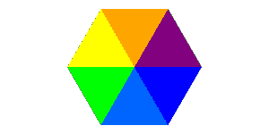

# WebGL 月份。第五天。交错缓冲器

> 原文：<https://dev.to/lesnitsky/webgl-month-day-5-interleaved-buffers-2k9a>

## 交错缓冲器

这是一系列与 WebGL 相关的博文。每天都会有新帖子

[](https://github.com/lesnitsky/webgl-month)
[T6】](https://twitter.com/lesnitsky_a)

[加入邮件列表](http://eepurl.com/gwiSeH),让新邮件直接进入你的收件箱

[此处提供源代码](https://github.com/lesnitsky/webgl-month)

建造于

[](https://github.com/lesnitsky/git-tutor)

* * *

嘿👋欢迎来到网络博客月。昨天我们已经学习了如何使用变量。今天我们要再探索一个概念，但是让我们先解决昨天的一个作业

我们需要首先定义彩虹的颜色

📄src/webgl-hello-world.js

```
 gl.uniform2fv(resolutionUniformLocation, [canvas.width, canvas.height]);

+ const rainbowColors = [
+     [255, 0.0, 0.0, 255], // red
+     [255, 165, 0.0, 255], // orange
+     [255, 255, 0.0, 255], // yellow
+     [0.0, 255, 0.0, 255], // green
+     [0.0, 101, 255, 255], // skyblue
+     [0.0, 0.0, 255, 255], // blue,
+     [128, 0.0, 128, 255], // purple
+ ];
+ 
  const triangles = createHexagon(canvas.width / 2, canvas.height / 2, canvas.height / 2, 360);
  const colors = fillWithColors(360); 
```

渲染一个七边形

📄src/webgl-hello-world.js

```
 [128, 0.0, 128, 255], // purple
  ];

- const triangles = createHexagon(canvas.width / 2, canvas.height / 2, canvas.height / 2, 360);
- const colors = fillWithColors(360); + const triangles = createHexagon(canvas.width / 2, canvas.height / 2, canvas.height / 2, 7);
+ const colors = fillWithColors(7); 
  function createHexagon(centerX, centerY, radius, segmentsCount) {
      const vertices = []; 
```

用彩虹色填充颜色缓冲区

📄src/webgl-hello-world.js

```
 for (let i = 0; i < segmentsCount; i++) {
          for (let j = 0; j < 3; j++) {
-             if (j == 0) { // vertex in center of circle
-                 colors.push(0, 0, 0, 255);
-             } else {
-                 colors.push(i / 360 * 255, 0, 0, 255);
-             } +             colors.push(...rainbowColors[i]);
          }
      } 
```

[](https://res.cloudinary.com/practicaldev/image/fetch/s--25rk83hA--/c_limit%2Cf_auto%2Cfl_progressive%2Cq_auto%2Cw_880/https://git-tutor-assets.s3.eu-west-2.amazonaws.com/rainbow.png)

红色在哪里？为了渲染 7 个多边形，我们需要 8 个边🤦我的错，对不起。

现在我们有了一个彩色的 8 边形，并将顶点坐标和颜色存储在两个独立的缓冲区中。拥有两个独立的缓冲区允许分别更新它们(假设我们需要改变颜色，而不是位置)

另一方面，如果位置和颜色都相同，我们可以将这些数据存储在一个缓冲区中。

让我们重构代码来实现它

我们需要通过属性来构建缓冲区数据。

```
x1, y1, color.r, color.g, color.b, color.a
x2, y2, color.r, color.g, color.b, color.a
x3, y3, color.r, color.g, color.b, color.a
... 
```

📄src/webgl-hello-world.js

```
 ];

  const triangles = createHexagon(canvas.width / 2, canvas.height / 2, canvas.height / 2, 7);
- const colors = fillWithColors(7); 
  function createHexagon(centerX, centerY, radius, segmentsCount) {
-     const vertices = []; +     const vertexData = [];
      const segmentAngle =  Math.PI * 2 / (segmentsCount - 1);

      for (let i = 0; i < Math.PI * 2; i += segmentAngle) {
          const from = i;
          const to = i + segmentAngle;

-         vertices.push(centerX, centerY);
-         vertices.push(centerX + Math.cos(from) * radius, centerY + Math.sin(from) * radius);
-         vertices.push(centerX + Math.cos(to) * radius, centerY + Math.sin(to) * radius); +         const color = rainbowColors[i / segmentAngle];
+ 
+         vertexData.push(centerX, centerY);
+         vertexData.push(...color);
+ 
+         vertexData.push(centerX + Math.cos(from) * radius, centerY + Math.sin(from) * radius);
+         vertexData.push(...color);
+ 
+         vertexData.push(centerX + Math.cos(to) * radius, centerY + Math.sin(to) * radius);
+         vertexData.push(...color);
      }

-     return vertices;
+     return vertexData;
  }

  function fillWithColors(segmentsCount) { 
```

我们不再需要颜色缓冲

📄src/webgl-hello-world.js

```
 }

  const positionData = new Float32Array(triangles);
- const colorData = new Float32Array(colors);
- 
  const positionBuffer = gl.createBuffer(gl.ARRAY_BUFFER);
- const colorBuffer = gl.createBuffer(gl.ARRAY_BUFFER);
- 
- gl.bindBuffer(gl.ARRAY_BUFFER, colorBuffer);
- gl.bufferData(gl.ARRAY_BUFFER, colorData, gl.STATIC_DRAW); 
  gl.bindBuffer(gl.ARRAY_BUFFER, positionBuffer);
  gl.bufferData(gl.ARRAY_BUFFER, positionData, gl.STATIC_DRAW); 
```

并且将`positionData`和`positionBuffer`重命名为`vertexData`和`vertexBuffer`也是有意义的

📄src/webgl-hello-world.js

```
 return colors;
  }

- const positionData = new Float32Array(triangles);
- const positionBuffer = gl.createBuffer(gl.ARRAY_BUFFER); + const vertexData = new Float32Array(triangles);
+ const vertexBuffer = gl.createBuffer(gl.ARRAY_BUFFER); 
- gl.bindBuffer(gl.ARRAY_BUFFER, positionBuffer);
- gl.bufferData(gl.ARRAY_BUFFER, positionData, gl.STATIC_DRAW); + gl.bindBuffer(gl.ARRAY_BUFFER, vertexBuffer);
+ gl.bufferData(gl.ARRAY_BUFFER, vertexData, gl.STATIC_DRAW);
  gl.lineWidth(10);

  const attributeSize = 2; 
```

但是，我们如何指定应该如何从缓冲区读取这些数据并将其传递给有效的着色器属性呢

我们可以用`vertexAttribPointer`、`stride`和`offset`自变量来做这件事

`stride`以字节表示每个顶点应该读取多少数据

每个顶点包含:

*   位置(x，y，2 个浮点数)
*   颜色(r、g、b、a、4 个浮点数)

所以我们总共有`6`个浮点`4`个字节，每个
个字节，这意味着步距是`6 * 4`

Offset 指定在块的开头应该跳过多少数据

颜色数据在位置之后，位置是 2 个浮点数，所以颜色的偏移量是`2 * 4`

📄src/webgl-hello-world.js

```
 const attributeSize = 2;
  const type = gl.FLOAT;
  const nomralized = false;
- const stride = 0; + const stride = 24;
  const offset = 0;

  gl.enableVertexAttribArray(positionLocation);
  gl.vertexAttribPointer(positionLocation, attributeSize, type, nomralized, stride, offset);

- gl.bindBuffer(gl.ARRAY_BUFFER, colorBuffer);
- 
  gl.enableVertexAttribArray(colorLocation);
- gl.vertexAttribPointer(colorLocation, 4, type, nomralized, stride, offset); + gl.vertexAttribPointer(colorLocation, 4, type, nomralized, stride, 8); 
- gl.drawArrays(gl.TRIANGLES, 0, positionData.length / 2);
+ gl.drawArrays(gl.TRIANGLES, 0, vertexData.length / 6); 
```

瞧，我们得到了相同的结果，但是只有一个缓冲器🎉

### 结论

让我们总结一下`vertexAttribPointer(location, size, type, normalized, stride offset)`方法是如何为单个缓冲区工作的(这个缓冲区称为 interleavd)

*   `location`:指定我们想要设置哪个属性
*   `size`:应该为这个属性读取多少数据
*   `type`:正在读取的数据类型
*   `normalized`:数据是否应该“规格化”(对于 gl，箝位到`[-1..1]`)。字节和 gl。简称，并以`[0..1]`为 gl。无符号字节和 gl。无符号 _ 短整型)
*   `stride`:每个顶点总共有多少数据(字节)
*   `offset`:在每个数据块的开始应该跳过多少数据

因此，现在您可以使用不同的缓冲区组合来用数据填充属性

明天见👋

* * *

这是一系列与 WebGL 相关的博文。每天都会有新帖子

[](https://github.com/lesnitsky/webgl-month)
[T6】](https://twitter.com/lesnitsky_a)

[加入邮件列表](http://eepurl.com/gwiSeH),让新邮件直接进入你的收件箱

[此处提供源代码](https://github.com/lesnitsky/webgl-month)

建造于

[](https://github.com/lesnitsky/git-tutor)