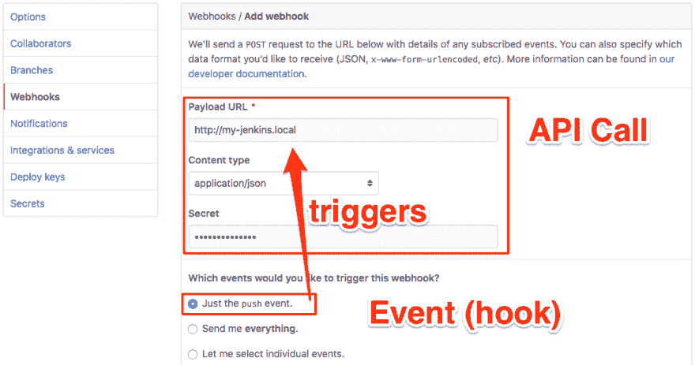

# Webhook 只是“事件驱动的服务器到服务器 API 调用”的一种花哨说法🤦‍♀️在 1 分钟内解释道。

> 原文：<https://dev.to/getd/webhook-is-just-a-fancy-way-of-saying-event-driven-server-to-server-api-calls-explained-in-1-min-4e23>

这里没有什么新东西。我本可以在这里结束我的帖子，因为标题已经说明了一切。但是我确实想无耻地插入我下面的副业，所以请继续读下去。

我们都非常熟悉**客户端**到服务器 API 调用的工作方式。是的，我说的是那些`GET`、`POST`、`PUT` http 请求。

*顺便说一下，你可以在我创建的 [getd.io](https://getd.io) 中玩各种 API 请求。这是一个基于网络的邮递员，没有原生应用。让我知道你对❤️的看法*

webhooks 不是客户端到服务器的，而是**服务器**到服务器的 API 调用。是的，我说的是老一套的`GET`、`POST`、`PUT` http 请求，如上。但是，关键的区别是，由于这些调用是从机器(服务器)发出的，它们需要由事件触发，也就是钩子。

一个常见的 webhook 示例是，每当一个新的提交被推送到 Github repo 时，它就会触发 Github 调用您的 Jenkins 服务器，从而开始构建新代码。这里我们有一个“推送事件驱动的 Github 到 Jenkins API 调用”。

在这种情况下，Github 将向 Jenkins 提供一个 JSON 有效负载，其中包含关于这个新提交的所有信息。

所以下次你看到某个服务器使用 webhooks 时，这仅仅意味着它可以被一些事件触发，向另一个服务器发送一些 http 请求(API 调用)。