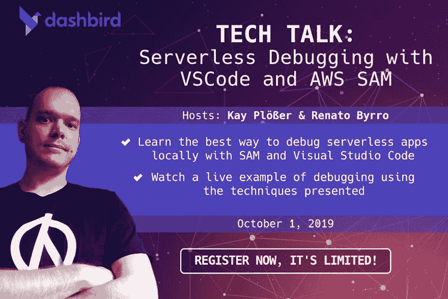

# 网络研讨会:用 VSCode 调试 AWS Lambda 函数

> 原文：<https://dev.to/kayis/webinar-debugging-aws-lambda-functions-with-vscode-ehm>

10 月 1 日，我将和 [Dashbird](https://dev.to/dashbird) 的 [Renato Byrro](https://dev.to/byrro) 一起做一个网络研讨会。我们将讨论用 SAM CLI 和 VSCode 调试 AWS Lambda 函数。

现在注册，我们的名额有限:[https://zoom.us/webinar/register/WN_V-4DzL5aQF-4iyC9iB1wEQ](https://zoom.us/webinar/register/WN_V-4DzL5aQF-4iyC9iB1wEQ)

