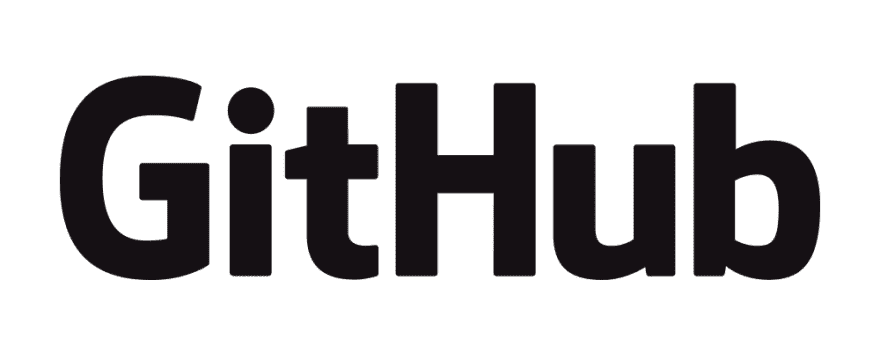

# webMethods.io 示例 1.1

> 原文：<https://dev.to/techcommunity/webmethods-io-examples-1-1-2f00>

## 概述

初学者 webMethods-io 开发人员示例集。它由常见用例以及开发人员快速掌握 webMethods.io 的起点组成。每个示例都包含如何从空白项目重新创建自身的说明。

目录

1.  [你好邮件](https://github.com/SoftwareAG/webmethodsio-examples/blob/master/hello-email)
2.  [page duty-Slack](https://github.com/SoftwareAG/webmethodsio-examples/tree/master/pager-slack)
3.  [SalesForceLeads-Slack](https://github.com/SoftwareAG/webmethodsio-examples/tree/master/salesforceleads-slack)
4.  [Github-Slack](https://github.com/SoftwareAG/webmethodsio-examples/tree/master/github-slack)
5.  [Slack-Twitter-Linkedin](https://github.com/SoftwareAG/webmethodsio-examples/tree/master/slack-twitter-linkedin)
6.  [AWS-Lambda](https://github.com/SoftwareAG/webmethodsio-examples/tree/master/aws-lambda)
7.  [Twilio-Receive-SMS](https://github.com/SoftwareAG/webmethodsio-examples/tree/master/twilio-receive-sms)
8.  [Twilio-Send-SMS](https://github.com/SoftwareAG/webmethodsio-examples/tree/master/twilio-send-sms)
9.  [S3 积云速度](https://github.com/SoftwareAG/webmethodsio-examples/tree/master/cumulocity-s3)
10.  [Cumulocity-Freshdesk](https://github.com/SoftwareAG/webmethodsio-examples/tree/master/cumulocitytofreshdesk)
11.  [Convert-XML-JSON](https://github.com/SoftwareAG/webmethodsio-examples/tree/master/convertdata-xml-json)
12.  [Dropbox-Sendemail](https://github.com/SoftwareAG/webmethodsio-examples/tree/master/dropbox-sendemail)

## 进一步说明

如需进一步说明，请访问 GitHub 的知识库:**[web methods io-examples](https://github.com/SoftwareAG/webmethodsio-examples)**

** Software AG 开放代码:**

* * *

分叉和拉请求是受欢迎的。对于与代码相关的错误，请在 Github 资源库中创建一个问题。如有任何问题或请求，请在下面发表评论。