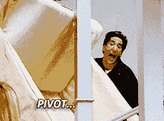

# 每周笔记- 06 制造商

> 原文：<https://dev.to/ruthmoog/weeknotes-06-makers-5h20>

# 🌈第六周

第六周是我们的第一个小组项目；我们第一次有机会组织我们的单口相声和表演，从“客户”的角度规划一个项目，然后按照我们想要的方式实施。这是一个解放的任务！

## 团队工作

我们四人一组工作。我的团队的方法是每天召开站立会议和回顾会议，在一天中的不同时间点聚集在一起，给出并获得关于我们状态的反馈。我们首先为最小可行产品(MVP)编写用户故事，并决定使用什么技术。

我们选择使用 JS 作为学习机会，但是在周中决定转向更熟悉的 Ruby 技术栈。因此，我们能够更快地构建一个工作的 web 应用程序，但由于浪费了时间，我们的方法很仓促，最终产品比预期的简单得多。笑声是衡量成功的一个标准。在制作人 T1，我们经常拿海鸥 T2 T3 开玩笑，一起度过了失望的时光。

> 💡[枢转](https://www.quora.com/What-is-a-pivot-in-a-business)正常！在成本、维护或速度方面有收益的地方通常会这样做。

### 如何决定[败得快](https://www.forbes.com/sites/sunniegiles/2018/04/30/how-to-fail-faster-and-why-you-should/)？

*   尽早并经常阐明方法——是否有有用的信息丢失或未知会影响你的进展？
*   尽可能快地收集尽可能多的数据，决定‘好’是什么样子——不要想着完美。
*   作出团队决定，并尽快实现！

## XP 值

XP 的意思是[极限编程](http://www.extremeprogramming.org/when.html)。随之而来的是一系列的价值观，旨在帮助开发团队在更好的环境中产生更高质量的工作(与非敏捷、非 XP 编程团队相比)。如果你以前没有听说过 XP，你可能会失望地得知它是与寻求刺激有关的*而不是*。

**简约**。做到最低！快去找你的 MVP 吧。

**沟通**。每天面对面交流，在任何事情上都像团队一样工作，一起做决定。

**反馈**。&演示早期常。听取建议，做出改变。调整你的过程，而不是项目。交付工作软件。

**尊重**。每个人都有价值！尊重客户的专业知识，友好相处。

**勇气**。给出真实的进度报告和评估。计划成功，无所畏惧地适应变化。

> 💡确定 MVP 可能很棘手。在规范中寻找那些影响最大和最紧急的项目——这些应该优先考虑。做一些*管用*且能被*使用*并被客户理解的东西。

## 她成功了

制造商们举行了第一次[她成功了](https://blog.makersacademy.com/taking-control-of-your-career-destiny-475b3d3285d4?_hsenc=p2ANqtz-97LyDj4T_m1TIVaZ3MbMxTHbp8Q_0S5rqiC-xU9U7QZfVsf65x2kz3GHn2YPSU0dR5rHa-y8HLVGUA_TTJBMJzWbG6Lw&_hsmi=74364922)活动，与会者听取了三位女性关于改变职业的话题。

以下是我的一些外卖...

杰西卡·萨皮克:

*   教练帮助你发展自我意识/教练让你听到其他声音。
*   不寻常的职业道路有看不见的好处(比如知道如何在不舒服的环境中工作，以及如何避免在这样的环境中工作)。

夏洛特·赵:

*   通过与他人交谈来学习他人的经验，提出更深刻的问题可以建立更牢固的友谊。
*   在面试中有说服力；步入面试室前明确疑问。

> #### "Let the accident happen"- *Charlotte Zhao*

贝克斯·胡克:

*   对曾经有趣的事情不再感兴趣是正常的！
*   你人际网络中薄弱的联系会提供工作机会——朋友的朋友，还有熟人。

## 杂项。

☕大声对汉娜说，她邀请我做她在创客公司的导师

💒这个周末花了一些时间远离代码，去参加一个快乐的婚礼和补偿

🍪为 quii 校对 [Learn Go With Tests](https://quii.gitbook.io/learn-go-with-tests/) 的新章节，他接受了我的 PR

👀通过了视力测试，并为此沾沾自喜