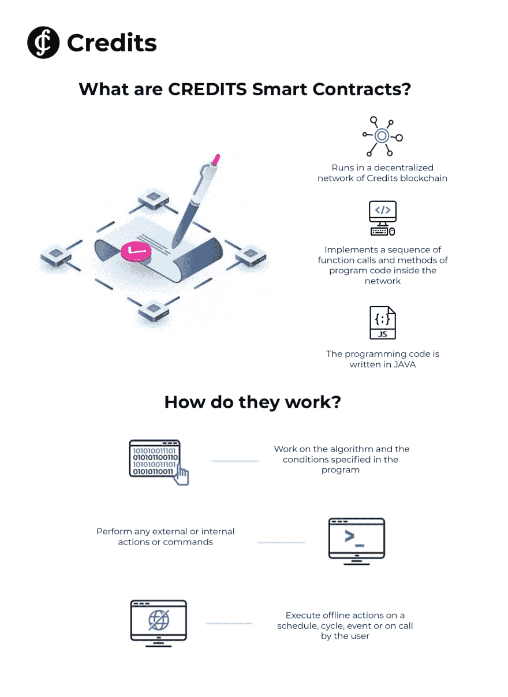
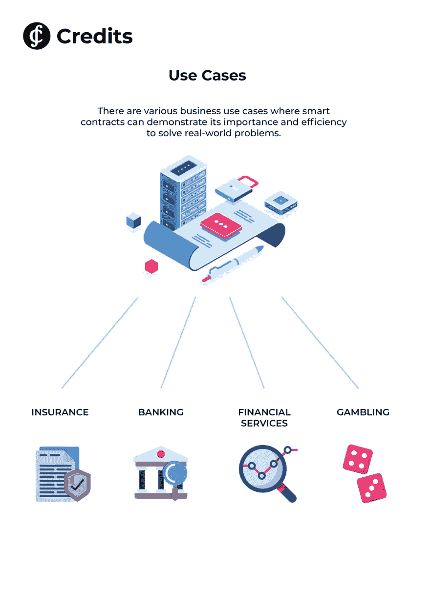

# 什么是智能合同？

> 原文：<https://dev.to/_aandrey/what-are-smart-contracts-4j6a>

如今，智能合约被认为是区块链技术最常用的应用。智能合约充当由计算机代码组成的协议，并基于其创建者指定的条件在区块链技术上运行。智能合约平台已成为最受欢迎和最有价值的区块链网络类型之一，因为它借助智能合约技术实现了未来的去中心化数字经济。至于信用智能合约，我们的开发人员已经在现有的智能合约中成功实施了一系列创新改进。在本文中，我们将探讨 CREDITS 智能合约的组件、它在我们的区块链平台上的独特功能，以及可以实现它们的真实用例。

# 信用智能合约

关于智能合同功能和组件，智能合同的编程代码用 JAVA 编写，在区块链信用的分散网络中运行，并在网络内实现程序代码的一系列功能和方法。智能合约需要的另一个组件是虚拟 Java 机器(JVM ),它用于运行智能合约，并根据免费分发的许可证随软件平台一起提供。智能合约代码在虚拟机中的隔离执行是在不访问文件系统和其他节点资源的情况下进行的。

## 智能合约开发

简而言之，让我们通过一些基础知识来理解智能合约开发的过程。如上所述，在 Credits 平台上，智能合约的开发代表了用 Java 编程语言编写代码的过程。不需要安装特殊的开发环境。开发环境是一个软件应用程序，它为开发软件提供了全面的工具。下面是 JAVA 应用程序最流行的开发环境:Notepad++、IntelliJ Idea、NetBeans 和 Eclipse Java。

## 独特的功能

全新的信用区块链平台提供了一个全面扩展的智能合约和一个具有独特功能的自治系统。信用开发者已经成功地实现了现有智能合同的各种创新改进，例如分散环境、低佣金、高速度等等。让我们来看看其中的一些，看看这些特性是如何让它们在区块链市场上脱颖而出的。

## 分散的环境

智能合约的分散执行是优化的功能之一，其中一个特定的智能合约在该轮的所有可信节点上同时执行。智能合同运行的网络是分散的。网络没有所有者或管理员。程序代码在节点网络中执行，这意味着如果它被启动，那么只有所有者可以停止它，只要该功能先前在智能合同代码中被指定。由于平台的共识算法，达成单一决策。

## 低佣金

区块链信贷平台智能合约的另一个独特之处是其诱人的低佣金。智能合同执行的支付通过内部加密货币 Credits (CS)完成。系统自动从账户中收取执行每项功能的少量费用。智能合约佣金取决于对区块链所做的改变的数量，其中操作的最小成本是动态的，并且从 0.0004 CS 开始。

## 速度

最后但同样重要的是，CREDITS 被称为智能合同领域第一个完全自主的系统。没有其他平台能够拥有如此令人印象深刻的高交易处理时间，从每次操作 0.1 秒开始。它允许每秒处理大量的合同，这提供了一个机会来满足即使是最苛刻的商业行业的需求。

## 期待的特性

时间表和周期。此外，CREDITS 的目标是提供一种服务，允许智能合约根据预定的时间表，在指定的时间和算法内调用内部函数。以下关键元素将允许用户创建在特定日期和时间执行智能合同的请求。一旦指定方法的执行完成，并且指定方法被动态计算，则根据存储的数据量进行支付。请继续关注这项即将推出的功能，它目前正在开发过程中，将于今年年底实现。

## 用例

由于以较低的成本实现了高级别的安全性、透明性、可扩展性和性能，信用智能合同可以极大地影响保险、银行、金融服务和赌博等行业的工作方式。

**保险业**

信用智能合同在现实生活中应用的一个最大的用例是保险业。例如，机场和航空公司有时无法应对压力，可能导致航班延误，也可能导致乘客取消行程。因此，CREDITS 建议创建一个服务，该服务接受取消旅行保险请求，提供标准检查，并根据检查结果将赔偿金额转移到保险公司的钱包中。

**银行业**

此外，信用智能合同可以在银行业成功实施，在银行业中，不仅支付(尤其是国际支付)的处理时间长是一个问题，而且银行之间的交易成本高也是客户一直面临的问题。在交易中使用智能合同可以加快和简化流程，由于具体条款对各方完全可见，金融交易中出错的可能性大大降低。

## 结论

智能合同有各种各样的优势，包括快速的合同执行、低成本和更好的隐私。然而，CREDITS 不仅结合了上述特征，还突出了智能合同的突出和独特的特征。这允许与用户的实时交互以及独有的高交易速度。在探索了什么是信用智能合同之后，我们可以总结出，该平台使得在智能合同是业务需求的绝对解决方案的不同行业中使用区块链技术的优势成为可能。毫无疑问，在不久的将来，智能信用合同将充分发挥其成为标准行业解决方案的潜力。