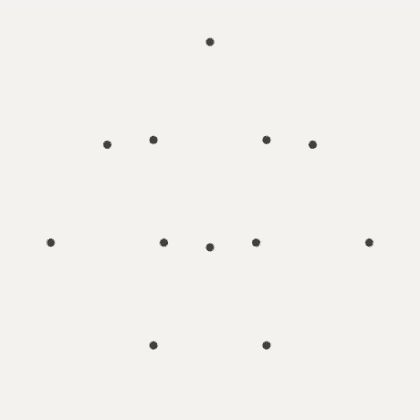

# 软件的组成部分是什么？

> 原文：<https://dev.to/stereobooster/what-are-the-building-blocks-of-the-software-17cn>

在几何学中，他们有公理。你得到这些公理，你就可以在此基础上建立所有的定理。参见欧几里得的《几何原本》。

化学中有原子。所有的物质都由原子组成。所以你需要研究原子和原子如何相互作用，你才能理解化学(我不是化学专业的，但我猜这是化学的一大部分)。参见元素周期表。

在建筑学中，他们有建造建筑物的单元，如窗户、墙壁、楼梯等。参见 Christopher Alexander 等人的模式语言。

我的问题是:软件开发的组成部分是什么？

是**算法和数据结构**吗？我不这么认为，因为我们没有一份详尽的清单，这些更像是预制的收据。更像是几何学中的定理，而不是公理。

是**设计模式**吗？是物件吗？我不这么认为，因为这些是特定于范例的。

是**单子**吗？也许吧。我不确定。我们可以用它来描述汇编吗(我想我们可以，因为它是一个非常抽象的领域，但问题是在这种情况下使用它会舒服吗)？它是范式特定的还是更普遍的？

有可能只有一套积木吗？或者我们需要低层代码(汇编)和高层代码(比如函数式语言)的不同集合。也许我们可以定义不同层次的抽象，并为每个层次找到构建模块？

也许什么认为[是不同的抽象是同一件事](https://github.com/thma/LtuPatternFactory)？

图片来源: [reddit](https://www.reddit.com/r/blackmagicfuckery/comments/845n8g/these_shapes_shouldnt_be_able_to_coexist_like_this/) 。

每个程序员应该知道什么来独立于语言和范例理解编程？软件开发中最基本的积木**是什么？**

> 里克·梅森在 Unsplash 上的照片