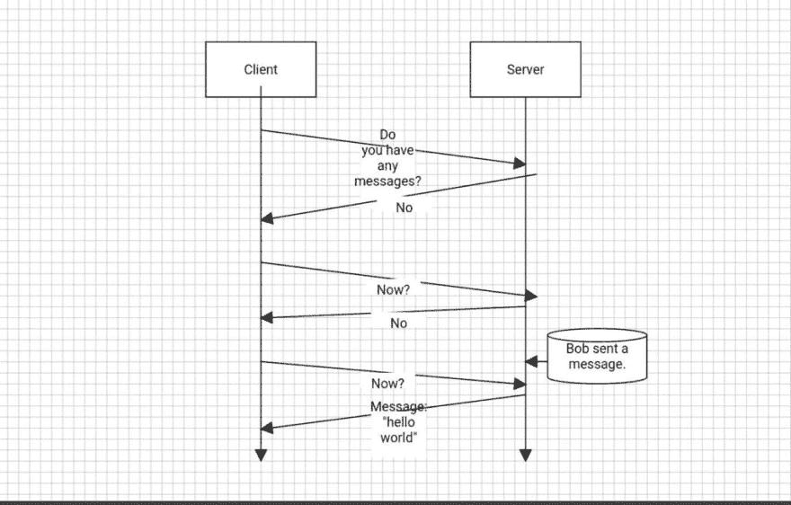
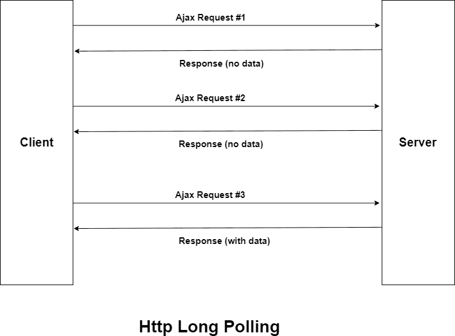
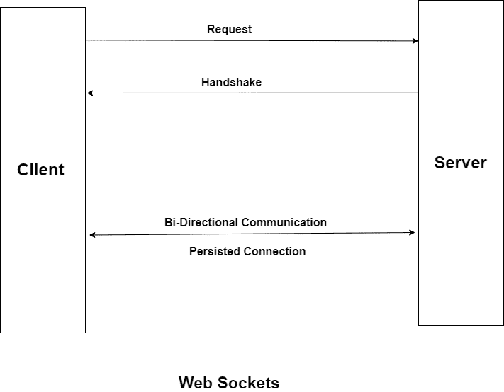
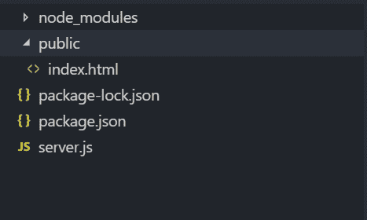
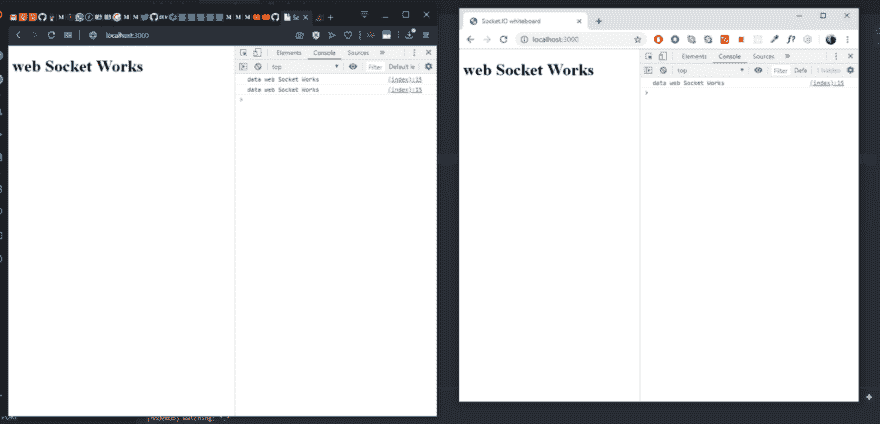

# 什么是 Web 套接字？在 Node.js 中实现 Web 套接字

> 原文：<https://dev.to/ganeshmani/what-are-web-sockets-implementing-web-sockets-in-node-js-3d86>

在本文中，我们将了解什么是 WebSockets 以及在 Node.js 中实现 Web Sockets

### 什么是 Web 套接字？

Web 套接字不过是一种通信协议，它允许作为浏览器的客户机和服务器之间的实时交互通信。它使用一种完全不同的协议，允许双向数据流，这使它与 HTTP 不同。

你可以问我，当我们可以通过 HTTP 发送和接收消息时，为什么我们需要一个单独的协议。

有些情况下，我们需要实时获取数据。例如，构建聊天应用程序或任何其他需要实时通知的应用程序。我们不能使用 HTTP 协议。我将在本文中解释原因

### HTTP 协议是如何工作的？

*   

在 Http 协议中，每次我们需要获得更新的数据或通知时，我们都需要请求服务器。服务器将使用更新的数据进行响应。

这种方法的问题是，它会进行大量的网络调用，导致应用程序延迟。每次我们需要请求服务器并更新数据时。

我们可以通过 **Http 长轮询**来解决这个问题

### 什么是 Http 长轮询？

Http 长轮询是客户端轮询请求新信息的服务器。服务器保持请求打开，直到有新的数据可用。一旦可用，服务器就会响应并发送新信息。当客户端收到新信息时，它会立即发送另一个请求，并重复该操作

*   

长轮询的问题是需要大量资源来处理请求。

考虑一下，如果有一百万用户访问这个应用程序。仅仅维持客户端和服务器之间的通信就需要大量的计算资源。

为了解决所有这些问题，WebSockets 开始发挥作用。

### WebSocket 是如何工作的？

web 套接字是双向通信的。客户端发送带有**升级**关键字和其他元数据的请求。

```
GET ws://websocket.example.com/ HTTP/1.1
Origin: http://example.com
Connection: Upgrade
Host: websocket.example.com
Upgrade: websocket
```

服务器接收请求。如果服务器支持 websockets，它将发送一个握手响应。一旦它发送了响应，客户机和服务器之间就建立了双向通信。

*   

web 套接字是一种低延迟通信协议，与 Http 长轮询相比，它占用的计算资源更少。

### 在 Node.js 中实现 WebSockets

我们将看到如何在 node.js 中实现 websockets。我们将为 node.js 中的 web sockets 使用一个名为 **socket.io** 的库。

运行以下命令来引导应用程序

```
npm init --yes
npm install --save socket.io express 
npm install --save-dev nodemon
```

项目结构将会是什么样子

*   

在 server.js 中添加以下代码

```
const express = require('express');

const app = express();

const http = require('http').Server(app);

const socketIO = require('socket.io')(http);
const PORT = process.env.PORT || 3000;

app.use(express.static(__dirname+'/public'));

socketIO.on('connection',() => {

    socketIO.emit('welcome','web Socket Works');
})

http.listen(PORT,() => {
    console.log(`app is listening to port ${PORT}`);
})
```

首先，您导入 express 并启动服务器。

**。on('connection')** 开始与客户端建立套接字连接

要发出事件，您需要使用**。用事件名发出()**。在这里，你通过事件**欢迎**与数据 **web Socket Works**

此外，要接收事件，您需要使用**。开('事件名称')**

在公共目录中创建一个文件**index.html**，并添加以下代码。

```
<!doctype html>
<html>
    <head>
            <meta charset="UTF-8">
            Socket.IO whiteboard
    </head>
    <body>
        <h1 id="message"></h1>
    </body>
    <script src="socket.io/socket.io.js"></script>
    <script>
        const socket = io();

        socket.on('welcome',data => {
            console.log("data",data);
             document.getElementById('message').innerHTML = data;
        })
    </script>
</html>
```

现在，您需要使用以下命令运行服务器。

```
npm run start
```

如果访问网址 **http://localhost:3000** 。你会看到类似这样的东西

*   

因此，几个客户机可以与套接字连接，并与服务器/客户机通信。

很酷的技术。对吗？..

总之，我们可以在不同类型的应用程序中使用 Web 套接字

*   实时应用
*   聊天应用
*   物联网
*   在线多人游戏

完整源代码:[https://codesandbox.io/s/socket-demo-y0bve](https://codesandbox.io/s/socket-demo-y0bve)

在本文中，我们已经看到了什么是 WebSockets 以及在 Node.js 中实现 Web Sockets。

我们将在下一篇文章中深入了解 web 套接字。在此之前，**快乐黑客** :-)

同时，为了更多地了解 web 开发

*   [面向前端开发者的 Nginx】](https://cloudnweb.dev/2019/05/nginx-for-front-end-developers/)
*   【React 开发人员的不变作业