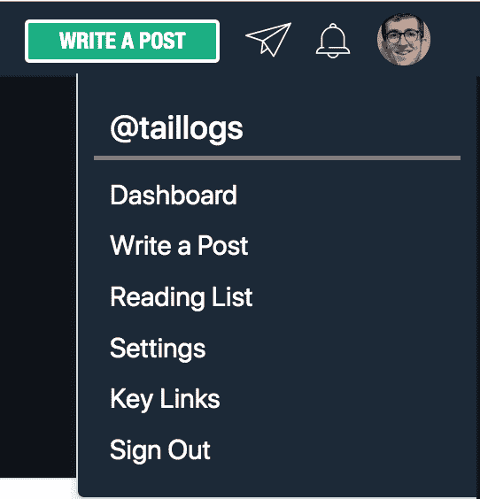
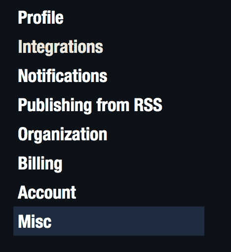
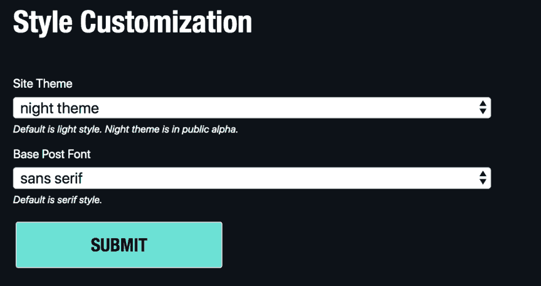
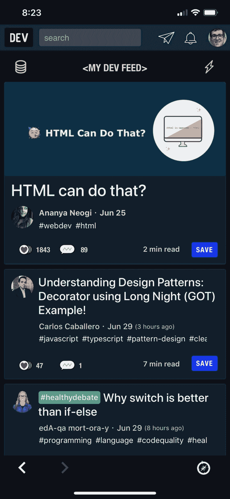

# 你用的是什么主题？

> 原文：<https://dev.to/taillogs/what-dev-to-theme-are-you-using-2ben>

你知道 Dev.to 有主题吗？直到最近，我肯定没有。现在我离不开 Dev.to night 主题，它甚至把“写帖子”按钮变成了一个很棒的路牌。

## 如何使用开发到主题

1.  转到`Settings`

    

2.  转到`Settings->Misc`

    

3.  向下滚动并选择你的主题

    

4.  甚至转移到手机！

    

你用的是什么主题？

 [T3】](https://twitter.com/taillogs)