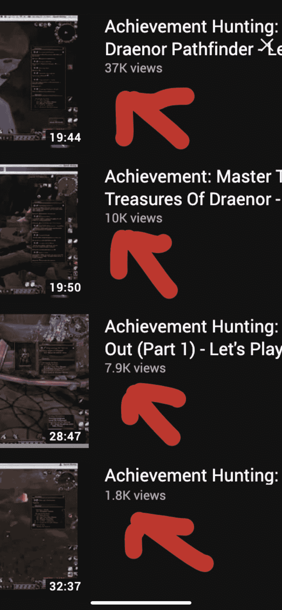

# 关于营销，开发人员需要知道什么？

> 原文：<https://dev.to/garrett/what-do-devs-need-to-know-about-marketing-51go>

嘿，我的名字是加勒特，我有十多年的互联网营销经验。主要是搜索引擎优化，内容和电子邮件。

我会在另一篇文章中更深入地探讨，但现在我想告诉你，我厌倦了营销。

我决定转行，学编程。

但在我离开之前，我想分享我十年来积累的营销知识。

我确信当我学习编码时，你们中的许多人会伸出手来帮助我学习。我想为你做同样的事。

所以我现在伸出手来问:关于营销，你需要知道什么？

你好奇什么？

不知道你不知道什么？你的目标是什么？我可以告诉你你需要做什么。

你问的问题越多，或者你给我的关于你想要实现的目标的信息越多，我就能更好地帮助你。

不要担心时间线。如果对你有帮助的话，我再回答十年。

下面是我在 YouTube 视频上做的一些 SEO:
