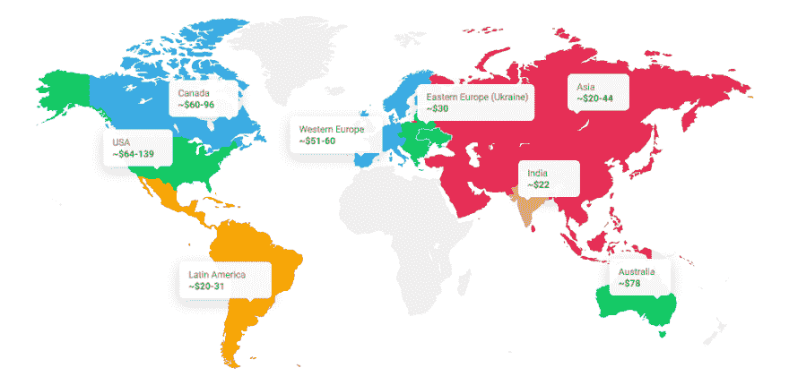

# 网站设计要花多少钱？

> 原文：<https://dev.to/aleksan50106136/what-does-website-design-cost-40i0>

要知道，75%的用户是根据一个公司的网站设计来判断其可信度的。当然，用户友好和有吸引力的网页设计是任何软件项目的主要资产之一。

### 网站设计费用的 3 个选项

值得一提的是，网站设计成本是基于你的网站类型，它的特点，和商业目标。至关重要的是，设计的选择应该来自所选择的 web 技术栈。如果 web 项目很复杂，那么应该创建更多的自定义 web 设计来展示必要的功能。

在开始的时候，考虑网站应该如何运作，因为如果你的网站看起来很棒，它也一定会运行得很好。

下面你会读到创建网页界面的选择和每种选择的潜在网站设计成本。

1) DIY 网站设计费用

*   DIY 服务:Wordpress、Wix、Shopify(针对电商项目)等。
*   网站设计费用(包含在网站包中):$0 - $500 以上

Wix、Wordpress、Shopify 或 Weebly 等服务已经将预制的网页设计模板纳入了它们的网站开发定价计划。根据项目类型和行业，您可以选择必要的设计布局和配置。

小型企业网站设计的平均成本在 300 到 500 美元之间。除了网页设计价格，你还会收到配置主机，网络服务器和域名。DIY 解决方案也有额外的设计元素和插件，价格从 15 美元到 200 美元不等。通常情况下，你会收到月度或年度发票，这些发票基于所选平台的网页设计价格表。

你应该记住，任何网站都需要定期更新和支持。维护费用从每年 60 美元到 3500 美元不等，取决于网站设计包的价格。

不要使用任何免费的网站设计模板是一个好主意，因为它们通常伴随着广告、恶意软件、功能和带宽限制。

建议使用 DIY 网站生成器进行以下操作:

*   简单的单页网站(登陆)
*   没有可伸缩性计划的 web 项目
*   个人投资组合网站
*   个人博客或服务

这个选项的主要好处是低成本的网页设计和快速设置。

另一方面，大多数企业会在几年内放弃 DIY 网站，原因如下:

*   通用网站设计
*   网站一致性、更新和维护方面的挑战
*   高度依赖第三方服务
*   网站定制和灵活性水平低
*   有限的可扩展性
*   可能的网站冻结和运行缓慢
*   在设计布局上没有应用新技术

建议考虑网站设计成本和选择，从长远来看，不要花费更大的预算。

2)自由职业者服务的网站设计定价

*   雇佣一个自由职业者:在当地或自由职业平台上，如 Upwork、Freelancer.com 等。
*   网站设计费用:500-2000 美元以上

一个专业的网页设计师会帮助你创建一个更加定制的网页设计或者设计你自己的模板来适应 Wordpress 网站。他还可以帮助你制作商标、横幅等品牌材料。

你可以在本地找到这些专家，在自由职业平台如 Upwork，Freelancer.com，或者在设计网站如 Behance 和 Dribbble。

网站设计的成本取决于自由职业者的经验水平、技能和地点，在北美大约是每小时 65-140 美元。

记住自由职业服务和外包是两回事。你必须很好地理解你需要什么来把这个愿景传达给网页设计师。这就是为什么，你需要为和你一起工作的自由职业者建立一个清晰的指导和管理流程。

在这种情况下，你应该找一个自由网页设计师:

*   小型网站项目或小型网站设计作品
*   只需要网站设计
*   品牌材料

在自由职业平台上雇佣网站设计师的优势:

*   能够调整你的网页设计理念
*   中等价位的网站设计成本
*   适当的网页设计质量
*   其他品牌推广材料
*   会议和交流

自由网页设计师的缺点如下:

*   寻找一个好的、可靠的网页设计师的艰难而漫长的过程
*   项目管理过程完全在客户一方
*   雇用 web 开发人员所涉及的额外费用和管理工作
*   沟通的潜在问题
*   遵守截止日期方面的潜在问题
*   自由职业者分发项目材料或其他不当行为的风险
*   与不令人满意的最终结果相关的风险

1.  雇佣代理时的定制网站设计成本

*   在当地雇佣一个软件开发代理或者和一个离岸公司合作
*   网站设计费用:2000-5000 美元以上

如果您需要额外的功能，计划扩展网站，或者想要应用现代技术，自定义网站设计是您的最佳选择。你应该意识到，定制网站设计成本会更高，但你会收到一个网站设计和开发的交钥匙解决方案。

专业软件开发机构为所有领域分配一个专家团队来创建优秀的网站。通常，团队由设计师、web 前端开发人员、web 后端开发人员、质量保证工程师、项目经理和业务分析师组成。

你可以以较低的价格雇佣一批这样的专业人员，但外包时他们的能力是一样的。例如，东欧(如乌克兰)专业网页设计师的工资约为每小时 30 美元。

雇佣一个代理只需要你最少的努力。您必须只选择一个可靠的合作伙伴，跟上进程，并及时发送您的反馈。

为您的 web 项目创建自定义 web 设计的优点:

*   能够轻松扩展 web 项目(添加和调整网页)
*   搜索引擎优化和营销实践的应用
*   创造独特的设计，从竞争者中脱颖而出
*   独立于第三方服务和设计模板
*   创建适合目标受众的网页设计
*   自定义视觉元素(动画、插图、图标)的应用
*   精心设计的用户导航的开发
*   能够快速调整设计以适应新兴技术
*   将时间投入到核心业务需求的能力(项目管理在代理一方)
*   定制网站设计完全是你的财产

应该为以下内容创建自定义网站设计:

*   具有进一步可伸缩性需求的 web 项目
*   想要试验技术的网站
*   复杂的网站、网络平台或电子商务网站
*   具有大量后端管理的网站(管理面板)

那么，从代理公司聘请专业网页设计师的成本是多少呢？

这取决于供应商的位置和服务价格。下图显示了全球网站设计服务的平均小时费率。东欧是知名的网站设计和开发地区，价格合理。

