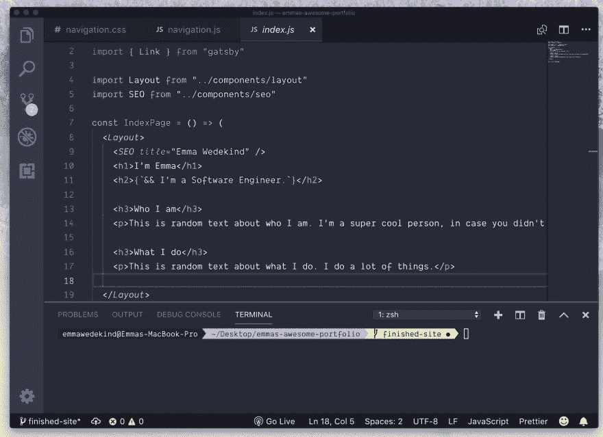
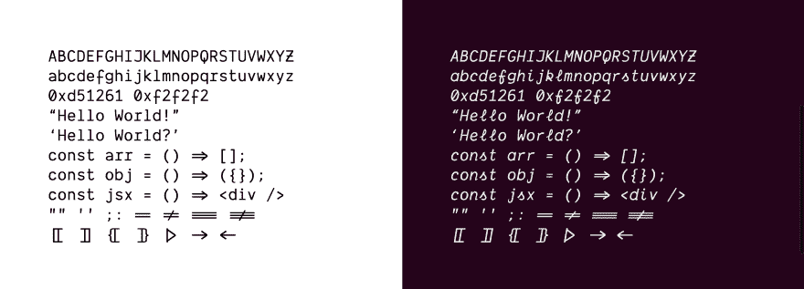
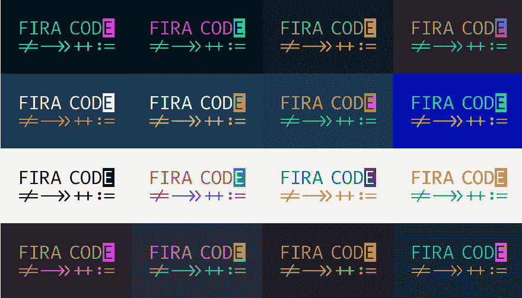
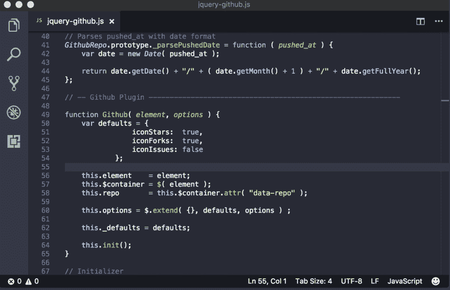
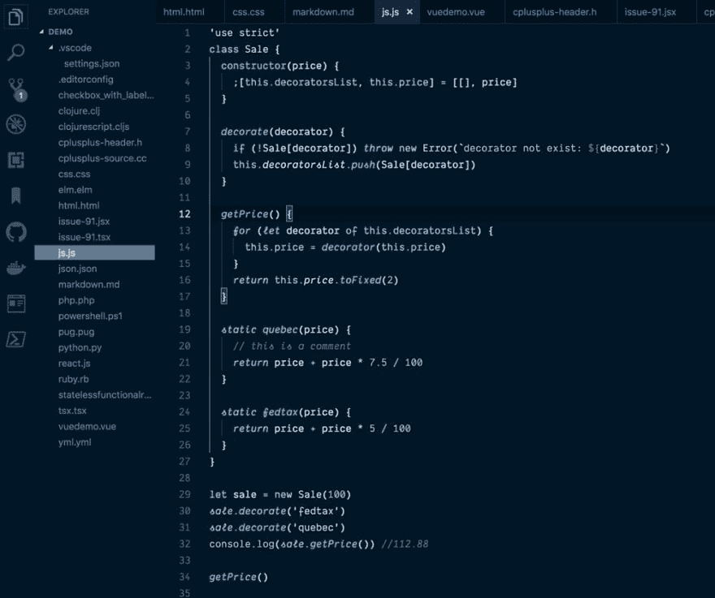
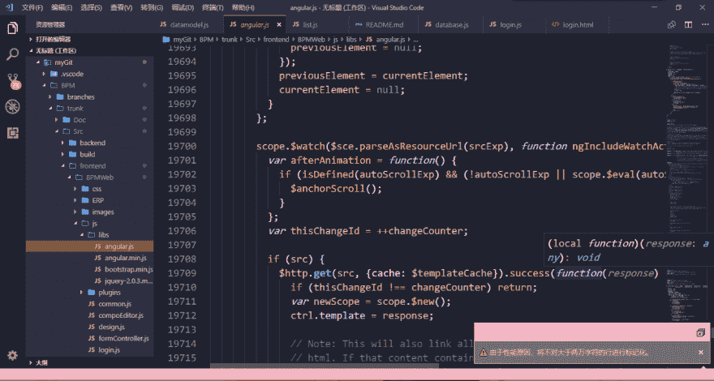

# 你的 IDE/代码编辑器是什么样子的？

> 原文：<https://dev.to/emmabostian/what-does-your-ide-code-editor-look-like-550e>

我终于让我的代码编辑器成为我的理想设置。但是现在我很好奇，你的代码编辑器/IDE 是什么样子的？

# 编辑

我用的是 [VS 代码](https://code.visualstudio.com/)。虽然我以前用过 [Sublime Text](https://www.sublimetext.com/) 和 [Atom Editor](https://atom.io/) ，但我发现 VSCode 更胜一筹。

# 字体

我正在使用字体 [Dank Mono](https://dank.sh/) 。是付费字体；它花了我大约 40 英镑，但绝对值得。 [Fira Code](https://github.com/tonsky/FiraCode) 是一个带有连字的免费替代品(使代码编辑器漂亮的草书风格和连接线)。

### 潮湿的单色

### Fira 代码

# 主题

我目前正在为我的编辑器使用[德古拉](https://draculatheme.com/visual-studio-code/)主题。虽然我倾向于在德拉库拉和莎拉·德拉斯纳的[夜猫子](https://github.com/sdras/night-owl-vscode-theme)和[粉红猫布](https://marketplace.visualstudio.com/items?itemName=ftsamoyed.theme-pink-cat-boo)之间切换。

### 德拉库拉

### 夜猫子

### 粉红猫嘘

# 终端

我的代码终端是使用 [OhMyZsh](https://github.com/robbyrussell/oh-my-zsh) 设置的。如果你有兴趣了解更多，阿里·斯皮特尔有一篇有趣的[博客文章](https://dev.to/aspittel/what-does-your-terminal-look-like-4476)是关于终端设置的！

* * *

在下面贴上你的设置图片！