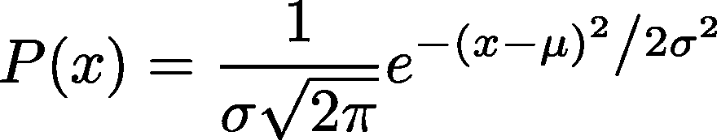
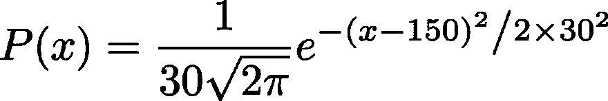
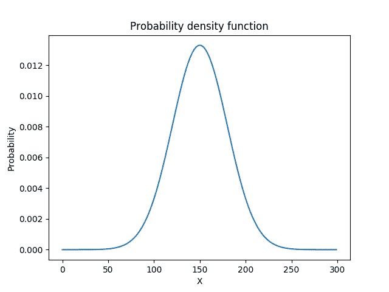
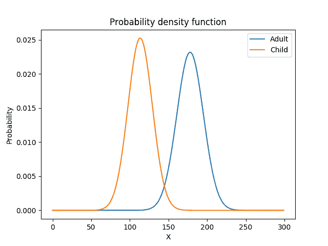

# 什么是机器学习？

> 原文：<https://dev.to/jackdeadman96/what-even-is-machine-learning-2jcc>

## 简介

我从事机器学习已经有几年了，我觉得这非常酷。因此，我想为没有机器学习背景的人写一篇短文，看看我是否能让更多的人感兴趣，这里需要一点数学知识，我会尽力用一些 python 代码来解释它。

机器学习允许我们通过使用数据而不是显式指令来编写程序来做聪明的事情。

## 从数据中学习模型

如果我告诉你“我刚刚看到一个 10 英尺高的人”，你会相信我吗？你可能不会。这是因为在我们的一生中，我们接触到了大量的数据，我们也学到了很多。但是我们学到了什么？好吧，我们直观地知道一个普通人的身高是多少(至少是大致的)，以及我们可以预期一个人的身高会偏离这个平均值多少。有了这种直觉，我们已经可以开始构建机器学习程序了。

像这样的直觉可以用所谓的高斯分布来建模。高斯分布仅由两个参数描述，均值(即我们的平均身高)和标准差(我们期望它偏离多少)。让我们进入一些数字...首先，让我们看看高斯分布的公式:

[](https://res.cloudinary.com/practicaldev/image/fetch/s--nQRRXksB--/c_limit%2Cf_auto%2Cfl_progressive%2Cq_auto%2Cw_880/https://thepracticaldev.s3.amazonaws.com/i/29lespvqafx4wjkqdh0y.png)

Eeek...这看起来有点吓人，让我们把它分解一下。首先，μ是我们的平均值，假设我们认为一个人大约 150 厘米，σ是我们的标准差，假设我们预计身高变化 30 厘米。如果我们把这两个数字代入公式，我们得到这个新方程:

[](https://res.cloudinary.com/practicaldev/image/fetch/s--zsbDSUy2--/c_limit%2Cf_auto%2Cfl_progressive%2Cq_auto%2Cw_880/https://thepracticaldev.s3.amazonaws.com/i/yrl80d87olom47hdha88.png)

这仍然有点吓人，但已经好多了...现在方程只有一个变量，让我们把它画出来，看看函数的形状。下面我们可以看到通常所说的钟形曲线，让我们看看我们是否能理解它。

[](https://res.cloudinary.com/practicaldev/image/fetch/s--15Pl_N8U--/c_limit%2Cf_auto%2Cfl_progressive%2Cq_auto%2Cw_880/https://thepracticaldev.s3.amazonaws.com/i/20d6xdjnsux7nwb7ko5s.png)

x 轴代表一个随机人的身高，y 轴是数据来自这个分布的概率。首先，让我们看看分布的峰值，当高度为 150 时，概率最高，这是我们的平均值，所以它是最有可能的高度。你能看出σ代表什么吗？如果您不确定，复制下面的代码并更改“std”变量的值。记得我最初的陈述，“我刚刚看到一个 10 英尺高的人”。让我们看看模型是如何看待这种说法的...P(X=300)=0.00000005，woah，那是很小的！我们的模型同意这不太可能。

```
# Very popular maths library import numpy as np

# Library for making plots in python import matplotlib.pyplot as plt

def gaussian(x, mean, std):
    """
    x: Our "random variable"
    mean: The expected value of the distribution
    std: How much we expect the value to deviate from the expected
    """
    return (1/(std*np.sqrt(2*np.pi))) * np.exp(-(x - mean)**2 / (2*std**2))

# Create an array of points from 0 to 299 x_values = np.arange(0, 300)
# Call the gaussian function for each of the x_values probabilities = np.apply_along_axis(lambda x: gaussian(x, 150, 30), 0, x_values)
plt.plot(x_values, probabilities)
plt.title('Probability density function')
plt.xlabel('X')
plt.ylabel('Probability')
plt.show() 
```

## 利用模型解决问题

好了，我们有了这个模型，现在呢？嗯，我们现在可以仅根据数据做出决定。假设我们被给定一个未知的高度，我们想要分类这个人是成人还是儿童。这可以通过创建两个模型，然后选择最有可能的模型来完成。

首先，我们将适合一个孩子的模型。这将需要收集儿童身高的数据，计算平均值和标准偏差，并将其代入我们的高斯分布公式。我们将对成年人做同样的事情，我们将收集数据并计算统计数据。让我们看看一些虚构数据的分布情况。看着这些分布，我们可以给一个未知的身高一个等级(成人或儿童)。例如，如果我们的身高为 160，则成人模型将返回更高的概率，因此该类是成人。如果我们的身高是 110，这个班级将会是一个孩子。

[](https://res.cloudinary.com/practicaldev/image/fetch/s--GnEnpGOn--/c_limit%2Cf_auto%2Cfl_progressive%2Cq_auto%2Cw_880/https://thepracticaldev.s3.amazonaws.com/i/3glbi99l2vpp72yvo06g.png)

```
children = [ 100, 110, 103, 110, 144 ]
adults = [180, 190, 200, 150, 170]

child_mean = np.mean(children)
child_std = np.std(children)
adult_mean = np.mean(adults)
adult_std = np.std(adults)

# Create an array of points from 0 to 299 e.g., x_values = np.arange(0, 300)
# Call the gaussian function for each of the x_values adult_probabilities = np.apply_along_axis(
                        lambda x: gaussian(x, adult_mean, adult_std), 0, x_values)
child_probabilities = np.apply_along_axis(
                        lambda x: gaussian(x, child_mean, child_std), 0, x_values)

plt.plot(x_values, adult_probabilities, label='Adult')
plt.plot(x_values, child_probabilities, label='Child')
plt.legend()
plt.title('Probability density function')
plt.xlabel('X')
plt.ylabel('Probability')
plt.show() 
```

你可能会想“这很酷，但是我可以用一些‘if 语句’来做这件事”。是的，你可以，但假设你现在想让你的模型为不同国家的人工作，那里的人身高不同。对于机器学习模型，我们只需使用不同的数据来训练模型，而无需更改一行代码。对于这样一个简单的任务来说，它可能看起来并不酷，但是想象一下创建一个机器学习程序来识别猫的图片。一种识别狗图片的新模型可以通过简单地改变数据来学习！

# 结束语

祝贺你，如果你已经完成了你的第一个机器学习程序！这仅仅是开始，还有很多要学习的，例如，我们如何使用一个以上的变量，如身高和体重。如果我们的数据没有很好地符合高斯分布，我们如何评估我们的模型是好的呢？那些不属于分类的任务呢，比如预测股票市场。

感谢您的阅读！