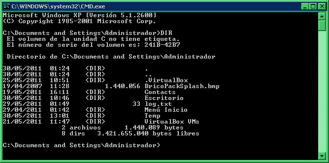
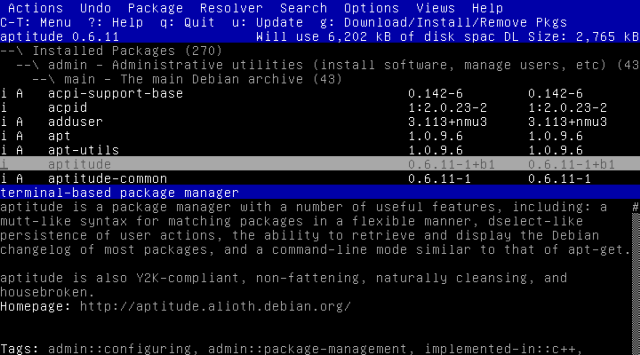
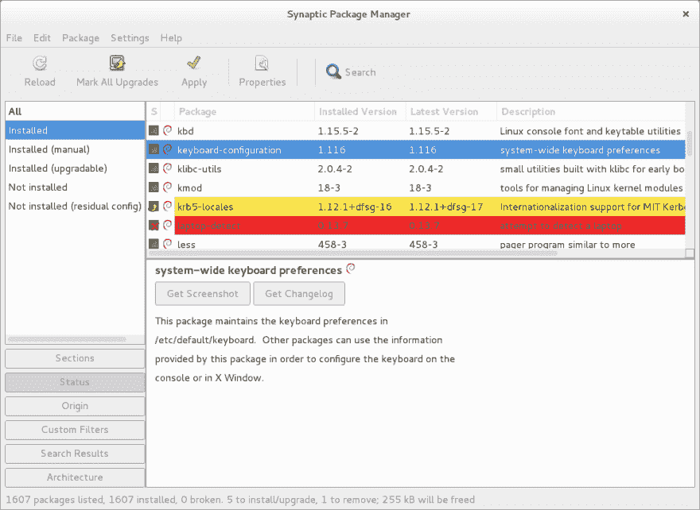

# 什么时候会发生...您运行$apt-get install <>

> 原文：<https://dev.to/_tink3r/what-happens-when-you-run-apt-get-install-3e41>

~~~本帖最初发表在我的[博客](https://blog.koundinya.xyz/posts/dependency_tools_apt_get/) ~~~

如果你尝试过任何基于 Linux 的系统，你可能会运行

```
apt-get install <> 
```

Enter fullscreen mode Exit fullscreen mode

至少有一次。

接下来你会去喝咖啡(或茶？)并且在你的终端喷涌东西的时候休息一下，比如-

<center>

</center>

> 我认为在我们继续之前我们需要谈论一些事情。
> 
> 1.  我知道 gif 显示的是 windows 终端。
> 2.  它不显示 apt-get 安装。
> 3.  我花了很多时间搜索，试图找到最完美的 gif。它不存在。但是过程中看了很多猫 gif。
> 4.  你明白了。

apt-get 是一个命令行界面，用于管理由

### 什么是套餐

我们需要步入时光机，回到软件主要通过邮件列表和 FTP 发布的时代。人们必须下载源代码，寻找一个**。/configure** 将
安装所需的依赖项，然后使用 **Makefile** 编译并安装软件。

> 让你想给 npm 一个美好的拥抱并说**“谢谢”**不是吗？

这是一个安装和摆弄软件的繁琐过程。软件包就是为了应对这种复杂性而设计的。软件包是预先构建的二进制文件，可以使用名为软件包管理器的工具进行安装。这些包管理器的早期版本只处理二进制文件，二进制文件的依赖项不是下载的 artifcat 的一部分。较新版本的软件包管理器包含了依赖关系解析，这使得下载软件前查找依赖关系变得简单和不再需要。软件包管理系统通常与软件库密切相关，软件库是软件包或关于软件包的元信息的集合。包管理人员通常搜索存储库来找到软件和它们的依赖关系。

### 什么是 Debian 软件包

Debian GNU/Linux 是 Linux 操作系统的一个特殊发行版，以及在其上运行的许多软件包。

> Debian 项目是由伊恩·默多克创建的，我喜欢这个项目名称是 Debra 和伊恩·默多克名字的缩写。

由于 Linux 有多种风格，每个发行版都有自己的软件仓库、包管理器和包结构。其中最值得注意的是-

1.  。用于 Ubuntu、Linux Mint 和 Debian 的 deb 包
2.  。RedHat、Fedora 和 SUSE 使用的 rpm。

。deb 包主要包含以下组件

1.  debian-二进制-包含关于 debian 软件包版本的信息。
2.  控制档案——该档案包含关于软件包的元信息。
3.  数据存档-包含实际的软件。

### 那么什么是 apt-get 呢

的。deb 包最初是由一个叫做 dpkg 的工具管理的。dpkg 是为下载预构建的二进制文件而构建的，它有能力检查依赖项是否匹配，但没有能力为用户解析依赖项。后来，一个新的 debian 项目，高级包工具(APT)开始了，它也可以解决依赖性问题，并与 dpkg 一起工作。

APT 包括一组处理软件包管理的工具，以及使用该库的命令行程序。apt-get 和 apt-cache 是最常用的命令行程序。通常，apt 和命令行工具被称为 dpkg 的前端。即用户可以与 dpkg 通信的方式。

APT 使用 */etc/apt/sources.list* 作为可以下载软件包的源列表。
源列表示例如下-

```
deb http://deb.debian.org/debian buster main
deb-src http://deb.debian.org/debian buster main

deb http://deb.debian.org/debian-security/ buster/updates main
deb-src http://deb.debian.org/debian-security/ buster/updates main

deb http://deb.debian.org/debian buster-updates main
deb-src http://deb.debian.org/debian buster-updates main 
```

Enter fullscreen mode Exit fullscreen mode

您可以添加或删除源代码，在修改源代码列表后，apt-get 会知道搜索包的新位置。

现在有很多 apt 的前端可用，有些除了有像 Synaptic 和 aptitude 这样的命令行界面外，还有 GUI。从历史上看，apt-get 只是作为 libapt-pkg 的测试前端而设计的，但是它非常成功和受欢迎。

<center>

</center>

<center>

</center>

### 总结

当你运行

```
 sudo apt-get install <package-name> 
```

Enter fullscreen mode Exit fullscreen mode

1.  apt-get 在软件存储库中搜索软件包。
2.  检查依赖性。
3.  安装依赖项。
4.  安装软件包。

关于查找和依赖关系解析过程的更详细的信息，请点击这里-
[https://debian-handbook . info/browse/stable/Sect . apt-get . html](https://debian-handbook.info/browse/stable/sect.apt-get.html)

### 参考文献

1.  [https://open source . com/article/18/7/evolution-package-managers](https://opensource.com/article/18/7/evolution-package-managers)

2.  [https://blog . tide lift . com/a-brief-history-of-package-management](https://blog.tidelift.com/a-brief-history-of-package-management)

3.  [https://www . debian . org/doc/manuals/debian-FAQ/ch-pkg tools . en . html](https://www.debian.org/doc/manuals/debian-faq/ch-pkgtools.en.html)

4.  [https://en . Wikipedia . org/wiki/Deb _(file _ format)](https://en.wikipedia.org/wiki/Deb_(file_format))

5.  [https://debian-handbook . info/browse/stable/Sect . apt-get . html](https://debian-handbook.info/browse/stable/sect.apt-get.html)