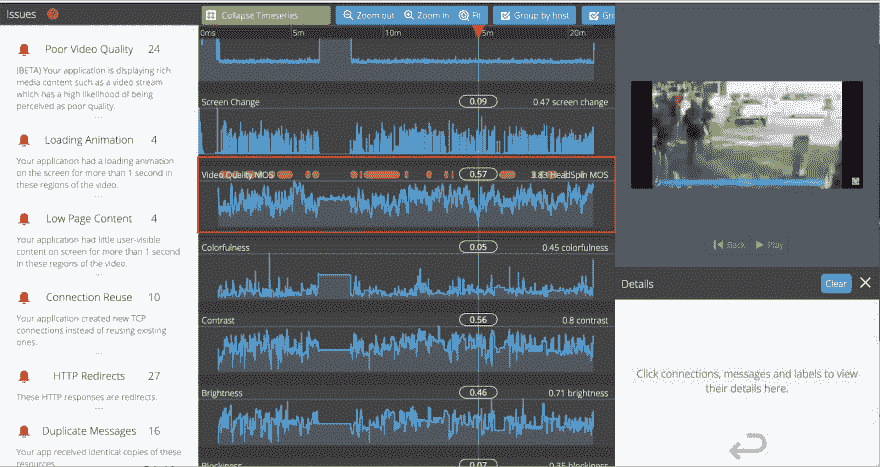

# 什么是平均意见得分或 MOS？

> 原文：<https://dev.to/headspin_io/what-is-a-mean-opinion-score-or-mos-2i5i>

平均意见得分(MOS)是对体验质量的衡量，通常用于描述音频和视频内容的质量。HeadSpin 的 AI 引擎在性能会话测试期间持续测量移动应用视频的视频平均意见得分。以下是 HeadSpin 的瀑布 UI 时间线上用红色轮廓突出显示的视频质量 MOS 的截图。

**头针瀑布 UI 中的 MOS 性能指标

** 

性能会话链接:

[https://ui-dev . head spin . io/sessions/de8d 3768-c57d-11e 9-bcde-f 01898 ea 5299/瀑布](https://ui-dev.headspin.io/sessions/de8d3768-c57d-11e9-bcde-f01898ea5299/waterfall)

视频内容被合并到不同类型的移动应用中:直播体育和事件、直播新闻、解说视频、游戏中的过场动画、介绍/漫游视频、直播通信视频、作为文件的视频等。糟糕的视频体验会对用户的整体体验产生负面影响。对于移动开发人员和 QA 团队来说，了解他们的视频在真实网络条件下在真实设备上的表现至关重要。

## **头旋的 AI 引擎 MOS**

HeadSpin 的平均意见得分从 0 到 4 不等，0 表示非常差，4 表示非常好，如下表所示。

分数范围:

*   0 非常差
*   1 穷人
*   2 公平
*   3 好
*   4 优秀

**iPhone X 视频示例

MOS:3.54【Youtube 视频】**

评论:虽然汉字和 QR 字符的内容不是非常清楚，但是没有观察到明显的块状。

**MOS: 2【有模糊和块状的 NBA 视频】**

[![MOS- 2 [NBA Video with blur and blockiness] ](img/ebcd1fb8586abd6b52f7234335b57773.png)](https://res.cloudinary.com/practicaldev/image/fetch/s--xHbFbIJJ--/c_limit%2Cf_auto%2Cfl_progressive%2Cq_auto%2Cw_880/https://www.headspin.io/hs-fs/hubfs/_website%2520filimg/MOS-%25202%2520%255BNBA%2520Video%2520with%2520blur%2520and%2520blockiness%255D%2520.png%3Fwidth%3D682%26name%3DMOS-%25202%2520%255BNBA%2520Video%2520with%2520blur%2520and%2520blockiness%255D%2520.png)

注释:请注意，视频屏幕截图上的播放器是块状的。视频上的记分牌模糊不清。

**MOS 评分:0.57【严重块状化的 Youtube 视频】** [![MOS Score- 0.57 [Youtube Video with severe blockiness] ](img/2de6106ac50cb5ccfae8e8e1aac64a85.png)](https://res.cloudinary.com/practicaldev/image/fetch/s--Czt0WkZi--/c_limit%2Cf_auto%2Cfl_progressive%2Cq_auto%2Cw_880/https://www.headspin.io/hs-fs/hubfs/_website%2520filimg/MOS%2520Score-%25200.57%2520%255BYoutube%2520Video%2520with%2520severe%2520blockiness%255D%2520.png%3Fwidth%3D512%26name%3DMOS%2520Score-%25200.57%2520%255BYoutube%2520Video%2520with%2520severe%2520blockiness%255D%2520.png)

评论:请注意，该视频是非常块状的人的脸是不可区分的。

## **改善您的视频并取悦您的客户**

借助真实设备上的真实网络，许多因素会影响通过移动应用交付视频内容。下面的列表包括一些不同的因素:

*   移动应用程序的设备和操作系统
*   网络的带宽、延迟、抖动和丢包
*   内容交付网络(CDN)的错误配置
*   播放视频的移动应用程序客户端问题
*   损坏的视频下载

使用 HeadSpin 的平台视频平均意见得分(MOS)和网络性能捕捉，开发人员和 QA 团队可以解决问题并改善移动视频观看体验，最终带来满意的客户。

借助 HeadSpin，您可以在真实的设备和全球真实的网络上测试您的移动应用，直接从您的 web 浏览器获得真实的用户体验条件。不需要修改代码。[开始免费试用](https://ui.headspin.io/register?referral=start-testing-promo)